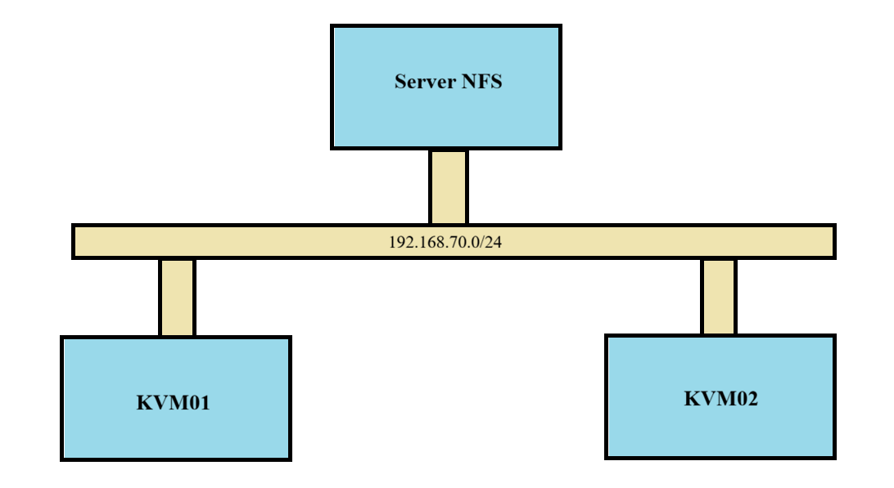
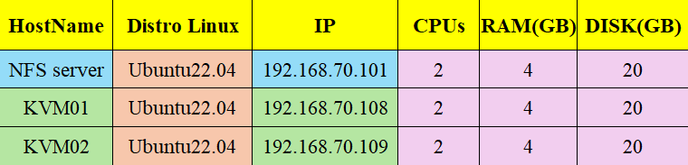
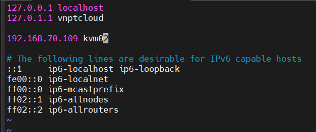
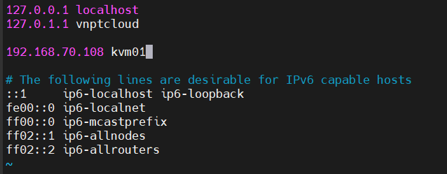
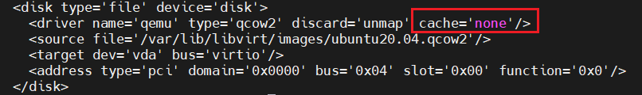
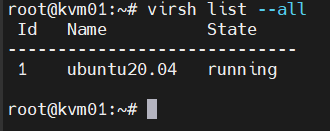
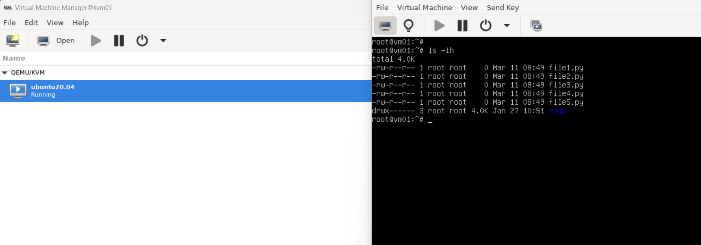
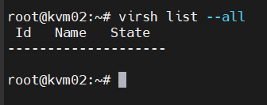
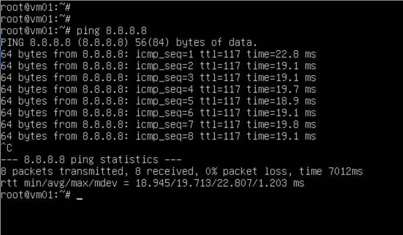

# Live migrate trên KVM
## I. Tổng quan
Trong quá trình vận hành để phục vụ cho việc bảo trì và nâng cấp hệ thống chúng ta cần chuyển các VM từ host này sang host khác. Với các VM đang chạy các ứng dụng quan trọng chúng ta không thể tắt nó đi trong quá trình chuyển. Trên KVM việc `live migrate` sẽ đảm bảo được các yêu cầu này

## II. Mô hình



## III. Phân hoạch địa chỉ IP



## IV. Cơ chế cơ bản của live-migrate
Về cơ bản cơ chế di chuyển VM khi VM vẫn đang hoạt động. Quá trình trao đổi diễn ra nhanh các phiên làm việc kết nối hầu như không cảm nhận được sự gián đoạn nào. Quá trình Live Migrate được diễn ra như sau:
- Bước đầu tiên của quá trình Live Migrate: 1 ảnh chụp ban đầu của VM cần chuyển trên host KVM01 được chuyển sang VM trên host KVM02
- Trong trường hợp người dùng đang truy cập VM tại host KVM01 thì những sự thay đổi và hoạt động trên host KVM01 vẫn diễn ra bình thường, tuy nhiên những thay đổi này sẽ không được ghi nhận
- Những thay đổi của VM trên host KVM01 được đồng bộ liên tục đến host KVM02
- Khi đã đồng bộ xong thì VM trên host KVM01 sẽ offline và các phiên truy cập trên host KVM01 được chuyển sang host KVM02

## V. Cài đặt 
## 1. Cấu hình phân dải tên miền
Để có thể live migrate giữa 2 KVM host thì 2 máy cần biết tên miền của nhau. Ta có thể cấu hình DNS phân dải tên miền cho cả 2 máy, tuy nhiên đây là mô hình lab nhỏ nên ta có thể cấu hình thẳng vào file host trên 2 máy

**Trên KVM01:**



**Trên KVM02:**



## 2. Cài đặt NFS

**Trên NFS server:**

- Cài đặt các gói NFS:

    ```bash
    apt install -y nfs-kernel-server
    ```

- Chọn 1 thư mục để làm thư mục share hoặc tạo mới 1 thư mục. Ở đây, ta tạo 1 thư mục `/root/storage`

    ```bash
    mkdir /root/storate
    ```

- Chia sẻ thư mực này với các máy KVM host bằng cách ghi các thông tin như sau vào trong file `/etc/exports`

    ```bash
    /root/storage 192.168.70.108/24(rw,sync,no_root_squash)
    /root/storage 192.168.70.109/24(rw,sync,no_root_squash)
    ```

    Địa chỉ IP bên trên là địa chỉ IP của 2 máy KVM host.

- Cập nhật lại file vừa chỉnh sửa:

    ```bash
    exportfs -a
    ```

- Khởi động dịch vụ NFS:

    ```bash
    systemctl start nfs-kernel-server
    systemctl enable nfs-kernel-server
    ```

**Trên máy KVM host:**

Trên 2 máy KVM ta đều thực hiện các lệnh sau:

- Cài đặt NFS:

    ```bash
    apt install -y nfs-common
    ```

- Sử dụng thư mục chứa file disk. Ở đây, ta tạo thư mục mới để lab

    ```bash
    mkdir storage
    ```

- Mount thư mục chứa máy ảo với thư mục đã share. `Lưu ý`: địa chỉ IP đúng với IP của NFS server

    ```bash
    mount 192.168.70.101:/root/storage/  storage
    ```

    hoặc khi sử dụng thư mục mặc định chứa disk của VM


    ```bash
    mount 192.168.70.101:/root/storage/ /var/lib/libvirt/images/
    ```

**NOTE:** mỗi khi reboot lại máy ta cần mount lại các thư mục này. Nếu không muốn bạn mount nó bằng cách sửa file `/etc/fstab`


## 3. Cài đặt KVM

Thực hiện cài đặt KVM trển cả 2 máy KVM host [Cài đặt KVM tại đây](https://github.com/Bimmie226/system-intership/blob/main/LuongVN/KVM/docs/3.Setting_KVM_on_ubuntu.md)

Khi cài đặt VM ta cần lưu file disk của VM vào thư mục đã mount với thư mục được share của NFS server.

Khi cài máy ảo xong ta cần thêm thông tin sau vào trong file xml của VM bằng cách dùng lệnh

```bash
virsh edit <tên-VM>
```

Thêm vào `cache=’none’` để tránh trường hợp migrate bị mất dữ liệu



Sau đó reboot lại VM

**NOTE:** Các bước này nên thực hiện ngay sau cài VM kể cả bạn chưa có ý định live migrate ngay lúc này bởi vì khi cần migrate có thể thực hiện được luôn mà không cần phải reboot VM khi đã cài các ứng dụng lên.

## 4. Kết nối qemu giữa 2 KVM host
Để có thể live migrate giữa hai host thì hai host này cần phải kết nối được với nhau. Để làm được việc này ta thực hiện các bước sau ở trên cả hai máy host KVM.

```bash
sed -i 's/#listen_tls = 0/listen_tls = 0/g' /etc/libvirt/libvirtd.conf 
sed -i 's/#listen_tcp = 1/listen_tcp = 1/g' /etc/libvirt/libvirtd.conf
sed -i 's/#tcp_port = "16509"/tcp_port = "16509"/g' /etc/libvirt/libvirtd.conf
sed -i 's/#listen_addr = "10.10.34.1"/listen_addr = "0.0.0.0"/g' /etc/libvirt/libvirtd.conf
sed -i 's/#auth_tcp = "sasl"/auth_tcp = "none"/g' /etc/libvirt/libvirtd.conf
sed -i 's/#LIBVIRTD_ARGS="--listen"/LIBVIRTD_ARGS="--listen"/g' /etc/sysconfig/libvirtd
```

Restart lại libvirtd trên cả hai máy:

```bash
systemctl restart libvirtd
```

### 4.0 NOTE 

Nếu bạn gặp lỗi trong quá trình kết nối qemu hãy tham khảo [tại đây](https://github.com/Bimmie226/system-intership/blob/main/LuongVN/KVM/webvirtcloud/1.Tim_hieu_%26_cai_dat_webvirtcloud.md#10-note)

## 5. Migrate
Ta kiểm tra VM trên KVM01, và tạo 1 số file 





Trên KVM02 không có VM nào:




Trước khi migrate, ta sẽ chạy lệnh `ping` trên `ubuntu20.04` của KVM01



**Migrate** từ `KVM01(192.168.70.108)` sang `KVM02(192.168.70.109)` Thực hiện câu lệnh trên KVM01

```bash
virsh migrate --live ubuntu20.04 qemu+tcp://192.168.70.109/system
```