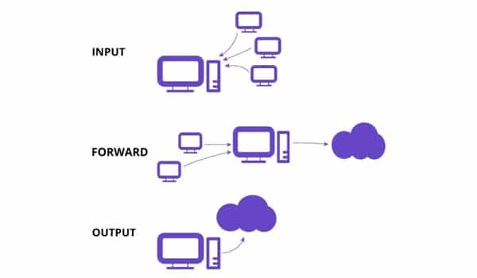

# Tìm hiểu IPtables
## I. IPtables là gì?
IPtables là ứng dụng tường lửa miễn phí trong Linux, cho phép thiết lập các quy tắc riêng để kiểm soát truy cập, tăng tính bảo mật. Khi sử dụng máy chủ, tường lửa là một trong những công cụ quan trọng giúp bạn ngăn chặn các truy cập không hợp lệ. Đối với các bản phân phối Linux như Ubuntu, CentOS… bạn có thể tìm thấy công cụ tường lửa tích hợp sẵn `IPtables`

## II. Thành phần của IPtables

Về cơ bản, IPtables chỉ là giao diện dòng lệnh để tương tác với packet filtering của netfilter framework. Cơ chế packet filtering của IPtables hoạt động gồm 3 thành phần là Tables, Chains và Targets


### 2.0 Các bảng trong IPtables là gì?

Table được `IPtables` sử dụng để định nghĩa các rules dành cho các gói tin. 

- `Filter Table`: Là một trong những tables được IPtables sử dụng nhiều nhất, Filter Table sẽ quyết định việc một gói tin có được đi đến đích dự kiến hay từ chối yêu cầu của gói tin

- `NAT Table`: Để dùng các rules về NAT, NAT Table sẽ có trách nhiệm chỉnh sửa sourceIP hoặc destIP của gói tin khi thực hiện cơ chế NAT
- `Mangle Table`: Cho phép chỉnh sửa header của gói tin, giá trị của các trường TTL, MTU, Type or Service
- `Raw Table`: 1 gói tin có thể thuộc một kết nối mới hoặc cũng có thể là của 1 một kết nối đã tồn tại. Table raw cho phép bạn làm việc với gói tin trước khi kernel kiểm tra trạng thái gói tin

### 2.1 Chains

Chains được tạo ra với một số lượng nhất định ứng với mỗi Table, giúp lọc gói tin tại các điểm khác nhau

- Chain PREROUTING tồn tại trong NAT Table, Mangle Table và RAW Table, các rules trong chains sẽ được thực thi ngay khi gói tin vào đến giao diện mạng (Network Interface)
- Chain INPUT chỉ có ở Mangle Table và NAT Table với các rules được thực thi ngay trước khi gói tin gặp tiến trình
- Chain OUTPUT tồn tại ở RAW Table, Mangle Table và Filter Table, có các rules được thực thi sau khi gói tin được tiến trình tạo ra
- Chain FORWARD tồn tại ở Mangle Table và Filter Table, có các rules được thực thi cho các gói tin được định tuyến qua host hiện tại
- Chain POSTROUTING chỉ tồn tại ở Mangle Table và NAT Table với các rules được thực thi khi gói tin rời giao diện mạng

### 2.2 Target
Target có thể được hiểu là hành động dành cho các gói tin thỏa mãn các rules đặt ra

- `ACCEPT`: Chấp nhận và cho phép gói tin đi vào hệ thống
- `DROP`: loại gói tin, không có gói tin trả lời 
- `REJECT`: loại gói tin, tuy nhiên sẽ gửi một gói tin phản hồi cho bên gửi biết rằng kết nối bị từ chối
- `LOG`: Chấp nhận gói tin nhưng có ghi lại log

Gói tin sẽ được đi qua tất cả các rules đặt ra mà không dừng lại ở bất kì rule nào đúng. Trường hợp gói tin không khớp với rules nào mặc định sẽ được chấp nhận

## III. Các rules trong IPtables là gì? 



Người dùng có thể dùng lệnh sau để xem các rules hiện có trong IPtables:

```bash
root@kvm01:~# iptables -L -v
Chain INPUT (policy DROP 0 packets, 0 bytes)
 pkts bytes target     prot opt in     out     source               destination
1008K 1364M LIBVIRT_INP  all  --  any    any     anywhere             anywhere
1008K 1364M ufw-before-logging-input  all  --  any    any     anywhere             anywhere
1008K 1364M ufw-before-input  all  --  any    any     anywhere             anywhere
    0     0 ufw-after-input  all  --  any    any     anywhere             anywhere
    0     0 ufw-after-logging-input  all  --  any    any     anywhere             anywhere
    0     0 ufw-reject-input  all  --  any    any     anywhere             anywhere
    0     0 ufw-track-input  all  --  any    any     anywhere             anywhere

Chain FORWARD (policy DROP 0 packets, 0 bytes)
 pkts bytes target     prot opt in     out     source               destination
 249K  679M LIBVIRT_FWX  all  --  any    any     anywhere             anywhere
 249K  679M LIBVIRT_FWI  all  --  any    any     anywhere             anywhere
41709 2373K LIBVIRT_FWO  all  --  any    any     anywhere             anywhere
    0     0 ufw-before-logging-forward  all  --  any    any     anywhere             anywhere
    0     0 ufw-before-forward  all  --  any    any     anywhere             anywhere
    0     0 ufw-after-forward  all  --  any    any     anywhere             anywhere
    0     0 ufw-after-logging-forward  all  --  any    any     anywhere             anywhere
    0     0 ufw-reject-forward  all  --  any    any     anywhere             anywhere
    0     0 ufw-track-forward  all  --  any    any     anywhere             anywhere

Chain OUTPUT (policy ACCEPT 5 packets, 224 bytes)
 pkts bytes target     prot opt in     out     source               destination
1004K 7496M LIBVIRT_OUT  all  --  any    any     anywhere             anywhere
1004K 7496M ufw-before-logging-output  all  --  any    any     anywhere             anywhere
1004K 7496M ufw-before-output  all  --  any    any     anywhere             anywhere
  233 16428 ufw-after-output  all  --  any    any     anywhere             anywhere
  233 16428 ufw-after-logging-output  all  --  any    any     anywhere             anywhere
  233 16428 ufw-reject-output  all  --  any    any     anywhere             anywhere
  233 16428 ufw-track-output  all  --  any    any     anywhere             anywhere
```

Trong đó:
- `Chain INPUT`: Chain này xử lý packet đi vào chính máy server. Ta thấy `policy drop` tức là nếu packet không match rule nào thì sẽ bị drop
- `Chain FORWARD`: Chain này xử lý packet đi xuyên qua máy này sang máy khác.
- `Chain OUTPUT`: Chain này xử lý packet do chính server tạo ra.
- `pkts`: Số packet match rule
- `bytes`: tổng dung lượng dữ liệu
- `target`: Action hoặc chain tiếp theo. Ví dụ: `LIBVIRT_INP`, `ufw-before-input` Nghĩa là packet nhảy sang chain đó.
- `prot`: Protocol (TCP, UDP, ICMP, ALL, ...)
- `opt`: Option đặc biệt của protocol. Thường để `--`
- `in`: Interface Packet đi vào 
- `out`: Interface Packet đi ra
- `source`: IP nguồn 
- `destination`: IP đích 

### 3.0 Các tùy chọn để chỉ định thông số IPtables 

| Option    | Ý nghĩa                                |
| --------- | -------------------------------------- |
| `-t`      | Chỉ định tên table (mặc định `filter`) |
| `-p`      | Chỉ định giao thức                     |
| `-i`      | Chỉ định card mạng vào                 |
| `-o`      | Chỉ định card mạng ra                  |
| `-s`      | Chỉ định địa chỉ IP nguồn              |
| `-d`      | Chỉ định địa chỉ IP đích               |
| `--sport` | Chỉ định port nguồn                    |
| `--dport` | Chỉ định port đích                     |

### 3.1 Các tùy chọn để thao tác với chain trong IPtables 

| Option      | Ý nghĩa                                                                                                        |
| ----------- | -------------------------------------------------------------------------------------------------------------- |
| iptables -N | Tạo chain mới                                                                                                  |
| iptables -X | Xóa hết các rule đã tạo trong chain                                                                            |
| iptables -P | Đặt chính sách cho các chain built-in. Ví dụ: IPtables -P INPUT ACCEPT để chấp nhận các packet vào chain INPUT |
| iptables -L | Liệt kê các rule có trong chain                                                                                |
| iptables -F | Xóa các rule có trong chain                                                                                    |

### 3.2 Các tùy chọn để thao tác với rule trong IPtables 

| Option | Ý nghĩa        |
| ------ | -------------- |
| `-A`   | Thêm rule      |
| `-D`   | Xóa rule       |
| `-R`   | Thay thế rule  |
| `-I`   | Chèn thêm rule |

