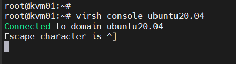
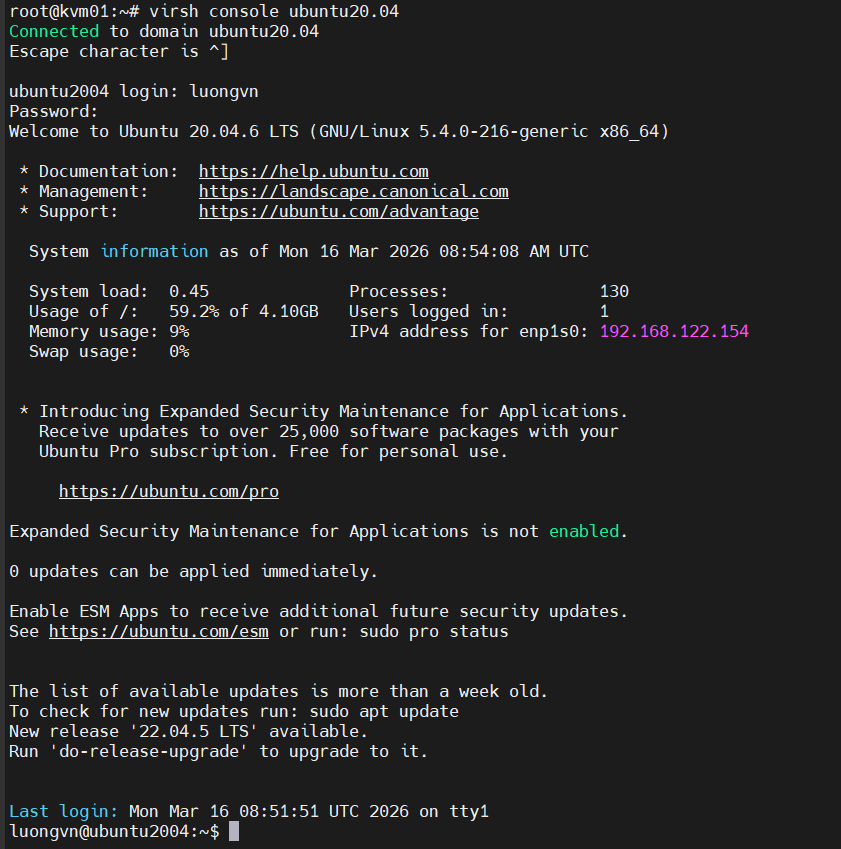

# Truy cập console VM

- Cần khởi động dịch vụ trên VM

    ```bash
    systemctl enable serial-getty@ttyS0.service
    systemctl start serial-getty@ttyS0.service
    ```

- Trên Host KVM

    ```bash
    virsh console <tên_VM>
    ```

- Nhấn phím enter:

    

- Nhập tài khoản và mật khẩu đăng nhập cho VM:

    

- Muốn quay lại host ta nhập tổ hợp phím: `CTRL + ]`