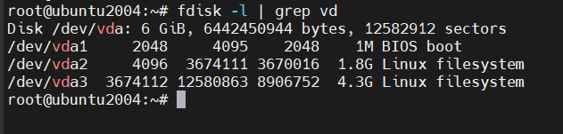
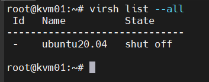
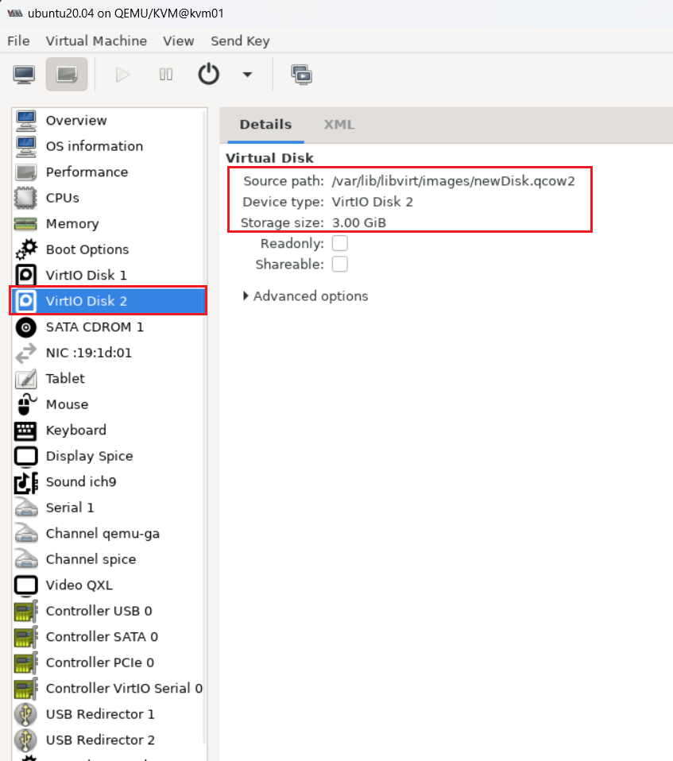
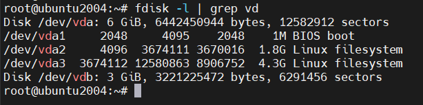
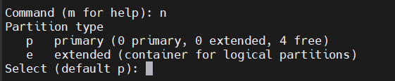
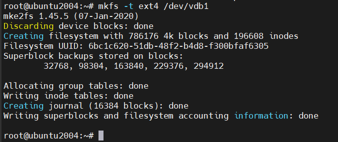
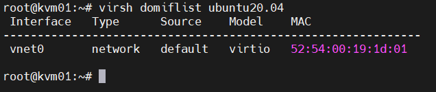
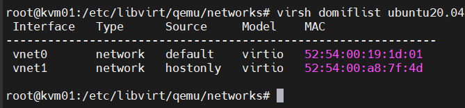
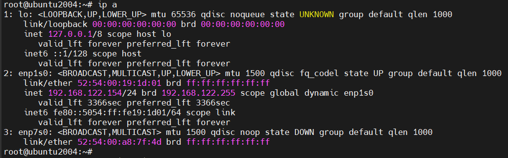

# Thêm Disk, Card vào VM

## I. Thêm Disk vào VM

### 1. Thêm Disk vào VM

```bash
- Tạo đĩa ảo
- Gán đĩa ảo vào VM
```

- Kiểm tra số lượng Disk của VM

    ```bash
    fdisk -l | grep vd
    ```

    

    Ta thấy có 1 đĩa ảo vda (3 phân vùng `vda1`, `vda2` và `vda3`) trên VM này

- Tắt VM

    

- Tạo 1 đĩa ảo trên host KVM bằng lệnh `qemu-img`. Ở đây, ta tạo 1 đĩa ảo dung lượng 3GB và lưu tại `/var/lib/libvirt/images`

    ```bash
    cd /var/lib/libvirt/images
    qemu-img create -f qcow2 newDisk.qcow2 3G
    ```

- Chỉnh sửa file xml của VM:

    ```bash
    virsh edit ubuntu20.04
    ```

- Thêm đoạn như sau và lưu lại:

    ```xml
    <disk type='file' device='disk'>
        <driver name='qemu' type='qcow2'/>
        <source file='/var/lib/libvirt/images/newDisk.qcow2'/>
        <target dev='vdb' bus='virtio'/>
    </disk>
    ```

    Trong đó:

    -  `<driver name='qemu' type='qcow2'/>`: Tên driver và kiểu disk
    -  `<source file='/var/lib/libvirt/images/newDisk.qcow2'/>`: đường dẫn tới disk ảo trên host KVM
    -  `<target dev='vdb' bus='virtio'/>` : cần tạo tên khác với những disk ảo đã có của VM. Như ở đây, ta đặt là `vdb`
- Define lại file xml của VM

    ```bash
    virsh define /etc/libvirt/qemu/ubuntu20.04.xml
    ```

- Start VM và kiểm tra disk ta tạo trên VM:

    

    

### 2. Phân vùng disk

Trên VM mới thêm disk `vdb`, ta thực hiện phân vùng:

- Dùng lệnh `fdisk`

    ```bash
    fdisk /dev/vdb

    Command (m for help):
    ```

- Nhập `n` để tạo phân vùng mới

    

- Nhập `p` để tạo phân vùng chính
- Chọn phân vùng có sẵn. Ở đây, ta chọn phân vùng `1`

    

- Sau khi hoàn thành, nhập `w` để xác nhận thay đổi

    ```bash
    Command (m for help): w
    ```

- Định dạng phân vùng với với hệ thống file `ext4`

    ```bash
    mkfs -t ext4 /dev/vdb1
    ```

    

## II. Thêm card mạng cho VM

### 1. Thêm card mạng
- Xem những card mạng hiện tại có trên VM

    ```bash
    virsh domiflist ubuntu20.04
    ```

    

- Chỉnh sửa file xml của VM
- Thêm đoạn `interface` như sau vào file xml

    ```bash
    <interface type='network'>
        <source network='hostonly'/>
        <model type='virtio'/>
    </interface>
    ```

    Trong đó:

    - `interface type`: kiểu card mạng
    - `source`: dải mạng mà card cắm vào

- define file xml của VM và khởi động lại VM

    

- Trên VM:

    

### 2. Xóa card mạng

Ta có thể xóa card mạng bằng 2 cách:

- Xóa trong file xml của VM
- Sử dụng lệnh:

    ```bash
    virsh detach-interface --domain demo --type network --mac 52:54:00:2c:24:cb --config
    ```