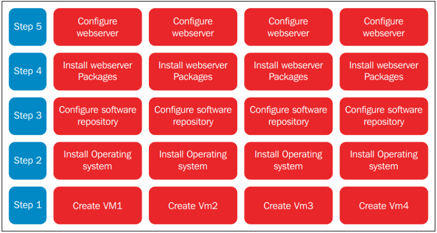
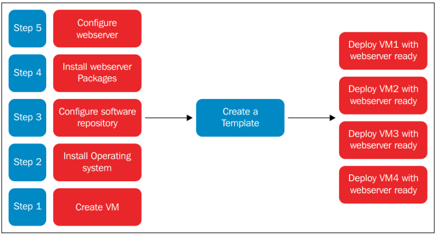
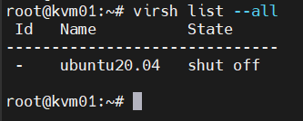
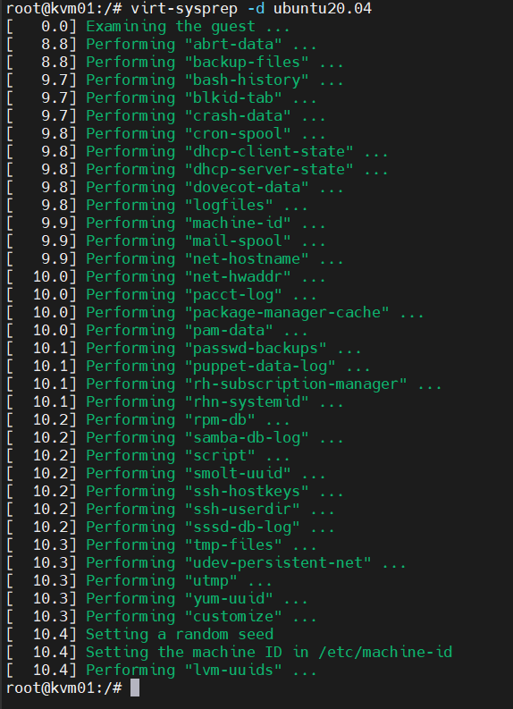
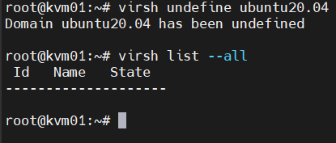
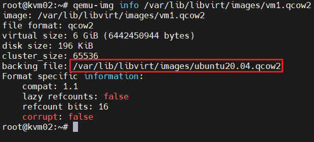
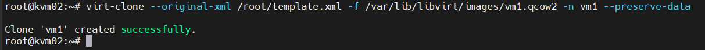
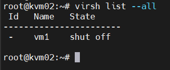

# Tạo Template cho VM và tạo VM từ Template 

## I. Template là gì?

Template là 1 dạng file image pre-configured của hệ điều hành được dùng để tạo nhanh các máy ảo. Sử dụng template sẽ khiến bạn tránh khỏi những bước lặp đi lặp lại và tiết kiệm thời gian rất nhiều so với việc cài bằng tay từng bước một

- Giả sử bạn có 4 máy Apache web server. Thông thường, bạn sẽ phải cài 4 máy ảo rồi lần lượt cài hệ điều hành cho từng máy, sau đó lại tiếp túc tiến hành cài đặt dịch vụ hoặc phần mềm. Điều này tốn rất nhiều thời gian và template sẽ giúp bạn giải quyết vấn đề này.

- Hình dưới đây mô tả các bước mà bạn phải thực hiện theo ví dụ trên nếu bạn cài bằng tay. Ta thấy, từ bước 2 - 5 chỉ là những tasks lặp đi lặp lại và nó sẽ tiêu tốn rất nhiều thời gian không cần thiết

    

Với việc sử dụng template, số bước mà người dùng phải thực hiện sẽ được rút ngắn đi rất nhiều, chỉ cần thực hiện 1 lần các bước từ 1 - 5 rồi tạo template là bạn đã có thể triển khai 4 web servers còn lại một cách rất dễ dàng. Điều này sẽ giúp người dùng tiết kiệm rất nhiều thời gian



## II. Tạo Template 1 VM

Hai khái niệm mà chúng ta cần phân biệt đó là `clone` và `template`:
- `clone`: Tạo một bản sao y hệt của một VM đã có
- `template`: Là một VM được chuẩn bị sẵn để làm mẫu, dùng để tạo ra nhiều VM mới

Có hai phường thức để triển khai máy ảo từ template đó là `Thin` và `Clone`

- `Thin`: VM mới không sao chép toàn bộ disk của template, mà dùng chung disk gốc và chỉ ghi phần thay đổi
    - Cách hoạt động:

    ```bash
    Template Disk (base image)
    │
    ├── VM1 overlay
    ├── VM2 overlay
    └── VM3 overlay
    ```

    - Template giữ base image
    - Mỗi VM có overlay disk
    - Khi VM thay đổi dữ liệu -> chỉ ghi vào overlay
    - Cơ chế này thường dùng Copy-on-Write (CoW)
    - Ví dụ: Ta có template: `ubuntu-template.qcow2 (10GB)` deploy 3 VM thin: `vm1-overlay.qcow2 (200MB)`, `vm2-overlay.qcow2 (150MB)`, `vm3-overlay.qcow2 (300MB)` => Tổng dung lượng: `10GB + 650MB`

- `Clone`: sao chép toàn bộ disk của template để tạo VM mới
  - Cách hoạt động: 

    ```bash
    Template Disk
      │
      ├── Copy → VM1 Disk
      ├── Copy → VM2 Disk
      └── Copy → VM3 Disk
    ```

  - Mỗi VM có disk hoàn toàn riêng biệt
  - Ví dụ: Ta có template: `ubuntu-template.qcow2 (10GB)` deploy 3 VM thin: `vm1.qcow2 (10GB)`, `vm2.qcow2 (10GB)`, `vm3.qcow2 (10GB)` => Tổng dung lượng: `40GB`

### 2.0 Các bước tạo Template
- Bước 1: Cài đặt máy ảo với đầy đủ các phần mềm cần thiết để biến nó thành template
- Bước 2: Loại bỏ tất cả những cài đặt cụ thể ví dụ như password SSH, địa chỉ MAC, ... để đảm bảo rằng nó sẽ không được áp dụng giống nhau tới tất cả các máy ảo được tạo ra sau này
- Bước 3: Đánh dấu máy ảo là template bằng việc đổi tên

## III. Virt-sysprep

`virt-sysprep` là một công cụ dùng trong môi trường ảo hóa để "làm sạch" một máy ảo trước khi biến nó thành template hoặc clone

Khi bạn muốn tạo template từ 1 VM, VM đó thường chứa các thông tin độc nhất như:
- hostname
- SSH host key
- machine-id
- lịch sử bash
- log hệ thống
- MAC/IP 
- user password

Nếu clone VM này nhiều lần → các VM mới sẽ bị trùng thông tin.

`virt-sysprep` giúp: xóa hoặc reset các thông tin đặc trưng của máy để VM trở thành template sạch


Có 2 options để dùng `virt-sysprep` đó là `-a` và `-d`. Tùy chọn `-d` được sử dụng với tên hoặc UUID của máy ảo, tùy chọn `-a` được sử dụng với đường dẫn tới ổ đĩa máy ảo.

## IV. Lab tạo template và cài đặt VM từ template

### 4.0 Tạo template

Cài đặt 1 VM ubuntu20.04 trên host KVM01. Cài đặt các gói cần thiết để dùng làm template

Shutdown VM: 

```bash
virsh shutdown ubuntu20.04
```



Cài đặt gói `libguestfs-tools-c` trên KVM host:

```bash
sudo apt install libguestfs-tools
```

Sử dụng `virt-sysprep` để loại bỏ các thông tin cấu hình như UUID, MAC, ... đồng thời niêm phong và biến máy ảo thành template


```bash
virt-sysprep -d ubuntu20.04
```



Backup file xml của template bằng lệnh `dumpxml`

```bash
virsh dumpxml ubuntu20.04 > /root/template.xml
```

Undefine máy ảo

```bash
virsh undefine ubuntu20.04
```



Ta đã tạo xong file image template

### 4.1 Sử dụng template

Copy file image template sang host KVM02

Tạo ra file image mới với định dạng qcow2 để file template làm file backups bằng câu lệnh

```bash
qemu-img create -b /var/lib/libvirt/images/ubuntu20.04.qcow2 -f qcow2 /var/lib/libvirt/images/vm1.qcow2
```

Kiểm tra xem file mới tạo ra đã được chỉ tới file backup của nó hay chưa bằng câu lệnh:

```bash
qemu-img info /var/lib/libvirt/images/vm1.qcow2
```



Dùng virt-clone để tạo ra máy ảo mới từ file XML

```bash
virt-clone --original-xml /root/template.xml -f /var/lib/libvirt/images/vm1.qcow2 -n vm1 --preserve-data
```



- Nếu muốn VM có Disk tách hẳn ra, ta thay `--preserve-data` thành `--auto-clone`

Kiểm tra các máy ảo đã tạo:




# Tài liệu tham khảo

[REFERENCE 1](https://github.com/danghai1996/thuctapsinh/blob/master/HaiDD/KVM/kvm/19-templateVM.md)