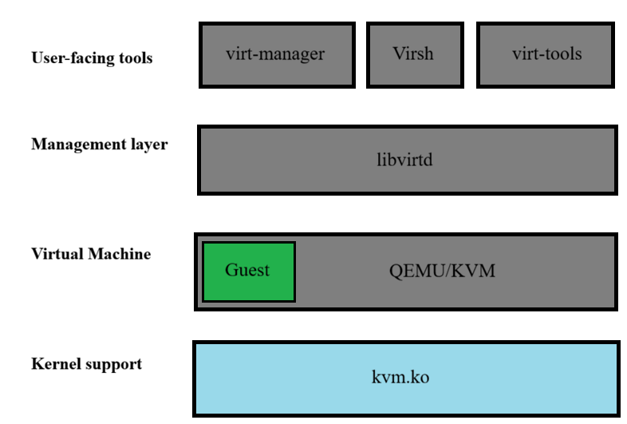

# Tìm hiểu KVM
## I. KVM là gì?
KVM(Kernel-based Virtual Machine) là một module của nhận Linux, biến nhân Linux thành hypervisor loại native để tạo và quản lý máy ảo. Sử dụng công nghệ ảo hóa phần cứng (Intel VT-x, AMD-V) để máy ảo truy cập trực tiếp tài nguyên (CPU, RAM)

## II. KVM dùng để làm gì?
Nhiệm vụ chính của KVM là quản lý và chia sẻ nguồn tài nguyên (CPU, RAM) một cách công bằng. Bên cạnh đó công nghệ này còn được tích hợp trong Linux với các đặc trưng sau:
- Với công nghệ ảo hóa KVM, Linux có khả năng biến máy chủ thành một môi trường ảo, cho phép chạy nhiều máy khách hoặc máy ảo (Virtual Machine) được cô lập.
- KVM là một phần của mã nguồn mở Linux và được tích hợp trực tiếp vào nhân Linux, nên công nghệ này gần như được thừa hưởng mọi tính năng, bao gồm khả năng sửa lỗi và các cập nhật mới của Linux mà không cần thông qua các kỹ thuật bổ sung.

## III. KVM thuộc loại ảo hóa nào
KVM thuộc loại ảo hóa Type 1 (Native). Mặc dù KVM là một module của nhân Linux, nhưng nó hoạt động như một hypervisor native vì những lý do sau:
- **Tích hợp trực tiếp vào kernel Linux**: KVM là một module của nhân Linux, không phải ứng dụng chạy trên OS host. Khi KVM được kích hoạt, Linux kernel trở thành hypervisor, hoạt động tương tự VMware ESXi hay Microsoft Hyper-V.
- **Truy cập trực tiếp phần cứng (hardware virtualization):** KVM sử dụng VT-x(Intel) hoặc AMD-V để cho phép VM chạy lệnh CPU trực tiếp trên phần cứng, không qua lớp OS trung gian như hypervisor hosted

## IV. Các thành phần KVM

### 1. User-facing tools
Là các công cụ mà người dùng trực tiếp sử dụng để quản lý máy ảo trên KVM
- `virt-manager`: giao diện đồ họa (GUI) giúp tạo, khởi động, tắt, snapshot và cấu hình máy ảo dễ dàng
- `virsh`: công cụ dòng lệnh (CLI), hỗ trợ gần như toàn bộ chức năng quản lý máy ảo thông qua libvirt
- `virt-tools`: tập hợp các công cụ hỗ trợ bổ sung cho việc quản lý, cài đặt và cấu hình máy ảo (bao gồm virt-install, virt-clone, ...)

Các công cụ này không tương tác trực tiếp với KVM mà sẽ gửi yêu cầu đến libvirt để thực hiện thao tác quản lý VM

### 2. Management layer
Lớp quản lý bao gồm thư viện `libvirt` và `daemon libvirtd`, cung cấp API chuẩn để user-facing tools có thể giao tiếp với hypervisor.

Chức năng:
- Quản lý vòng đời máy ảo: tạo, start, stop, pause, resume, snapshot
- Quản lý storage pool
- Cung cấp API đa ngôn ngữ (C, Python, Go) cho lập trình và tích hợp hệ thống

KVM chỉ cung cấp khả năng ảo hóa CPU và memory, không có chức năng quản lý VM, vì vậy libvirt đóng vai trò quản lý trung gian giữa user và hypervisor

### 3. Virtual Machine
Máy ảo (Virtual Machine) là hệ điều hành khách (guest OS) mà người dùng tạo ra và vận hành trên hạ tầng ảo hóa KVM.

VM hoạt động dựa trên qemu-kvm: QEMU giả lập phần cứng máy ảo, KVM tăng tốc xử lý lệnh CPU để đạt hiệu năng cao

### 4. Kernel Support
Lớp hỗ trợ trong kernel Linux cho phép KVM hoạt động như một hypervisor.

Thành phần chính:
- `kvm.ko`: module kernel chính, cung cấp hạ tầng ảo hóa cơ bản
- `kvm-intel.ko/kvm-amd.ko`: module kernel đặc thù cho CPU Intel hoặc AMD, hỗ trợ tập lệnh VT-x (Intel) hoặc AMD-V (AMD) để thực thi ảo hóa phần cứng.
