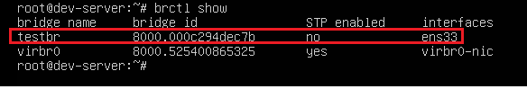
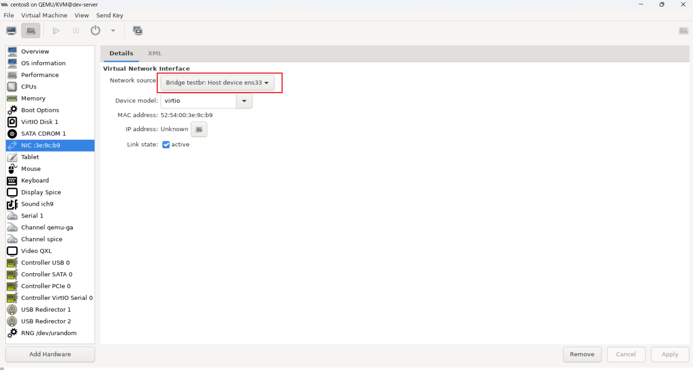
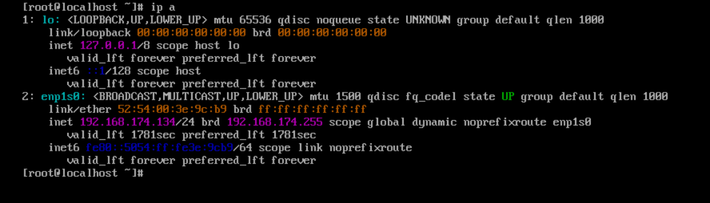

# Cấu Hình Linux Bridge Trên KVM
## I. Tổng quan về Linux Bridge
Linux-Bridge là một mô hình ảo hóa mạng được hỗ trợ bởi KVM. Nó cung cấp switch ảo để giải quyết vấn đề ảo hóa Network bên trong các máy vật lý


Các VM kết nối đến switch ảo để liên lạc với nhau hoặc có thể liên lạc ra bên ngoài khi kết nối con switch ảo này với card mạng vật lý trên máy

## II. Chuẩn bị
Một máy chạy ubuntu đã cài KVM và bên trong nó đã có 1 con VM (Rocky9, Centos7, ...)

**Chú ý:** máy vật lý ở đây là máy cài KVM. Máy này có thể là một máy ảo nhưng ở đây ta coi nó như một server vật lý.

## III. Cấu hình
Ta có thể hình dung card mạng trên máy vật lý sẽ được gắn trực tiếp vào switch ảo nên ta có thể thấy sau khi add switch ảo vào card vật lý thì chúng sẽ có cùng địa chỉ MAC và trên card vật lý sẽ không còn địa chỉ IP mà chỉ có địa chỉ IP trên swtich ảo


Để tạo một linux bridge (switch ảo) ta dùng lệnh sau:

```bash
brctl addbr testbr
```

Tiếp theo là bước add card mạng cho switch dùng lệnh sau:

```bash
brctl addif testbr ens33
```

- Tên switch ở đây là switch ta vừa mới tạo ở câu lệnh bên trên
- Tên card ở đây là card mạng trên máy vật lý 

Để kiểm tra những switch ảo trên máy và những card đã được add vào switch ảo đó ta dùng lệnh:

```bash
brctl show
```




Tiếp theo đó ta tiến hành cấp IP cho NIC. Ta dùng câu lệnh sau để xóa IP của card `ens33`:

```bash
ifconfig ens33 0
```

Sau đó cấp IP cho bridge bằng lệnh:

```bash
ip addr add 192.168.174.36/24 dev testbr
ip link set ens33 up
sudo ip route add default via 192.168.174.2
```

**NOTE:** hai câu lệnh trên chỉ có hiệu lực đến khi ta reboot lại máy vật lý. Để VM có thể nhận được IP ngay cả khi server vật lý bị reboot ta thực hiện ghi các dòng như sau vào file `/ect/network/interfaces`

```bash
auto lo
iface lo inet loopback

auto ens33
iface ens33 inet manual

auto testbr
iface testbr inet static
        address 192.168.174.36
        netmask 255.255.255.0
        gateway 192.168.174.2
        dns-nameservers 8.8.8.8 1.1.1.1
        bridge_ports ens33
        bridge_stp off
        bridge_fd 0
        bridge_maxwait 0
```


Sau đó sử dụng câu lệnh sau để khởi động lại `testbr`:

```bash
ifdown testbr && ifup testbr
```

**NOTE:** 
- Nếu card `ens33` trên server bạn để là IP tĩnh thì lúc này bạn phải sửa lại file `/etc/netplan/00-installer-config.yaml` với nội dung như sau:

    ```bash
    network:
    ethernets:
        ens33:
        dhcp4: no
        nameservers:
            addresses:
                    - 8.8.8.8
                    - 1.1.1.1
    version: 2
    ```

- Sau đó bạn thêm 2 nameserver là `8.8.8.8, 1.1.1.1` vào file `/etc/resolv.conf`. Tuy nhiên sau khi reboot thì file này sẽ reset lại nên để khắc phục ta sẽ tạo file `/etc/my-resolv.conf` với 2 nameserver là `8.8.8.8 1.1.1.1` sau đó soft link với `/etc/resolve` bằng câu lệnh: `ln -s /etc/my-resolv.conf /etc/resolv.conf` sau đó reboot


Bây giờ trên VM kết nối với switch ảo đó 




