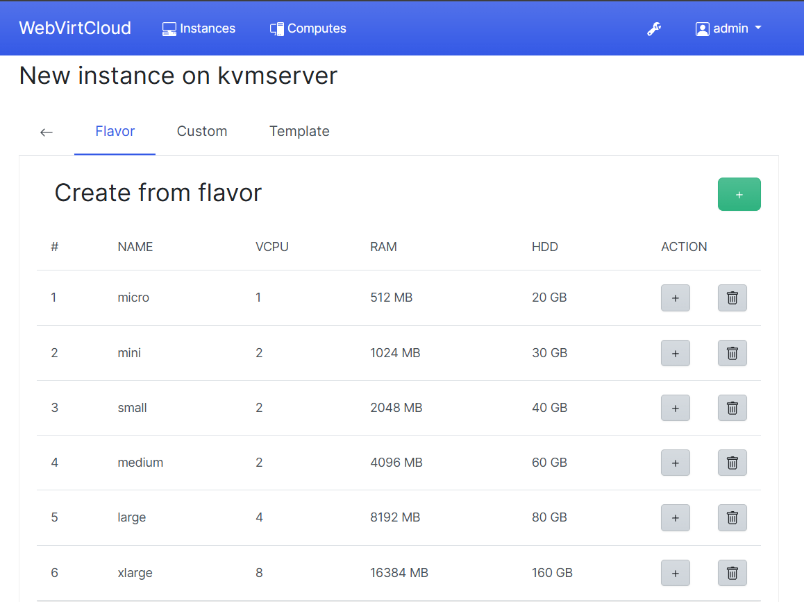
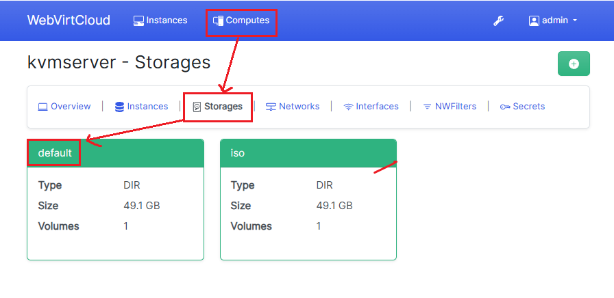
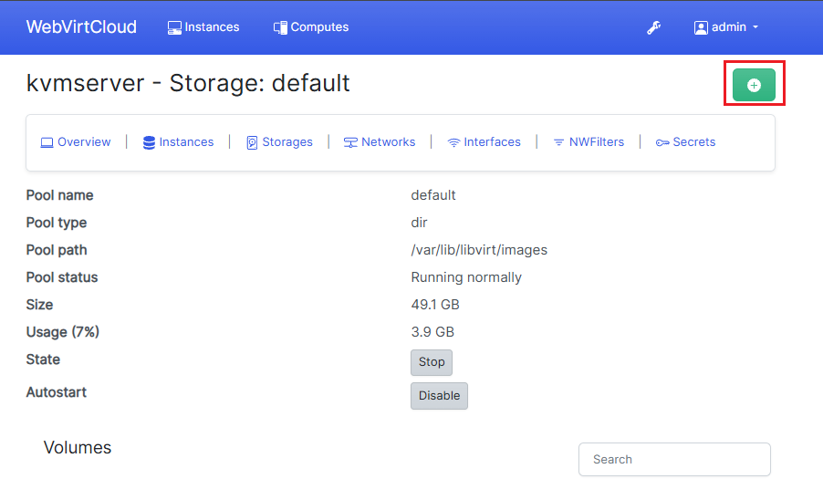
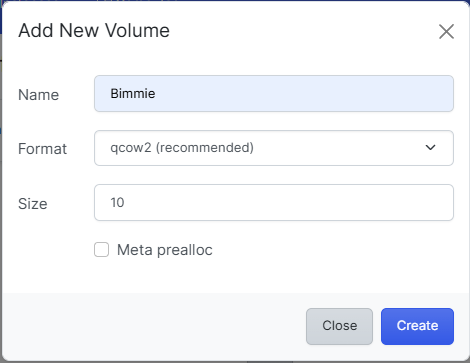
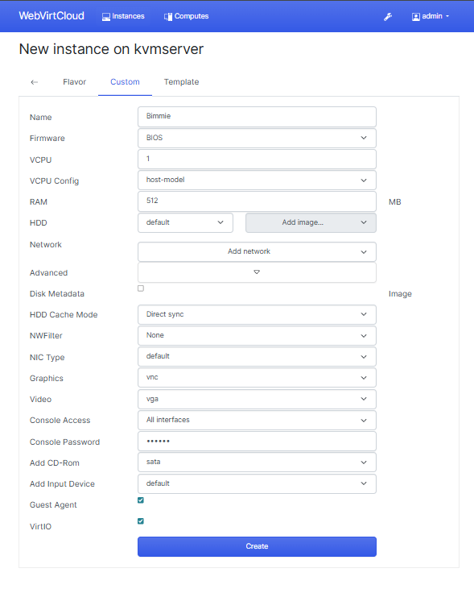

# Hướng dẫn sử dụng WebVirtCloud
## 0. Mô Hình

## 1. Hướng dẫn sử dụng
### 1.0 Tạo users

  

  <em>Chọn Users</em>

  

  <em>Chọn +</em>

  

  <em>Ta điền các thông tin cần thiết cho user này(Lưu ý nên xem xét user kỹ càng cho phần permission)</em>

### 1.1 Tạo storage pool

Ở đây, ta tạo ra các Pool để lưu volumes VM và ISO để cài đặt OS cho VM

  

  <em>Vào tab Computes chọn compute bạn muốn tạo pools</em>

  

  <em>Chọn storage</em>

  

  <em>Tạo một pool mới</em>

Ở đây, ta thấy đã có sẵn 1 pool là `default`, ta sẽ lấy pool này làm nơi lưu images cho VMs

  

  <em>Chọn đường dẫn lưu ISO</em>

  

  <em>Sau khi tạo xong</em>

### 1.2 Tạo network

  

  <em>Chọn Networks</em>

  

  <em>Chọn name và mode network bạn muốn</em>

### 1.3 Tạo VM
Để thực hiện được bước tạo VM user bạn phải là user có quyền admin

  

  <em>Truy cập tab Instances, chọn +</em>

  

  <em>Chọn compute</em>

  

  <em>Chọn kiến trúc</em>

  

  <em>Có thể tạo VM từ Flavor có sẵn hoặc Custom</em>

Nếu tạo từ Flavor

  

  <em>Chọn Flavor</em>

  

  <em>Điền các thông số cần thiết</em>

Nếu bạn cài đặt từ file iso, trước tiên bạn cần tạo ra một volume pool storage để gán vào VM

  

  <em>Chọn pool muốn tạo volume</em>

  

  <em>Chọn +</em>

  

  <em>Khai báo thông tin volume bạn muốn tạo</em>

  

  <em>Khai báo các thông tin cho VM</em>

