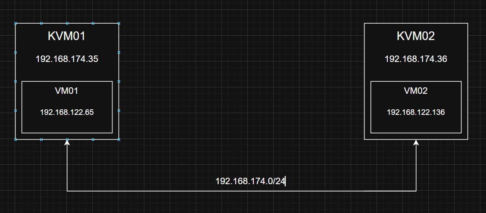
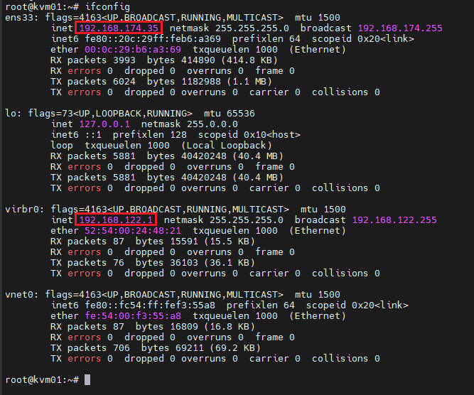
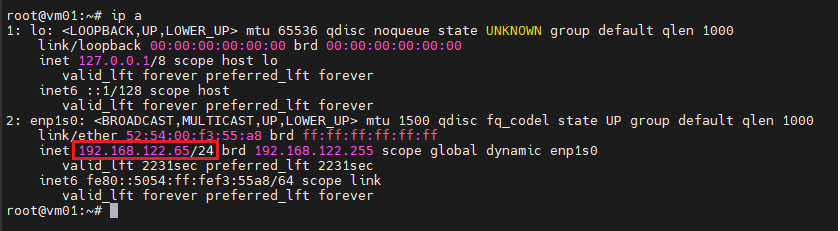
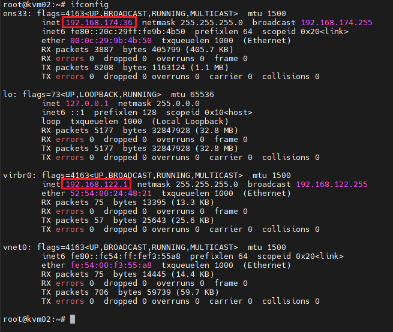
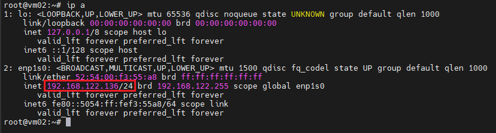
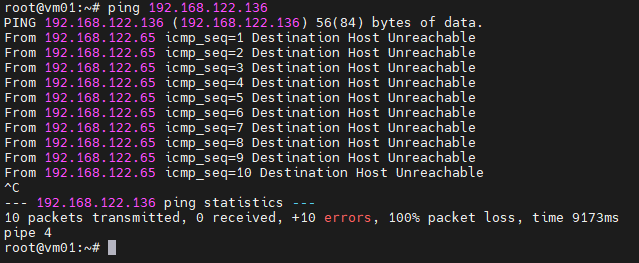
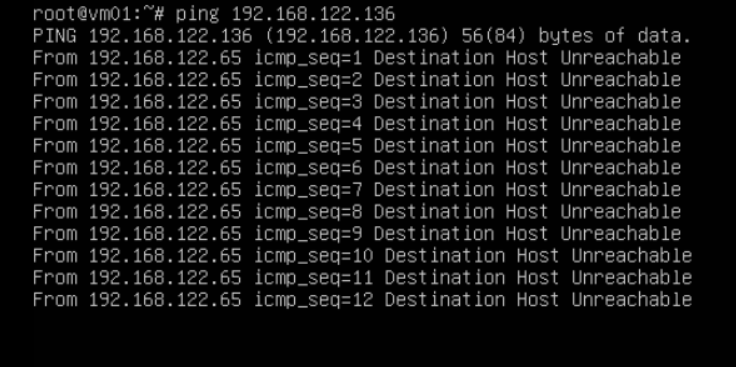
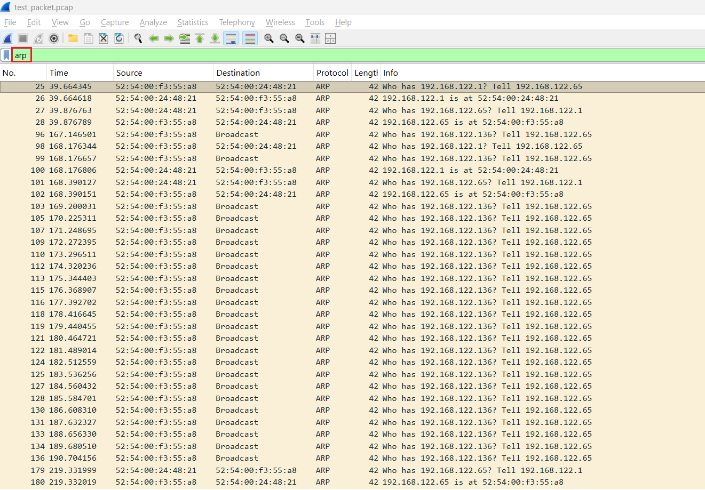
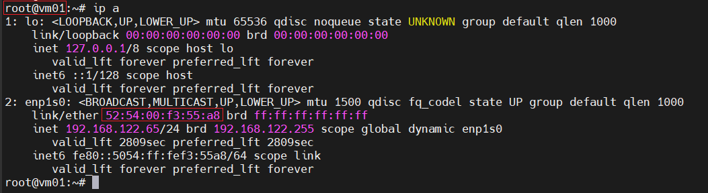
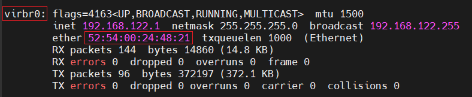

# Lab kiểm chứng xem 2 VM trên 2 host KVM khác nhau có Ping được đến nhau hay không?

## I. Trường Hợp 1

2 máy VM ở cùng 1 dải mạng

### 1.0 Mô hình



### 1.1 Mục tiêu

Kiểm chứng xem VM01: `192.168.122.65` có ping được tới VM02: `192.168.122.136` hay không?

Sử dụng `Tcpdump` và `Wireshark` để kiểm chứng

### 1.2 Thực hiện

- Thông tin của máy host `KVM01`:

    

- Thông tin của máy `VM01` trên host `KVM01`:

    

- Thông tin của máy host `KVM02`:

    

- Thông tin của máy `VM02` trên host `KVM02`:

    

- Từ máy `VM01: 192.168.122.65` ta sẽ thực hiện ping sang `VM02: 192.168.122.136`: 

    

    - Ta thấy, máy `VM01` và `VM02` mặc dù ở cùng dải mạng `192.168.122.0/24` tuy nhiên ta **KHÔNG** thể ping 2 máy được cho nhau !!!

### 1.3 Suy luận lý thuyết

Ta sẽ phân tích thử đường đi gói tin từ `VM01` sau khi ping đến `VM02`:

- Gói tin xuất phát từ `VM01`:

    ```bash
    source IP: `192.168.122.65`
    dest IP: `192.168.122.136`
    ```

- Thấy 2 IP này cùng 1 subnet => gửi trực tiếp (ARP): 

    ```bash
    VM01 gửi:

    Who has 192.168.122.136?
    ```

    Tuy nhiên:
  
    - broadcast chỉ trong virbr0 của KVM01
    - VM02 nằm trên KVM02 => Không nhận được
- Không có ARP reply => VM01 không biết MAC => Không gửi được packet 

    > Gói tin chết ngay tại đây


### 1.4 Kiểm chứng

Ta sử dụng lệnh `tcmpdump` để capture các gói tin tại `VM01`:

```bash
root@vm01:~# tcpdump -i enp1s0 -n -w test_packet.pcap
tcpdump: listening on enp1s0, link-type EN10MB (Ethernet), capture size 262144 bytes
```

Ở cửa sổ khác, ta ping từ `VM01` đến `VM02`:



Ta sẽ lọc các gói tin ARP trên wireshark để kiểm chứng lý thuyết:



Ở đây, ta thấy có 2 địa chỉ MAC chính: 

- `52:54:00:f3:55:a8` - MAC của VM01

    

- `52:54:00:24:48:21` - MAC của virbr0 trên KVM01

    

**Thứ tự từng packet:**

- Packet 25: 

    ```bash
    Who has 192.168.122.1? Tell 192.168.122.65
    ```

    - VM01 hỏi "Gateway 192.168.122.1 ở đâu?"

- Packet 26: 

    ```bash
    192.168.122.1 is at 52:54:00:24:48:21
    ```

    - Host (virbr0) trả lời: "Tôi đây (MAC: 52:54:00:24:48:21)"

- Packet 27 - 28 (ngược lại):

    ```bash
    Who has 192.168.122.65? Tell 192.168.122.1
    192.168.122.65 is at 52:54:00:f3:55:a8
    ```

    - Host hỏi lại VM -> VM trả lời -> 2 bên đã biết MAC của nhau
- Packet 96:

    ```bash
    Who has 192.168.122.136? Tell 192.168.122.65
    ```

    - VM01 hỏi: "VM02 (192.168.122.136) ở đâu?"
- Packet 98 - 136:

    ```bash
    Who has 192.168.122.136? Tell 192.168.122.65
    ```

    - Lặp lại liên tục.
    - Quan trọng: **Dest = broadcast**, **KHÔNG** có reply
- Ta không thể thấy gói packet phản hồi từ `192.168.122.136` reply lại cho VM01 => Nguyên nhân là vì VM02 thực chất không hề tồn tại trong virbr0 - bản chất là 1 switch layer 2