# Tìm hiểu và cài đặt WebVirtCloud quản lý hạ tầng KVM trên Ubuntu 22.04

Như ta đã biết công cụ để quản lý tập trung hạ tầng KVM trong các bài viết trước đó là virt-manager. Hôm nay ta sẽ tìm hiểu thêm một công cụ mới hiệu quả và tiện dụng hơn chính là WebVirtCloud 

# Mô hình cài đặt

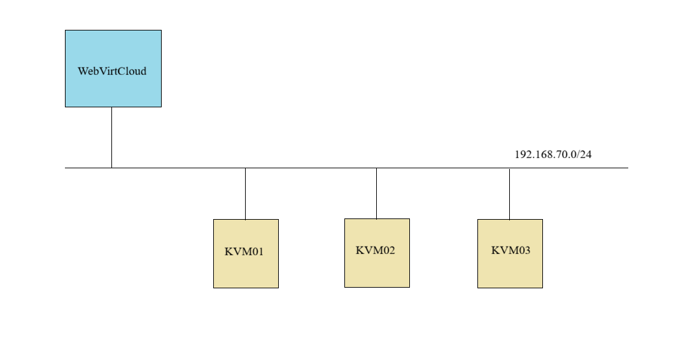

# Phân hoạch địa chỉ IP


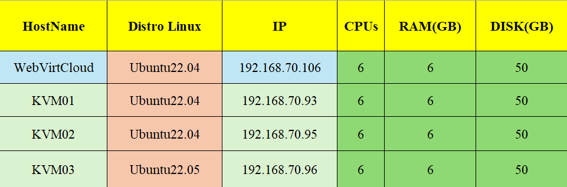


# Version Tối Thiểu

- Python: 3.11 trở lên 

# Các bước cài đặt

Trước khi cài đặt WebVirtCloud để quản lý hạ tầng máy chủ KVM ta phải có các máy chủ KVM trước đó đã cài đặt 

## Bước 1: Cài đặt KVM

Các bạn có thể tham khảo cách cài đặt KVM [tại đây](https://github.com/Bimmie226/system-intership/blob/main/LuongVN/KVM/docs/3.Setting_KVM_on_ubuntu.md)

Để có thể kết nối KVM đến WebVirtCloud, ta cần làm thêm một số bước sau:

- Chỉnh sửa file cấu hình libvirt như sau:

    ```bash
    vi /etc/libvirt/libvirtd.conf
    ```

    ```bash
    listen_tls = 0
    listen_tcp = 1
    tcp_port = "16509"
    listen_addr = "0.0.0.0"
    auth_tcp = "none" 
    ```

- Chỉnh sửa file `/etc/default/libvirtd`:

    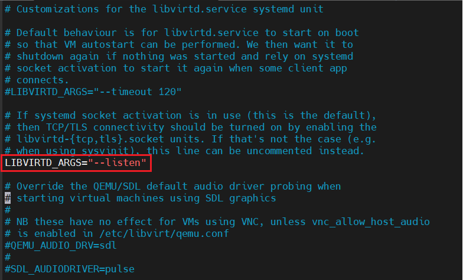

- Cho phép port `16509` của **libvirt** và dải port `5900-5999` của **VNC** đi qua **ufw**

    ```bash
    ufw allow 16509/tcp
    ufw allow 5900:5999/tcp
    ufw reload
    ```

- Restart lại dịch vụ `libvirtd`:

    ```bash
    systemctl restart libvirtd
    ```

### 1.0 NOTE
Khi bạn thực hiện bước 1 có thể gặp lỗi sau khi restart libvirtd:

```bash
root@kvmserver:~# systemctl restart libvirtd
Job for libvirtd.service failed because the control process exited with error code.
See "systemctl status libvirtd.service" and "journalctl -xeu libvirtd.service" for details.
root@kvmserver:~# systemctl status libvirtd
x libvirtd.service - Virtualization daemon
     Loaded: loaded (/lib/systemd/system/libvirtd.service; enabled; vendor preset: enabled)
     Active: failed (Result: exit-code) since Mon 2026-02-02 14:20:21 +07; 6s ago
TriggeredBy: x libvirtd-ro.socket
             x libvirtd-admin.socket
             x libvirtd.socket
       Docs: man:libvirtd(8)
             https://libvirt.org
    Process: 7473 ExecStart=/usr/sbin/libvirtd $LIBVIRTD_ARGS (code=exited, status=6)
   Main PID: 7473 (code=exited, status=6)
      Tasks: 2 (limit: 32768)
     Memory: 5.8M
        CPU: 55ms
     CGroup: /system.slice/libvirtd.service
             |-6120 /usr/sbin/dnsmasq --conf-file=/var/lib/libvirt/dnsmasq/default.conf --leasefile-ro --dhcp-script=/usr/lib/libvirt/libvirt_leaseshelper
             `-6121 /usr/sbin/dnsmasq --conf-file=/var/lib/libvirt/dnsmasq/default.conf --leasefile-ro --dhcp-script=/usr/lib/libvirt/libvirt_leaseshelper

Feb 02 14:20:21 kvmserver systemd[1]: libvirtd.service: Scheduled restart job, restart counter is at 5.
Feb 02 14:20:21 kvmserver systemd[1]: Stopped Virtualization daemon.
Feb 02 14:20:21 kvmserver systemd[1]: libvirtd.service: Start request repeated too quickly.
Feb 02 14:20:21 kvmserver systemd[1]: libvirtd.service: Failed with result 'exit-code'.
Feb 02 14:20:21 kvmserver systemd[1]: libvirtd.service: Unit process 6120 (dnsmasq) remains running after unit stopped.
Feb 02 14:20:21 kvmserver systemd[1]: libvirtd.service: Unit process 6121 (dnsmasq) remains running after unit stopped.
Feb 02 14:20:21 kvmserver systemd[1]: Failed to start Virtualization daemon.
root@kvmserver:~#
```

Ta để ý dòng log sau:

```ini
ExecStart=/usr/sbin/libvirtd $LIBVIRTD_ARGS (code=exited, status=6)
```

`status=6` của `libvirtd` không phải lỗi KVM mà là: libvirt bị crash khi khởi động vì cấu hình listen TCP không tương thích với systemd socket activation

Tức là:
- Bạn bật `--listen`
- Nhưng libvirtd đang được quản lý bởi systemd socket
- Hai cơ chế này sung đột với nhau

Nguyên nhân: Từ libvirt >= 5.x kiến trúc đã thay đổi:
- Không khuyến khích chạy libvirtd bằng `--listen`
- Mặc định dùng systemd socket activation

Trong hệ thống đang có 5 socket đang bật:

```bash
libvirtd.socket
libvirtd-ro.socket
libvirtd-admin.socket
libvirtd-tcp.socket
libvirtd-tls.socket
```

Khi bạn làm:

```bash
LIBVIRTD_ARGS="--listen"
```

- libvirt tự mở cổng TCP
- Nhưng systemd cũng đã mở socket trước
- libvirtd thấy socket đã tồn tại → exit với status 6

**Cách khắc phục:**

Ta sẽ chạy bằng kiểu legacy: Tắt hết các mode socket:

```bash
sudo systemctl stop libvirtd.socket libvirtd-ro.socket libvirtd-admin.socket libvirtd-tcp.socket libvirtd-tls.socket
sudo systemctl disable libvirtd.socket libvirtd-ro.socket libvirtd-admin.socket libvirtd-tcp.socket libvirtd-tls.socket
```

Sau đó mới dùng:

```bash
LIBVIRTD_ARGS="--listen"
```

Sau đó `Restart` lại `libvirtd`:

```bash
systemctl restart libvirtd
```

## Bước 2: Cài đặt WebVirtCloud trên Ubuntu 22.04

### 2.0 Cài đặt các gói cần thiết

```bash
apt update 
apt install -y git libvirt-dev libxml2-dev libxslt1-dev \
libxslt1-dev zlib1g-dev libffi-dev libssl-dev supervisor gcc \
pkg-config libsasl2-dev libssl-dev libldap2-dev 
```

### 2.1 Cài đặt python

```bash
sudo apt install python3 python3-pip python3-venv
```

### 2.2 Cài đặt Nginx Webserver

Các bạn có thể tham khảo cách cài đặt Nginx trên Ubuntu [tại đây](https://github.com/Bimmie226/system-intership/blob/main/LuongVN/WEBSERVER/Nginx/install_nginx.md#c%C3%A0i-%C4%91%E1%BA%B7t-nginx-tr%C3%AAn-ubuntu)

### 2.3 Cài đặt WebVirtCloud

Sử dụng git để lấy source của WebVirtCloud

```bash
git clone https://github.com/retspen/webvirtcloud.git
```

Chuyển hướng tới `webvirtcloud`

```bash
cd webvirtcloud
```

Tạo file `settings.py` từ template có sẵn:

```bash
cp webvirtcloud/settings.py.template webvirtcloud/settings.py
```

Tiếp theo, tạo SECRET bằng cách sử dụng script Python đã được cung cấp:

```bash
SECRET=$(python3 conf/runit/secret_generator.py)
```

Sử dụng `sed` để thêm SECRET vào file

```bash
sed -i "s|SECRET_KEY = \"\"|SECRET_KEY = \"$SECRET\"|" webvirtcloud/settings.py
```

Mở file `settings.py` thêm hostname vào danh sách các nguồn đáng tin cậy:

```bash
vi webvirtcloud/settings.py
```

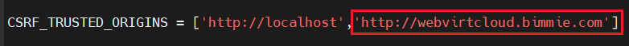

Thay `webvirtcloud.bimmie.com` với hostname server của bạn và lưu vào file `host`:

```bash
192.168.70.106 webvirtcloud.bimmie.com
```

Copy cấu hình `nginx` và `supervisord`:

```bash
sudo cp conf/nginx/webvirtcloud.conf /etc/nginx/conf.d
sudo cp conf/supervisor/webvirtcloud.conf /etc/supervisor/conf.d
```

Mở file cấu hình nginx cho webvirtcloud sau đó cấu hình như sau:

```bash
vi /etc/nginx/conf.d/webvirtcloud.conf
```

```nginx
server {
    listen 80;

    server_name webvirtcloud.bimmie.com;
    access_log /var/log/nginx/webvirtcloud-access_log;
    error_log /var/log/nginx/webvirtcloud-error_log;

    location /static/ {
        root /srv/webvirtcloud;
        expires max;
    }

    location / {
        proxy_pass http://127.0.0.1:8000;
        proxy_set_header X-Real-IP $remote_addr;
        proxy_set_header X-Forwarded-for $proxy_add_x_forwarded_for;
        proxy_set_header Host $host:$server_port;
        proxy_set_header X-Forwarded-Proto http;
        proxy_set_header X-Forwarded-Ssl off;
        proxy_connect_timeout 1800;
        proxy_read_timeout 1800;
        proxy_send_timeout 1800;
        client_max_body_size 1024M;
    }

    location /novncd/ {
        proxy_pass http://wsnovncd;
        proxy_http_version 1.1;
        proxy_set_header Upgrade $http_upgrade;
        proxy_set_header Connection "upgrade";
    }
    location /socket.io/ {
        proxy_pass http://wssocketiod;
        proxy_http_version 1.1;
        proxy_set_header Upgrade $http_upgrade;
        proxy_set_header Connection "upgrade";
    }
    location /websockify {
        proxy_pass http://wsnovncd;
        proxy_http_version 1.1;
        proxy_set_header Upgrade $http_upgrade;
        proxy_set_header Connection "upgrade";
    }
}

upstream wsnovncd {
      server 127.0.0.1:6080;
}
upstream wssocketiod {
      server 127.0.0.1:6081;
}
```

Copy `webvirtcloud` vào thư mục `/srv`

```bash
cd .. 
sudo mv webvirtcloud/ /srv
```

Tạo môi trường ảo cho `WebVirtCloud`

```bash
cd /srv/webvirtcloud
python3 -m venv venv
```

Bật môi trường và tải requirements:

```bash
source venv/bin/activate
```

Tải các gói phụ thuộc của python trong môi trường ảo:

```bash
pip3 install -r conf/requirements.txt
```

Khởi tạo cấu trúc database và sinh static files bằng các lệnh sau đây:

```bash
pip3 install setuptools
python3 manage.py migrate
python3 manage.py collectstatic --noinput
```

Set quyền cho user webserver

```bash
sudo chown -R www-data:www-data /srv/webvirtcloud
```

Start và enable nginx và supervisor services:

```bash
sudo systemctl enable nginx supervisor
sudo systemctl restart nginx supervisor
```

Kiểm tra dịch vụ supervisor managed:

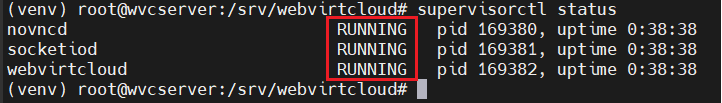

Thêm hostname vào file `host` trên máy và truy cập theo đường dẫn:

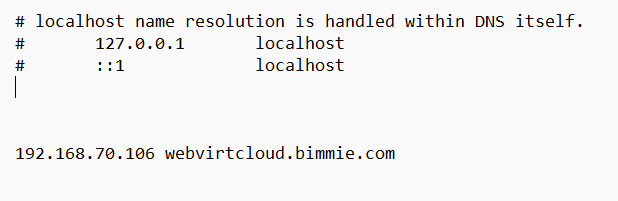

```bash
http://webvirtcloud.bimmie.com
```

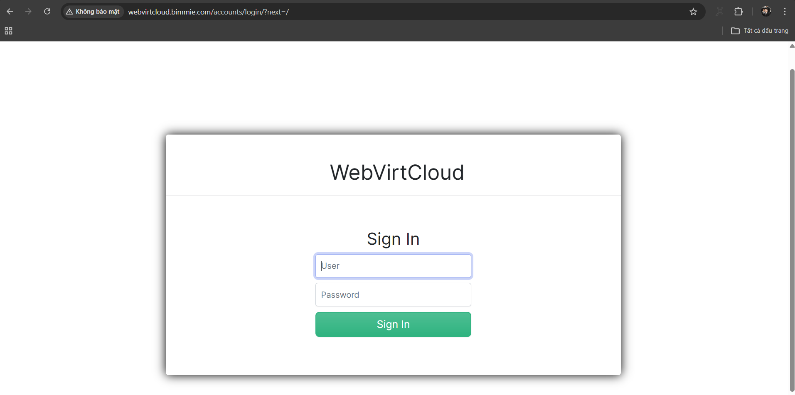

Đăng nhập bằng tài khoản mặc định:
- Username: `admin`
- Password: `admin`

### 2.4 Thay đổi password của admin

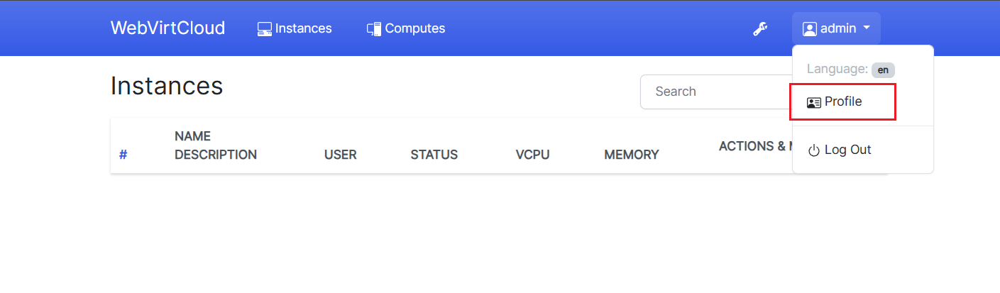


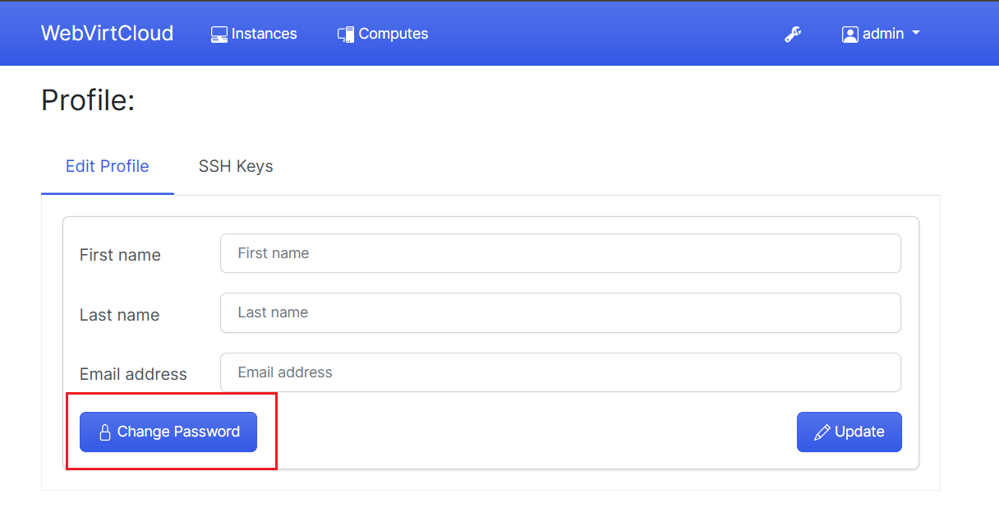

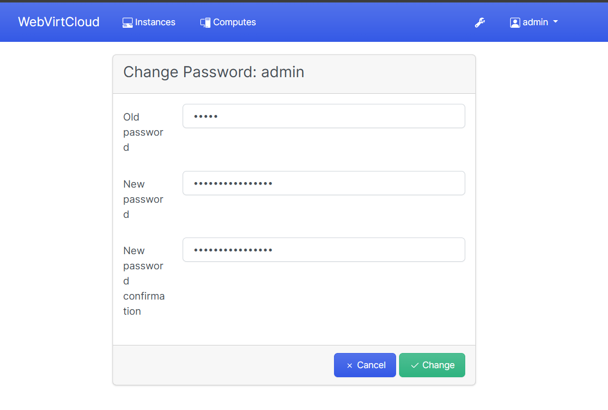

### 2.5 Add các nodes KVM

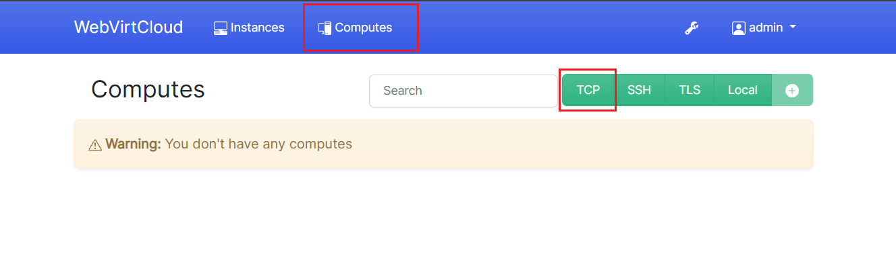

Chọn cách kết nối bằng TCP

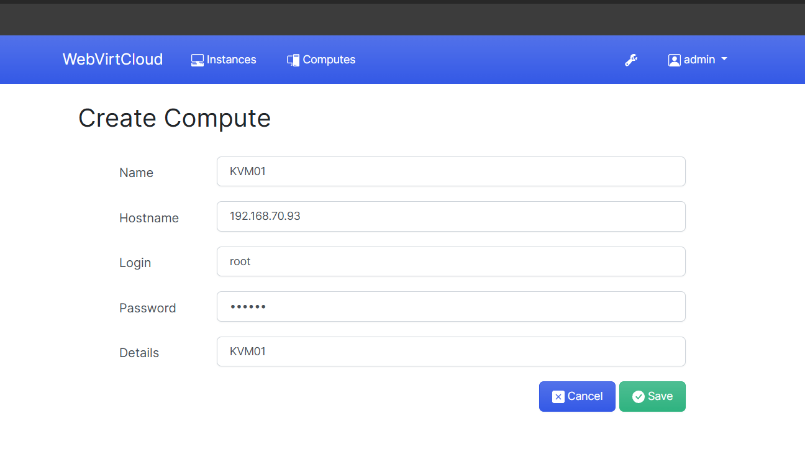

Khai báo thông tin TCP connect tới libvirt

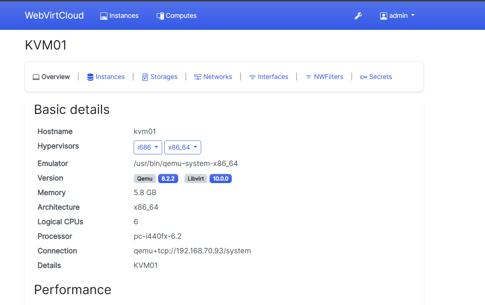

Ta có thể nhấp vào `instances` để xem các nodes KVM và các VM trên các nodes đó

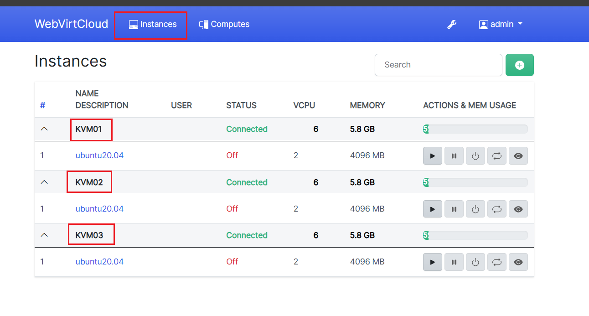

# Tài liệu tham khảo

[References 1](https://news.cloud365.vn/kvm-huong-dan-cai-dat-webvirtcloud-quan-li-ha-tang-kvm/)

[References 2](https://cloudspinx.com/manage-kvm-on-ubuntu-using-webvirtcloud/)