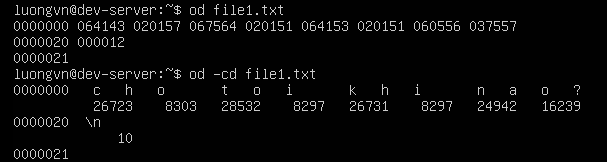
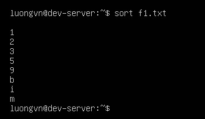
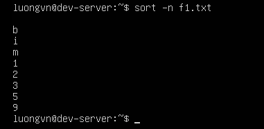
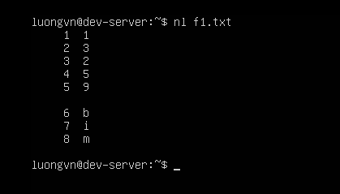
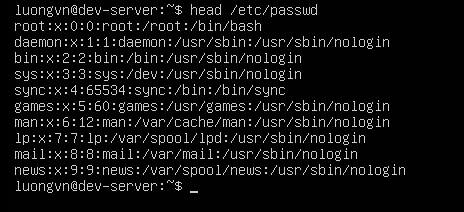
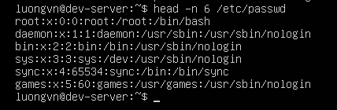
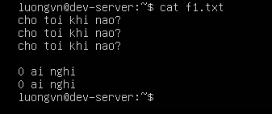
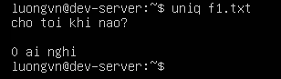
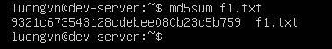
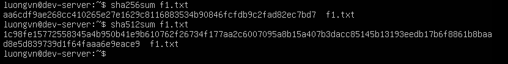

# PROCESSING TEXT USING FILTERS
## File-Combining Commands(Lệnh kết hợp tệp)

Trong Linux, nhiều lệnh dòng lệnh được thiết kế để xử lý và kết hợp các tệp văn bản. Một số công cụ phổ biến giúp nối, ghép hoặc trộn dữ liệu từ nhiều nguồn.

1) `cat` - hiển thị và ghép tệp:
- Dạng đơn giản nhất của lệnh xử lý văn bản.
- Dùng để hiển thị nộ dung tệp hoặc kết hợp nhiều tệp lại thành 1 tệp duy nhất.
```bash
cat file1 file2 > combined.txt
```
-> Kết hợp `file1` và `file2` thành `combined.txt`.
- Có thể dùng `cat -n` để đánh số dòng hoặc `cat -b` để chỉ đánh số dòng không trống.

2) `tac` - hiển thị ngược dòng
- Là phiên bản ngược của `cat`, hiển thị nội dung từ dưới lên trên:
```bash
tac file.txt
```

3) `paste` - ghép nội dung theo cột
- Dùng để kết hợp tệp theo chiều ngang (từng dòng của các tệp sẽ được nối song song).
```bash
paste file1 file2
```
-> Ghép hai tệp, ngăn cách bằng tab.

- Có thể đổi ký tự phân tách bằng `-d`, ví dụ:
```bash
paste -d "," file1 file2
```

## File-Transforming Commands(Lệnh chuyển đổi nội dung tệp)
1) `od`
- Sử dụng lệnh od để chuyển đổi file dạng text sang octal
- sử dụng thêm tùy chọn -cb sẽ hiển thị thông tin bổ sung



2) `hexdump` - Hiển thị dữ liệu nhị phân dưới dạng hexa.
3) `split` – Chia tệp lớn thành nhiều tệp nhỏ
- Cú pháp:
```bash
split [tùy chọn] <tệp_nguồn> [tên_cơ_sở]
```

- Ví dụ chia theo dòng:
```bash
split -l 3 /etc/passwd small_
```
→ Chia tệp /etc/passwd thành các tệp nhỏ, mỗi tệp chứa 3 dòng, đặt tên lần lượt small_aa, small_ab, small_ac, …

- Có thể chỉ định kích thước bằng byte, ví dụ:
```bash
split -b 1M largefile.bin part_
```

→ Mỗi tệp có dung lượng 1 MB.

## File-Formatting Commands(Lệnh định dạng tệp)
Sử dụng lệnh `sort` để sắp xếp đầu ra file theo thứ tự



Tùy chọn `-n` để sắp xếp theo thứ tự ngược lại



### Numbering with nl

Sử dụng lệnh `nl` để đánh số các dòng trong file



## File-Viewing Commands(Lệnh xem tệp)

Khi làm việc ở dòng lệnh (command line), việc xem nội dung các tập tin (files) là hoạt động thường xuyên.

- Với các tập tin nhỏ, lệnh cat đủ để hiển thị toàn bộ nội dung.

- Tuy nhiên, đối với các tập tin lớn, cần sử dụng các công cụ chuyên biệt hơn giúp xem từng phần hoặc di chuyển trong nội dung file.

### Sử dụng lệnh `more` và `less`
1) Lệnh `more`
- Chức năng: Xem nội dung tập tin theo từng trang.
- Cú pháp:
```bash
more [option] FILE [...].
```
- Phím thao tác:

  - `Spacebar`: Di chuyển xuống 1 trang.

  - `Enter`: Di chuyển xuống 1 dòng.

  - Không thể di chuyển ngược lại (chỉ tiến về trước).

  - `Q`: Thoát khỏi trình xem.

2) Lệnh `less`
- Linh hoạt hơn `more`, cho phép di chuyển cả tiến và lùi trong tập tin.
- Phím thao tác:

  - `Spacebar`: Di chuyển xuống 1 trang.

  - `↑` / `↓`: Di chuyển lên hoặc xuống 1 dòng.

  - `Esc + V`: Di chuyển lùi 1 trang.

  - `Q`: Thoát.

- Tìm kiếm trong file:

  - `/từ_khóa`: Tìm xuôi (forward).

  - `?từ_khóa`: Tìm ngược (backward).

### Xem phần đầu tệp tin với `head`
- Chức năng: Hiển thị phần đầu của file(mặc định 10 dòng đầu tiên).
- Cú pháp:
```bash
head [OPTION] FILE
```



- option `-n số dòng`: hiển thị số dòng mong muốn



### Xem phần cuối tệp tin với `tail`
- Chức năng: Hiển thị phần cuối của file(mặc định 10 dòng cuối).
- Cú pháp:
```bash
tail [OPTION] FILE
```
- Tùy chọn: 
 - `-n số dòng`: Hiển thị số dòng cuối mong muốn.
 - `-n +số_dòng`: Bắt đầu hiển thị từ dòng số n đến hết file.

- Ví dụ:
```bash
$ tail /etc/passwd         # 10 dòng cuối
$ tail -n 2 /etc/passwd    # 2 dòng cuối
$ tail -n +42 /etc/passwd  # từ dòng 42 trở đi
```

## File-Summarizing Commands(Lệnh tóm tắt tệp)
### Counting with wc
Lệnh `wc` (word count) là công cụ đơn giản và phổ biến nhất để đếm số lượng dòng, từ, và byte trong một tệp văn bản (text file).

- Cú pháp:
```bash
wc [OPTION] FILE
```
- Nếu không thêm tùy chọn nào, `wc` sẽ hiển thị 3 giá trị theo thứ tự:
1. Số dòng(lines)
2. Số từ(words)
3. Số byte(bytes)

Ví dụ:
```bash
$ wc random.txt
5 9 52 random.txt
$
```
→ File `random.txt` có 5 dòng, 9 từ, và 52 byte.

- Các option của `wc`:

|option|Chức năng|
|---|---|
|`-c`|Hiển thị số lượng byte trong file|
|`-L`|Hiển thị độ dài(theo byte) của dòng dài nhất|
|`-l`|Hiển thị số lượng dòng|
|`-m`|Hiển thị số lượng ký tự|
|`-w`|Hiển thị số lượng từ|

### Pulling out portions with cut
Khi cần trích xuất một phần dữ liệu nhỏ từ các tệp văn bản lớn, lệnh `cut` là công cụ hữu ích.

- Cú pháp:
```bash
cut [OPTION] FILE
```

Lệnh `cut` không chỉnh sửa file gốc, mà chỉ hiển thị phần dữ liệu được chọn ra màn hình.

- Ví dụ:
```bash
$ head -2 /etc/passwd
root:x:0:0:root:/root:/bin/bash
bin:x:1:1:bin:/bin:/sbin/nologin
$
$ cut -d ":" -f 1,7 /etc/passwd
root:/bin/bash
bin:/sbin/nologin
$
```

- File `/etc/passwd` có các trường được ngăn cách bởi dấu hai chấm (:).

- Tùy chọn:

  - `-d ":"` → chọn dấu phân cách là dấu hai chấm.

  - `-f 1,7` → lấy trường 1 (username) và trường 7 (shell).

- Kết quả: chỉ hiển thị tên người dùng và chương trình shell tương ứng.

### Discovering Repeated Lines with `uniq`

`uniq` là một công cụ dùng để phát hiện và xử lý các dòng trùng lặp (repeated lines) trong tệp văn bản (text file).

- Cú pháp:
```bash
uniq [OPTION] FILE
```





### Digesting an MD5 Algorithm

Kiểm tra tính toàn vẹn của file sử dụng hàm băm MD5

- Cú pháp:
```bash
md5sum FILE
```



### Securing Hash Algorithms
Thuật toán hàm băm an toàn (sha) cũng được sử dụng để xác minh tính toàn vẹn của file khi nó được sao chéo hoặc di chuyển sang 1 vị trí khác.

- Cú pháp:
```bash
sha256sum FILE

sha512sum FILE
```

