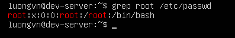
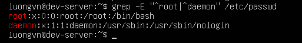
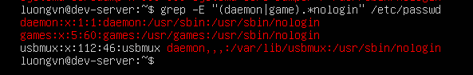

# USING REGULAR EXPRESSIONS
## Using `grep`
`grep` là công cụ tìm kiếm chuỗi trong một hoặc nhiều tệp văn bản

- Cú pháp:
```bash
grep [OPTION] PATTERN FILE
```
- PATTERN -> Từ khóa hoặc biểu thức muốn tìm



- Các option cơ bản:
  
|option|chức năng|
|---|---|
|`-c`|Chỉ hiển thị số lượng dòng khớp với mẫu|
|`-i`|Bỏ qua phân biệt chữ hoa thường|
|`-r`|Tìm đệ quy trong tất cả thư mục con|

## Understanding Basic Regular Expressions
### Regular Expression (Biểu thức chính quy) là gì?

Regular expression (viết tắt là regex) là một chuỗi ký tự đặc biệt dùng để tìm kiếm hoặc lọc mẫu (pattern) trong văn bản.

### Một số ký tự đặc biệt trong Basic Regular Expressions(BRE)
| Ký hiệu | Ý nghĩa                                     | Ví dụ                                             |
| ------- | ------------------------------------------- | ------------------------------------------------- |
| `.`     | Đại diện cho **một ký tự bất kỳ**           | `gr.p` khớp với `grep`, `grap`, `grxp`            |
| `.*`    | Đại diện cho **0 hoặc nhiều ký tự bất kỳ**  | `daemon.*nologin` khớp với `daemon:/sbin/nologin` |
| `^`     | Gắn pattern **vào đầu dòng**                | `^root` tìm các dòng bắt đầu bằng `root`          |
| `$`     | Gắn pattern **vào cuối dòng**               | `nologin$` tìm các dòng kết thúc bằng `nologin`   |
| `[ ]`   | Tạo **nhóm ký tự** cần khớp                 | `[aeiou]` tìm nguyên âm                           |
| `[A-Z]` | Tạo **phạm vi ký tự** (range)               | `[A-Z]` tìm chữ in hoa                            |
| `[^ ]`  | **Phủ định** – không chứa ký tự trong ngoặc | `[^0-9]` tìm dòng không chứa số                   |

### Ví dụ minh họa
- Tìm dòng chứa từ `daemon` và `nologin`
```bash
grep daemon.*nologin /etc/passwd
# Tìm các dòng có "daemon" rồi sau đó(ở cùng dòng) có "nologin"
```

- Tìm các dòng bắt đầu bằng `root`
```bash
grep ^root /etc/passwd

# root:x:0:0:root:/root:/bin/bash
```

- Tìm dòng chứa số trong File
```bash
grep [[:digit:]] random.txt

# [[:digit:]] là character class, tương đương với [0-9].
```

  File `random.txt`:
  ```bash
  42
  Flat Land
  Schrodinger's Cat
  0010 1010
  ```

  Kết quả:
  ```bash
  42
  0010 1010
  ```


## Understanding Extended Regular Expressions
### Extended Regular Expressions (EREs) là gì?
- ERE (Extended Regular Expression) mở rộng cú pháp của BRE (Basic Regular Expression),
cho phép tạo mẫu phức tạp hơn và dễ viết hơn.
- Để dùng ERE trong linux, dùng lệnh `grep -E`

### Các ký hiệu đặc trưng của ERE
| Ký hiệu | Ý nghĩa                             | Ví dụ                          |                           
|---|---|---|
| `+`     | Lặp **ít nhất một lần**             | `go+gle` khớp với “gogle”, “google”, “gooogle”, … |                                |                                |
| `?`     | Lặp **0 hoặc 1 lần**                | `colou?r` khớp với “color” và “colour”            |                                |                                |
| `{n,m}` | Lặp trong khoảng **từ n đến m lần** | `a{2,4}` khớp với “aa”, “aaa”, “aaaa”             |                                |                                |


### Ví dụ
- Tìm dòng bắt đầu bằng `root` hoặc `daemon`
```bash
grep -E "^root|^daemon" /etc/passwd
```



- Tìm dòng chứa `daemon` hoặc `game` và có chứa `nologin` trên cùng dòng
```bash
grep -E "(daemon|game).*nologin" /etc/passwd
```

