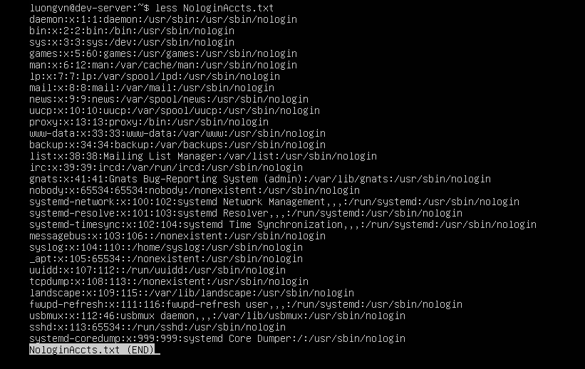
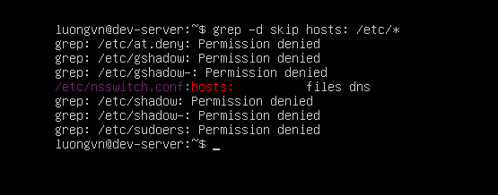
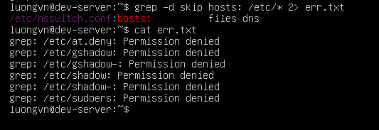
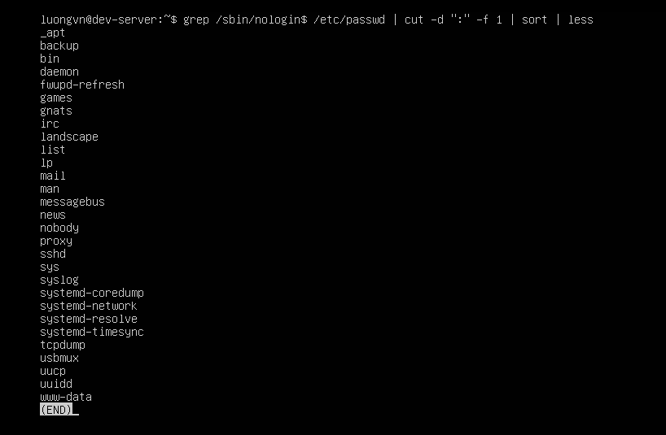
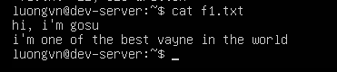
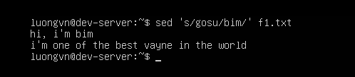
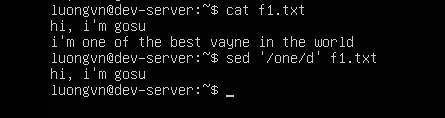
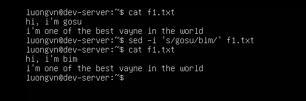
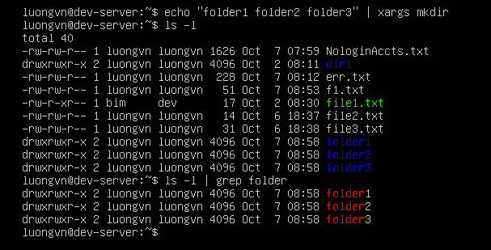

# USING STREAMS, REDIRECTION, AND PIPES
## Redirecting input and output
Khi làm việc ở command line (dòng lệnh), mỗi chương trình (command) trong Linux đều có:

- Input (đầu vào): thường là bàn phím (`stdin`)

- Output (đầu ra): thường là màn hình (`stdout`)

- Error output (lỗi): cũng hiển thị ra màn hình (`stderr`)

-> Tuy nhiên, Linux cho phép “redirect” — tức là chuyển hướng các luồng này sang tệp khác, hoặc sang lệnh khác.

### Handling standard output
Trong Linux, mọi thứ đều được xem là một file, kể cả:
- Dữ liệu nhập vào (input)
- Dữ liệu xuất ra (output)
- Thông báo lỗi (error)
  
Mỗi “file” mà tiến trình (process) làm việc với sẽ có một “file descriptor” — là số nguyên giúp hệ thống biết luồng nào là gì:
| File descriptor | Tên viết tắt | Chức năng                      | Mặc định đi đâu     |
| :-------------: | :----------- | :----------------------------- | :------------------ |
|        0        | STDIN        | Standard Input (đầu vào chuẩn) | Bàn phím            |
|        1        | STDOUT       | Standard Output (đầu ra chuẩn) | Màn hình (terminal) |
|        2        | STDERR       | Standard Error (thông báo lỗi) | Màn hình (terminal) |

- Ví dụ cơ bản - `echo` command
```bash
$ echo "Hello World"
Hello World
$
```
-> Lệnh `echo` in chuỗi ra STDOUT, nên thấy nó hiện trên màn hình.

- Chuyển hướng đầu ra chuẩn(Redirect STDOUT)
  - Có thể chuyển hướng (redirect) đầu ra sang file bằng toán tử `>` hoặc `>>`.
  - Ví dụ: Ghi đè `>`
    ```bash
    $ grep nologin$ /etc/passwd
    bin:x:1:1:bin:/bin:/sbin/nologin
    daemon:x:2:2:daemon:/sbin:/sbin/nologin
    […]

    $ grep nologin$ /etc/passwd > NologinAccts.txt
    ```
    - Ở đây:
      - `grep nologin$ /etc/passwd` lọc các dòng trong `/etc/passwd` có kết thúc bằng `nologin`

      - `>` chuyển hướng kết quả sang `file NologinAccts.txt`

      - File đó được tạo mới (hoặc ghi đè nếu đã tồn tại)

      - Không có gì hiện ra màn hình, vì output đã bị “chuyển hướng” sang file
    - Kiểm tra lại:
    
    

  - Ví dụ: Ghi nối thêm `>>`
    ```bash
    $ echo "Nov 16, 2019" > AccountAudit.txt
    $ wc -l /etc/passwd >> AccountAudit.txt
    $ cat AccountAudit.txt
    Nov 16, 2019
    44 /etc/passwd
    ````
    -> Giải thích:
    1. `>` tạo file mới `AccountAudit.txt` và ghi vào đó dòng `"Nov 16, 2019"`.
    2. `wc -l /etc/passwd` đếm số dòng trong `/etc/passwd`, cho ra `44 /etc/passwd`.
    3. `>>` nối thêm kết quả đó vào cuối file, không ghi đè phần cũ.

### Redirecting Standard Error
- Toán tử redirect STDERR:

|Toán tử|Tác dụng|Nếu file tồn tại|
|---|---|---|
|`2>`|Ghi lỗi vào file mới|Ghi đè|
|`2>>`|Ghi lỗi vào file có sẵn|Ghi nối thêm|

- Số 2 ở đây là file descriptor của STDERR.

#### Ví dụ minh họa 
Giả sự chạy lệnh:
```bash
$ grep -d skip hosts: /etc/*
```



-> Giải thích:
- `grep` đang tìm trong thư mục `/etc/` tất cả các file có chứa `hosts`:

- Nhưng bạn không có quyền đọc một số file, nên grep in ra lỗi “Permission denied”.

- Các lỗi đó đi ra STDERR, còn kết quả tìm thấy đi ra STDOUT.

- Cả hai đều đang cùng in trên màn hình ⇒ gây “rối”.

#### Redirect lỗi sang file riêng
```bash
$ grep -d skip hosts: /etc/* 2> err.txt
```
- `2>`: chuyển hướng STDERR (file descriptor 2)
- `err.txt`: file để chứa lỗi

Lúc này:
- Màn hình chỉ hiển thị kết quả hợp lệ tức là STDOUT
- File `err.txt` sẽ chứa các thông báo lỗi
  
Kiểm tra:



### Regulating Standard Input
Thay vì gõ dữ liệu từ bàn phím, ta có thể lấy dữ liệu từ 1 file và đưa vào chương trình thông qua STDIN bằng toán tử `<`.

- Ví dụ:
```bash
$ cat Grades.txt
89 76 100 92 68 84 73
$
$ tr " " "," < Grades.txt
89,76,100,92,68,84,73
```

Giải thích:
- File `Grades.txt` có chứa các số cách nhau bằng dấu cách (space).
- Lệnh `tr` (translate) được dùng để thay ký tự này bằng ký tự khác.
- Cú pháp:
```bash
tr "ký_tự_cũ" "ký_tự_mới" < tên_file
```

- Ở đây: `" "` → `","`, tức là đổi dấu cách thành dấu phẩy.

- Dấu `<` giúp lấy dữ liệu đầu vào từ file `Grades.txt`, thay vì bạn phải nhập bằng tay.

- Kết quả hiển thị ra màn hình (`STDOUT`), file gốc không thay đổi.

## Piping Data between Programs
### Pipe là gì?
- Pipe `|` là toán tử chuyển hướng đặc biệt trong linux
- Nó kết nối đầu ra STDOUT của một lệnh thành đầu vào STDIN của lệnh tiếp theo

### Cú pháp
```bash
COMMAND1 | COMMAND2 [| COMMAND3] ...
```
- `COMMAND1` chạy đầu tiên → tạo output (STDOUT)
- `COMMAND2` nhận output của command1 làm input (STDIN)
- Ta có thể xâu chuỗi nhiều lệnh liên tiếp.

Ví dụ:
```bash
$ grep /sbin/nologin$ /etc/passwd | cut -d ":" -f 1 | sort | less
```

Quá trình xử lý tuần tự:
| Bước | Lệnh                              | Kết quả trung gian                               |
| ---- | --------------------------------- | ------------------------------------------------ |
| 1️⃣  | `grep /sbin/nologin$ /etc/passwd` | Lọc ra các dòng user có shell là `/sbin/nologin` |
| 2️⃣  | `cut -d ":" -f 1`                 | Cắt cột đầu tiên (username) trong mỗi dòng       |
| 3️⃣  | `sort`                            | Sắp xếp danh sách username theo thứ tự alphabet  |
| 4️⃣  | `less`                            | Hiển thị kết quả phân trang dễ xem               |



Kết quả là một danh sách gọn gàng các username bị khóa shell đăng nhập.

## Using sed
`sed` là stream editor – một công cụ chỉnh sửa văn bản trực tiếp trong dòng dữ liệu (stream) mà không cần mở file trong trình soạn thảo như `vim` hay `nano`.

- Cú pháp:
```bash
sed [OPTION] [SCRIPT] FILE
```

- Ví dụ:
```bash
echo "I like cake." | sed 's/cake/donuts/'

# I like donuts
```

- Thay thế toàn bộ(global replacement):
  - Mặc định `sed` chỉ thay lần xuất hiện đầu tiên trong mỗi dòng.
  - Muốn thay đổi tất cả, thêm `g`(global):
  ```bash
  echo "I love cake and more cake." | sed 's/cake/donuts/g'

  # I love dounts and more donuts
  ```

- Sửa file:





- Xóa dòng có từ cụ thể:



- Nếu muốn thay đổi diễn ra trong file thêm option `-i`



## Generating Command Lines

Sử dụng `xargs` command để xây dựng và thực thi các lệnh từ đầu vào tiêu chuẩn.

Ví dụ: Tạo các thư mục `Folder1`, `Folder2`, `Folder3`:

