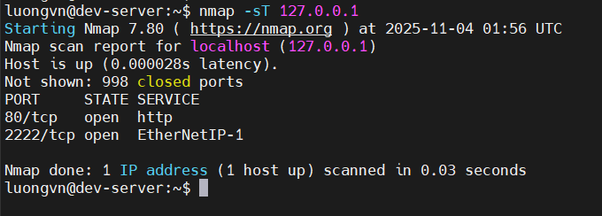
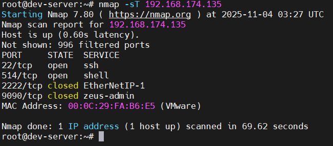
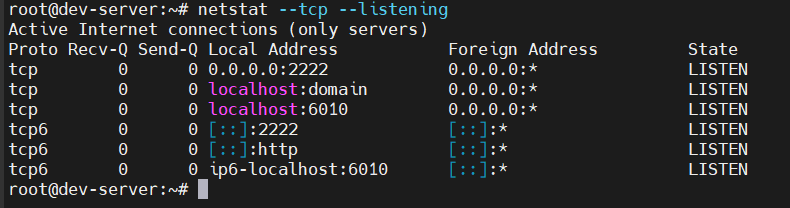
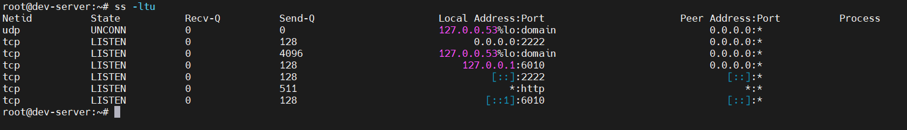
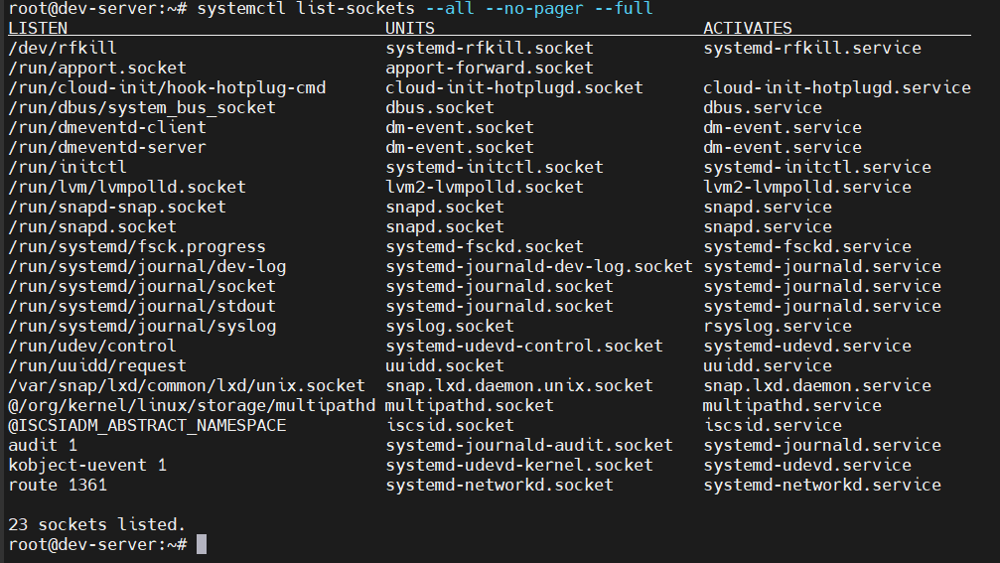
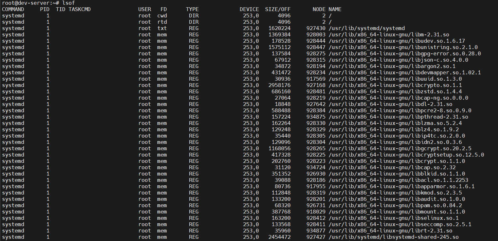
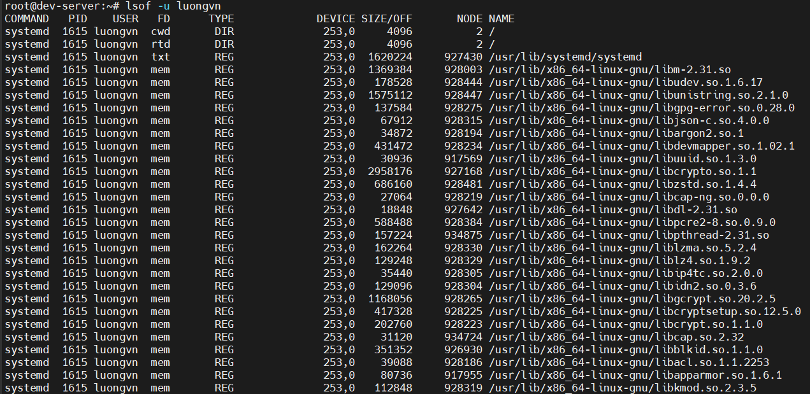
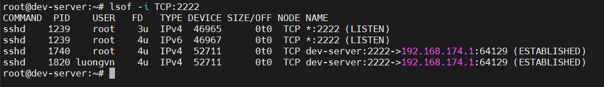
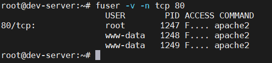

# ADMINISTERING NETWORK SECURITY

## Disabling Unused Services
- Ta có thể tắt các dịch vụ không cần thiết cho hệ thống

### Discovering Open Ports with `nmap`
- `nmap: network mapper` là lệnh để quét những cổng port trên mạng. Nó có thể quét nhiều máy chủ mạng từ xa

  - Xem TCP ports và dịch vụ trong firewall

    

      - `-sT`: scan TCP
  - Quét từ 1 máy trong mạng để xem firewall chặn những port nào

    

### Identifying Open Ports with `netstat`
- Xem các cổng TCP và dịch vụ bằng `netstat`

  

### Surveying Network Sockets via `ss` and `systemd.socket`

- Dùng `ss` để kiểm tra socket mạng đang lắng nghe(listening)

  

- Dùng `systemd.socket` để kiểm tra socket được quản lý bởi systemd

  


### Auditing Open Files with `lsof` and `fuser`
1. `lsof` - List open files
    - `lsof` hiển thị tất cả các file đang mở trên hệ thống

      

    - Muốn hiển thị các file đang mở của người dùng cụ thể dùng option `-u`

      

    - Để xem các tiến trình đang sử dụng 1 cổng cụ thể, dùng option `-i`

      

2) `fuser` - File User Identifier

    - `fuser` cho biết process nào đang sử dụng file, port, hoặc socket cụ thể
    - Hiển thị các PID sử dụng TCP và một cổng cụ thể:

      

### Disabling the Services
- Giảm attack surface bằng cách tắt những dịch vụ(network daemons) không cần thiết
- Ví dụ: nếu bạn không dùng FTP, thì nên tắt dịch vụ `vsftpd`; nếu không dùng SSH trên cổng 22, thì disable `sshd`.
- Dừng dịch vụ (nếu đang chạy):

  ```bash
  systemctl stop SERVICE-NAME
  ```

- Kiểm tra trạng thái:

  ```bash
  systemctl status SERVICE-NAME
  ```

- Tắt tự khởi động khi reboot:

  ```bash
  systemctl disable SERVICE-NAME
  ```

- Kiểm tra xem có thực sự bị disable chưa:

  ```bash
  systemctl is-enabled SERVICE-NAME
  ```

## Using Super Server Restrictions
## Restricting via TCP Wrappers
- TCP wrappers là một lớp bảo vệ mạng trung gian giữa client và service 
  - Nó kiểm tra IP hoặc hostname của máy đang cố kết nối
  - Dựa vào cấu hình trong 2 file 
    - `/etc/hosts.allow`
    - `/etc/hosts.deny`
  - Nếu dịch vụ hỗ trợ TCP Wrappers, nó sẽ liên kết thư viện libwrap khi biên dịch (compile) chương trình.
- Kiểm tra dịch vụ có hỗ trợ TCP wrappers không

  ```bash
  which sshd
  # -> /usr/sbin/sshd
  ldd /usr/sbin/sshd | grep libwrap
  ```

  - Nếu thấy dòng kiểu:

    ```bash
    libwrap.so.0 => /lib/x86_64-linux-gnu/libwrap.so.0 (0x00007f...)
    ```
    -> dịch vụ có hỗ trợ TCP Wrappers

- Cấu trúc dòng lệnh trong file:

  ```bash
  SERVICE: IPADDRESS[, IPADDRESS2, ...]
  ```

  ```bash
  sshd: 172.243.24.15, 172.243.24.16, 172.243.24.17
  ```
  
  -> Chỉ 3 địa chỉ IP này được truy cập SSH

  - Hoặc cho phép toàn mạng con:

    ```bash
    sshd: 172.243.24.
    ```

    -> Tất cả IP có dạng `172.243.24.x` đc phép SSH

- Thứ tự kiểm tra truy cập:
  - Hệ thống kiểm tra: `/etc/hosts.allow`: Nếu thấy địa chỉ IP -> cho phép ngay, ngừng ktra
  - Nếu không có trong allow -> kiểm tra `/etc/hosts.deny`: Nếu tìm thấy -> chặn kết nối
  - Nếu không thấy trong cả 2 file -> cho phép truy cập
- Chặn toàn bộ mặc định:
  - Để tránh việc ai không nằm trong danh sách cũng truy cập đc ta sửa `/etc/hosts.deny` như sau:

    ```bash
    ALL: ALL
    ```