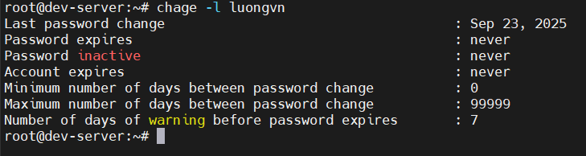
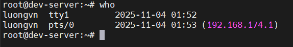
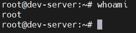
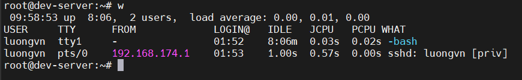
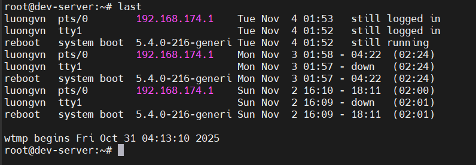

# ADMINISTERING LOCAL SECURITY
## Securing Passwords
- Tất cả các thông tin tài khoản (user) được lưu trong `/etc/passwd`
- Nhưng file này tất cả mọi người đều đọc được nên mật khẩu nằm ở đây rất nguy hiểm
- Do đó mật khẩu được di chuyển sang `/etc/shadow`, ko ai ngoài root có quyền đọc
- Muốn đổi mk ta phải dùng quyền `sudo`

### Dealing with Password Problems

- Sử dụng lệnh `chage` để kiểm tra lại thông tin tài khoản có bị hết hạn hay không

  

- Nếu tài khoản đã hết hạn, hãy sử dụng tùy chọn `-E` để đặt ngày hết hạn mới cho tài khoản.

## Limiting root Access
- Nguyên tắc quản lý tài khoản giúp tăng cường bảo mật hệ thống:
  - Không cho phép truy cập trực tiếp vào tài khoản root
  - Mỗi người chỉ dùng một tài khoản riêng
  - Đặt ngày hết hạn cho tài khoản tạm thời
  - Xóa các tài khoản không còn sử dụng

### Switching the User with `su`
- Lệnh `su` (switch user) dùng để chuyển sang tài khoản khác (thường là `root`) hoặc thực thi lệnh với quyền của tài khoản khác.
- `su -`: chuyển hẳn sang tk khác (thường là `root`). Trên Ubuntu, bị chặn mặc định, nên không đăng nhập root theo cách này.
- `su - <username>` -> chuyển sang người dùng khác

### Doing the Job as a Super User with `sudo`
- file cấu hình sudo chính: `/etc/sudoers` 
  - Không chỉnh sửa trực tiếp! Dùng lệnh `visudo` để chỉnh sửa an toàn.
  - Cú pháp cơ bản:

    ```bash
    USERNAME HOST=(USER:GROUP) COMMANDS
    ```

    ```bash
    root ALL=(ALL:ALL) ALL
    ```

    -> root có thể chạy bất kỳ lệnh nào, trên mọi host, với tư cách bất kỳ user/group nào.

  - Các dòng bắt đầu bằng `%` là nhóm người dùng:

    ```bash
    %sudo ALL=(ALL:ALL) ALL
    ```

    -> mọi người trong nhóm `sudo` đều có quyền `sudo`
- Thay vì chỉnh sửa trực tiếp `/etc/sudoers`, nên tạo file log riêng trong `/etc/sudoers.d/`
  - Dòng `#includedir /etc/sudoers.d` trong file chính cho phép load thêm các file con

## Auditing User Access
### Understanding the `who` and `w` Utilities
- Với lệnh `who`, ta có thể xem thông tin liên quan đến tài khoản của mình hoặc xem mọi người dùng hiện thại trên hệ thống.

  

- Để xem cửa sổ hiện tại sử dụng user nào, hãy sử dụng `whoami`

  

- Sử dụng lệnh `w` cũng có kết quả tương tự `who` nhưng nó mang nhiều thông tin hơn.

  

  | Cột        | Ý nghĩa                                                                            |
  | ---------- | ---------------------------------------------------------------------------------- |
  | **USER**   | Tên người dùng đang đăng nhập (`luongvn`)                                          |
  | **TTY**    | Loại terminal: `tty1` là đăng nhập trực tiếp (local console), `pts/0` là phiên SSH |
  | **FROM**   | Nơi đăng nhập đến: `-` là local, `192.168.174.1` là IP từ xa                       |
  | **LOGIN@** | Thời điểm đăng nhập (giờ:phút)                                                     |
  | **IDLE**   | Thời gian không hoạt động (idle) của người dùng                                    |
  | **JCPU**   | Thời gian CPU được dùng bởi tất cả tiến trình trong phiên                          |
  | **PCPU**   | Thời gian CPU được dùng bởi tiến trình hiện tại                                    |
  | **WHAT**   | Tiến trình hiện đang chạy, ví dụ: `-bash`, `sshd: luongvn [priv]`                  |

### Displaying Access History with the `last` Utility
- Lệnh `last` lấy thông tin từ file `/var/log/wtmp` và hiển thị danh sách các tài khoản hiển thị lần cuối cùng họ đăng nhập hoặc đăng xuất khỏi hệ thống.

  