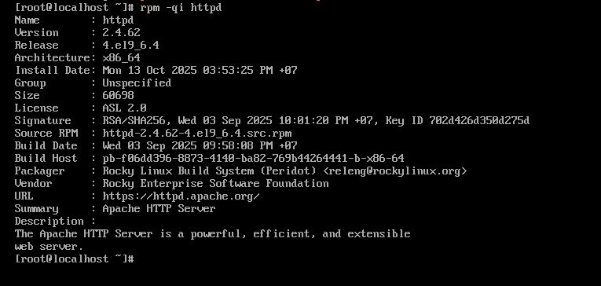
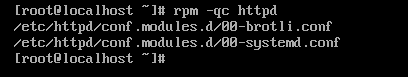
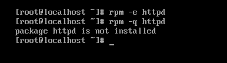
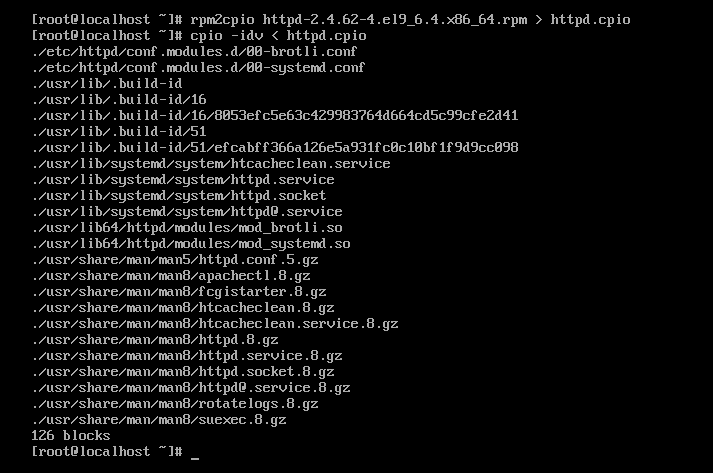

# USING RPM
Được phát triển bởi Red Hat, cho phép cài đặt, chỉnh sửa và gỡ bỏ các gói phần mềm.

## RPM Distributions and Conventions
### Cấu trúc tên file RPM:
File RPM có đuôi `.rpm` và tuân theo định dạng:
```pgsql
PACKAGE-NAME-VERSION-RELEASE.ARCHITECTURE.rpm
```
- **PACKAGE-NAME**: Tên gọi phần mềm(Ví dụ `emacs`) 
  
  Lưu ý: tên gói có thể khác nhau giữa các bản phân phối, và không nhất thiết trùng với tên chương trình.
- **VERSION**: Phiên bản của phần mềm, thể hiện các thay đổi lớn hơn so với các phiên bản cũ.

  Ví dụ: `1.13.1`.
- **RELEASE**: Số phát hành, thể hiện thay đổi nhưng nhỏ hơn so với version
- **ARCHITECTURE**: Kiến trúc CPU

  Ví dụ: `x86_64`: bộ xử lý 64 bit

### Loại gói RPM
Có hai loại gói RPM:
1) **Binary RPM**: Chứa chương trình đã biên dịch - dùng để cài đặt và chạy trực tiếp.
2) **Source RPM(SRPM)**: chứa mã nguồn, dùng để phân tích hoặc tùy chỉnh gói phần mềm.
          -> Gói SRPM có chữ `src` trong phần kiến trúc file.

## The rpm Command Set
### Công cụ chính `rpm`
- `rpm` là chương trình dòng lệnh dùng để cài đặt, gỡ bỏ và kiểm tra các gói phần mềm RPM.
- Cú pháp cơ bản:
  ```bash
  rpm ACTION [OPTION] PACKAGE-FILE
  ```
  -> Trong đó, ACTION là hành động bạn muốn thực hiện (cài đặt, gỡ, kiểm tra…). 

### Các ACTION phổ biến
| Viết tắt | Dạng đầy đủ | Mô tả                                                           |
| -------- | ----------- | --------------------------------------------------------------- |
| `-e`     | `--erase`   | Gỡ bỏ gói phần mềm đã cài đặt                                   |
| `-F`     | `--freshen` | Cập nhật gói **chỉ khi** hệ thống đã có phiên bản cũ hơn        |
| `-i`     | `--install` | Cài đặt gói được chỉ định                                       |
| `-q`     | `--query`   | Kiểm tra xem gói đã được cài đặt hay chưa                       |
| `-U`     | `--upgrade` | Cài đặt **hoặc nâng cấp** gói (nếu đã có phiên bản cũ hơn)      |
| `-V`     | `--verify`  | Xác minh xem các file của gói có còn đầy đủ và nguyên vẹn không |

### Installing and Updating RPM Packages
1) Điều kiện để sử dụng lệnh `rpm`
- Trước khi dùng lệnh `rpm`, phải cài đặt file `.rpm` đã tải về máy.
- Lệnh được dùng:
  - `rpm -i` -> cài đặt mới một gói phần mềm.
  - `rpm -U` -> cài đặt hoặc cập nhật nếu gói đã có sẵn.
  
2) Quyền thực thi(superuser privileges)
- Để cài đặt hoặc cập nhật phần mềm, bạn phải có quyền quản trị(root).
- Có thể:
  - Đặng nhập bằng tk root
  - Dùng lệnh `sudo`(nếu tk được cấp quyền này)
  
### Querying RPM Packages
Lệnh `rpm -q` - Truy vấn thông tin gói RPM

- Lệnh `rpm` với option `-q`(query) dùng để kiểm tra thông tin các gói phần mềm đã cài đặt trên hệ thống.

```bash
# rpm -q zsh
zsh-5.0.2-31.el7.x86_64
```
-> Có nghĩa là gói `zsh` đang được cài đặt với phiên bản `5.0.2-31`

Nếu gói chưa cài đặt, sẽ thấy:
```bash
# rpm -q docker
package docker is not installed
```

Thêm tùy chọn `-i` để xem chi tiết các gói



Xác định cấu hình của các gói đã cài đặt `-c`



### Verifying RPM Packages 
Lệnh kiểm tra tính toàn vẹn gón RPM
- Cú pháp:
```bash
rpm -V <tên_gói>
```
- Ví dụ:
```bash
rpm -V zsh
```
- Ý nghĩa:
  - Lệnh này so sánh thông tin hiện tại của các file với các thông tin gốc được ghi trong cơ sở dũ liệu của RPM khi cài đặt.
  - Nếu không có gì xuất ra -> mọi thứ đều nguyên vẹn
- Bảng mã phản hồi:

|  Ký hiệu  | Ý nghĩa                                       |
| :-------: | :-------------------------------------------- |
|    `?`    | Không thể kiểm tra được                       |
|    `5`    | Thay đổi giá trị *digest* (checksum SHA256)   |
|    `c`    | File cấu hình (config file)                   |
|    `D`    | Số thiết bị (major/minor) thay đổi            |
|    `G`    | Nhóm sở hữu (group) thay đổi                  |
|    `L`    | Liên kết (link path) thay đổi                 |
| `missing` | File bị mất                                   |
|    `M`    | Quyền truy cập (mode) hoặc loại file thay đổi |
|    `P`    | Quyền năng (capabilities) thay đổi            |
|    `S`    | Kích thước file thay đổi                      |
|    `T`    | Thời gian chỉnh sửa (timestamp) thay đổi      |
|    `U`    | Chủ sở hữu (user) thay đổi                    |

- Ví dụ:
```bash
# rpm -V zsh
.....UGT.   /bin/zsh
.......T. c /etc/zlogin
missing     c /etc/zprofile
```

- `/bin/zsh` -> UGT -> user thay đổi, group thay đổi, thời gian chỉnh sửa thay đổi
- `/etc/zlogin` -> chỉ thời gian chỉnh sửa thay đổi
- `/etc/zprofile` -> bị mất hoàn toàn(missing)

### Removing RPM Packages
Để xóa 1 gói đã cài đặt, sử dụng tùy chọn `-e`



## Extracting Data from RPMs
Giải nén tập `rpm` mà không cần cài đặt nó. Tiện ích `rpm` rất hữu ích trong những trường hợp này. Nó cho phép ta tạo 1 file mở rộng là `.cpio` để lưu trữ.

```bash
rpm2cpio httpd-2.4.62-4.el9_6.4.x86_64.rpm > httpd.cpio
```
- `rpm2cpio` là công cụ chuyển đổi định dạng `.rpm` -> `.cpio`

Giải nén file `cpio` ra thư mục hiện tại



- `-i`: copy-in mode (giải nén)

- `-d`: tạo thư mục con khi cần thiết

- `-v`: verbose — hiển thị chi tiết các file đang được giải nén

- `< httpd.cpio`: lấy dữ liệu đầu vào từ file cpio

### Quá trình hoạt động chi tiết
#### Khi chạy lệnh cài đặt gói `.rpm`
Ví dụ: 
```bash
sudo rpm -ivh httpd-2.4.62-4.el9_6.x86_64.rpm
```

Các script phổ biến trong quá trình hoạt động:

| Script     | Khi nào chạy                              | Mục đích                                   |
| ---------- | ----------------------------------------- | ------------------------------------------ |
| `%pre`     | Trước khi cài đặt (install/upgrade)       | Chuẩn bị môi trường, kiểm tra điều kiện    |
| `%post`    | Ngay sau khi cài đặt xong                 | Hoàn tất thiết lập, tạo service, thông báo |
| `%preun`   | Trước khi gỡ cài đặt                      | Dừng dịch vụ, sao lưu dữ liệu, dọn dẹp     |
| `%postun`  | Sau khi gỡ xong                           | Xóa tài nguyên tạm, log, user…             |
| `%trigger` | Khi một gói khác được cài/gỡ có liên quan | Dùng cho phụ thuộc phức tạp (hiếm dùng)    |


1) RPM mở file `.rpm`
- RPM giải nén phần header để lấy:
  - Tên gói
  - Phiên bản
  - Kiến trúc
  - Danh sách file cài đặt
  - Các script liên quan(`%pre`, `%post`, ...)

2) Kiểm tra phụ thuộc(dependencies)
- Trước khi cài, RPM sẽ:
  - Đọc trường `requires` trong file `.rpm`, cho biết gói này phụ thuộc vào những gói nào
  - So sánh với database các gói đã tải(ở `/var/lib/rpm/`)
  - Nếu thiếu, báo lỗi

3) Chạy script trước cài đặt

4) Giải nén file nội dung
RPM giải nén nội dung gói (dạng cpio archive) vào đúng vị trí trên hệ thống:

| Loại file          | Nơi cài                      |
| ------------------ | ---------------------------- |
| Binary executables | `/usr/bin`, `/usr/sbin`      |
| Libraries          | `/usr/lib` hoặc `/usr/lib64` |
| Config files       | `/etc/...`                   |
| Documentation      | `/usr/share/doc/...`         |

5) Ghi thông tin vào CSDL hệ thống RPM
- Thư mục lưu: `/var/lib/rpm/`
- Chứa các file như:
```pgsql
Packages
Name
Basenames
Group
Installtid
```
- Các file này lưu:
  - Gói nào đã xcafi
  - phiên bản, kiến trúc
  - file thuộc về gói nào
  -> Hỗ trợ chạy các option

6) Chạy script sau cài đặt

#### Khi chạy lệnh gỡ gói `.rpm`

Ví dụ: 
```bash
sudo rpm -e httpd
```

1) RPM đọc db hệ thống
- RPM mở CSDL hệ thống tại `/var/lib/rpm/`
- Đọc file packages, name, ...:
  - Xác định gói tồn tại không
  - Biết được gói ở phiên bản nào, kiến trúc nào
  - Lấy danh sách file mà gói đã cài lên hệ thống
- Nếu không tìm thấy -> báo lỗi

2) Kiểm tra phụ thuộc
- Trước khi xóa, RPM kiểm tra xem có gói nào khác đang phụ thuộc vào gói này không.
  - Đọc trường `provides` của gói cần xóa, để xem các gói phụ thuộc vào gói cần xóa này
  - So sánh trường `requires` của các gói khác trong db
  - Nếu có gói khác phụ thuộc -> báo lỗi

3) Chạy script `%preun`
- Nếu trong spec file có phần `%preun`, RPM sẽ thực thi script này trước khi xóa file.
- Dùng để:
  - Dừng dịch vụ đang chạy
  - Lưu trạng thái hoặc dũ liệu tạm thời
  - Báo cáo cho hệ thống rằng gói chuẩn bị bị gỡ

4) Gỡ bỏ các file được cài
- RPM tra danh sách file của gói trong database (`/var/lib/rpm/Packages`)
→ Xóa từng file một theo danh sách.
  
5) Cập nhật lại db RPM
- RPM cập nhật db hệ thống để phản ánh thay đổi:
  - Xóa metadata của gói khỏi các bảng:
    ```pgsql
    Packages
    Basenames
    Dirnames
    Providename
    Requirename
    ```
6) Chạy script `%postun`
- Dọn dẹp dữ liệu, user
- Xóa file còn sót
- Gỡ kích hoạt dịch vụ khỏi hệ thống

#### Khi chạy lệnh update gói `.rpm`
Ví dụ:
```bash
sudo rpm -Uvh httpd-2.4.62-4.el9_6.x86_64.rpm
```

1) RPM mở file `.rpm` mới:
- RPM sẽ mở gói mới và giải nén phần header để lấy thông tin:

  - Tên gói (`Name`)

  - Phiên bản (`Version`, `Release`)

  - Kiến trúc (`Arch`)

  - Danh sách file (payload list)

  - Script liên quan (`%pre`, `%post`, `%preun`, `%postun`, `%pretrans`, `%posttrans`)

2) Kiểm tra db hệ thống:
- RPM đọc CSDL tại `/var/lib/rpm/`(các file như `Packages`, `Name`, ...)
- Kiểm tra xem có gói cùng tên đã được cài hay chưa
- Nếu chưa -> RPM xử lý như cài một cái mới.
- Nếu đã có -> RPM xác định đây là một bản nâng cấp, và chuẩn bị chạy các script tương ứng.

3) Kiểm tra phụ thuộc
- Trước khi nâng cấp, RPM sẽ:
  - Đọc trường `requires` của gói mới
  - Đọc trường `provides` của hệ thống
  - So sánh để đảm bảo tất cả phụ thuộc của bản mới đều có sẵn
- Nếu thiếu -> báo lỗi

4) Chạy script `%preun` của gói cũ
- Khi chuẩn bị thay thế gói cũ, RPM chạy script `%preun` của phiên bản đang cài.
- Với biến `$1 = 1`, thể hiện rằng đang update, không phải gỡ hoàn toàn

5) Giải nén file nội dung của gói mới.

| Loại file           | Nơi cài                                                   | Hành động           |
| ------------------- | --------------------------------------------------------- | ------------------- |
| Binary              | `/usr/bin`, `/usr/sbin`                                   | Ghi đè phiên bản cũ |
| Library             | `/usr/lib`, `/usr/lib64`                                  | Thay thế bản cũ     |
| Config (`/etc/...`) | Ghi mới nếu chưa bị chỉnh sửa, nếu khác thì lưu `.rpmnew` |                     |
| Tài liệu            | `/usr/share/doc/...`                                      | Cập nhật            |
6) Cập nhật db `/var/lib/rpm/`
RPM cập nhạt thôgn tin của gói mới vào CSDL

7) Chạy `%postun` của gói cũ để dọn dẹp dư liệu của gói cũ

## Using YUM
### Hạn chế của `rpm`:
- Người dùng tự tìm các gói phần mềm muốn cài.
- Nếu một gói phụ thuộc vào gói khác, phải tự tải và cài theo đúng thứ tự -> bất tiện.

### Sự ra đời của `repository`
- Mỗi bản phân phối Linux có một kho (repository) 
- Nhờ có repository, người dùng có thể tải và cài đặt phần mềm chỉ bằng một lệnh, hệ thống sẽ tự động xử lý các phụ thuộc.

### Giới thiệu về `YUM`
- YUM(Yellowdog Update Manager) là công cụ trung tâm dùng cho hệ thống Red Hat và các distro
- Cung cấp lệnh `yum` để truy vấn, cài đặt, cập nhật và gỡ bỏ gói phần mềm trực tiếp từ repository.

### Cú pháp cơ bản của `yum`
```bash
yum [OPTION] [COMMAND] [PACKAGE...]
```

1) Kiểm tra các cập nhật

- Kiểm tra các gói nào đã cài đặt đang có sẵn phiên bản cập nhật
```bash
[root@localhost ~]# yum check-update
```

- Cập nhật tất cả các gói đã cài đặt
```bash
[root@localhost ~]# yum update
```

- Cập nhật một gói cụ thể hoặc 1 phiên bản cụ thể của gói

```bash
[root@localhost ~]# yum update [tên gói]
```

2) Cài đặt gói
- Cài đặt 1 gói hoặc phiên bản cụ thể của gói
```bash
[root@localhost ~]# yum install [gói]
```

- Cài đặt gói mà không cần xác nhận
```bash
[root@localhost ~]# yum -y install [gói]
```

3. Liệt kê gói
- Để tìm kiếm 1 gói cụ thể ta dùng list
```bash
[root@localhost ~]# yum list [gói]
```
4. Xem thông tin gói
- Để biết thông tin 1 gói trước khi ta cài đặt nó, ta sử dụng info
```bash
[root@localhost ~]# yum info [gói]
```
5. Xóa gói bằng yum
- Lệnh này sẽ xóa gói được chỉ định cùng với tất cả các phụ thuộc của nó
```bash
[root@localhost ~]# yum remove [tên gói]
```

### Hoạt động chi tiết
#### Khi cài đặt gói bằng `yum`
Ví dụ:
```bash
yum install httpd
```

1) YUM kiểm tra và tải metadata của repo
- Nó lấy thông tin gói từ các repository cấu hình trong:
```bash
/etc/yum.repos.d/*.repo
```
- Mỗi repo chứa:
  - Danh sách gói
  - Phụ thuộc
  - Nguồn tải

2) Yum tìm thông tin tương ứng như:
- Tên file `.rpm` tương ứng

3) Giải quyết phụ thuộc
- YUM có trình giải quyết phụ thuộc tự động
- So sánh giữa:
  - Gói cần tải(`Requires`)
  - Các gói hiện có trong hệ thống(`/var/lib/rpm/`)
- Nếu thiếu gói nào -> YUM tự động chọn thêm để cài
- Ví dụ:
```bash
Requires: libaprutil-1.so.0()(64bit)
→ YUM tìm thấy trong gói apr-util
→ Thêm apr-util vào danh sách tải
```

4) Tải gói về
- Sau khi giải quyết xong phụ thuộc, YUM tải các file `.rpm` cần thiết về thư mục cache:
```bash
/var/cache/yum/<repo-name>/packages/
```
- Lúc này mới có file `.rpm` thật trong máy.

5) Gọi RPM để thực hiện cài đặt
- YUM không tự giải nén hay ghi file, mà gọi RPM làm việc đó
- Với mỗi gói, YUM chạy ngầm tương đương:
```bash
rpm -Uvh package.rpm
```

6) Cập nhật CSDL YUM
- Cập nhật db trong `/var/lib/yum/`

#### Khi xóa gói bằng `yum`
Ví dụ:
```bash
yum remove httpd
```

1) Người dùng ra lệnh:
- `yum remove <gói>` yêu cầu YUM gỡ bỏ gói khỏi hệ thống
- Người dùng chỉ cần tên gói logic(`httpd`) không cần đường dẫn `.rpm`

2) Xác định gói cần xóa:
- Mở CSDL RPM nội bộ tại `/var/lib/rpm/`
- Đọc file `packages` để xác định chính xác tên - phiên bản - kiến trúc của gói.
- Ví dụ: `httpd-2.4.62-4.el9_6.x86_64`
-> Nếu nhiều phiên bản tồn tại, YUM sẽ hỏi hoặc chọn bản mới nhất.


3) Giải quyết phụ thuộc
- YUM tra cứu toàn bộ gói đang cài(trong `/var/lib/rpm/`) để xem:
  - có gói nào phụ thuộc vào `httpd` không?
- Nếu có:
  - YUM sẽ hiên thị danh sách và hỏi xác nhận
  - Nếu chọn `y`, YUM sẽ xóa luôn cả các gói phụ thuộc đó.

4) Gọi RPM để thực hiện xóa:
tương đương lệnh:
```bash
rpm -e httpd
```
-> Nó sẽ cập nhật lại db của rpm tại `/etc/lib/rpm/`

5) Cập nhật lại db YUM
- Cập nhật lại tại `/etc/lib/yum/`


#### Khi update bằng `yum`
Ví dụ: 
```bash
yum update [package]
```

1) Cập nhật metadata repo
- Liên hệ với các repository được khai báo trong `/etc/yum.repos.d/*.repo`
- Tải metadata mới nhất từ các repo.
- Metadata sau khi tải về được lưu tạm tại:`/var/cache/yum/<repo-name>/`

2) So sánh phiên bản giữa repo và RPM db
- Đối chiếu dữ liệu của: `/var/lib/rpm/` và `/var/cache/yum/<repo>/`
- Xác định những gói có phiên bản mới trong repo

3) Giải quyết phụ thuộc
- Tất cả gói phụ thuộc vẫn thỏa mãn
- Nếu gói mới "thay thế" 1 gói khác, YUM sẽ tự động gỡ gói cũ

4) Gọi RPM để thực hiện cập nhật
- Tương đương lệnh:
```bash
rpm -Uvh httpd-2.4.62-4.el9_6.x86_64.rpm
```
- cập nhật lại db RPM `/var/lib/rpm/`

5) Cập nhật lại db YUM `/var/lib/yum/`