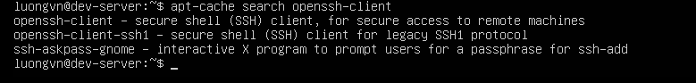
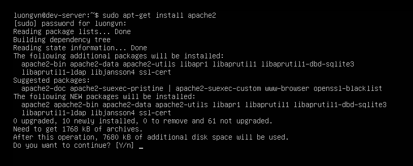

# USING DEBIAN PACKAGES
Debian được sử dụng chủ yếu trên các bản phân phối linux dựa trên Debian, chẳng hạn như Ubuntu.

## Debian Package File Conventions
Các ứng dụng trong Debian được đóng gói trong một file có phần mở rộng `.deb`, với cấu trúc tên:
```pgsql
PACKAGE-NAME-VERSION-RELEASE_ARCHITECTURE.deb
```
-> Cấu trúc này tương tự như định dạng `.rpm` của Red Hat.

## The `dpkg` Command Set
1) Giới thiệu:
- `dpkg` là công cụ dòng lệnh chính để làm việc với các gói Debian(`.deb`).
- Cho phép cài đặt, cập nhật, xem thông tin, gỡ bỏ gói phần mềm.
- Cú pháp:
```bash
dpkg [OPTION] ACTION PACKAGE-FILE
```

2) Các hành động (ACTION) thường dùng
  
| Short | Long               | Mô tả                                |
| ----- | ------------------ | ------------------------------------ |
| `-c`  | `--contents`       | Xem nội dung gói                     |
| `-C`  | `--audit`          | Tìm gói bị hỏng và gợi ý cách sửa    |
| —     | `--configure`      | Cấu hình lại gói đã cài              |
| —     | `--get-selections` | Liệt kê các gói hiện đang cài        |
| `-i`  | `--install`        | Cài hoặc nâng cấp gói                |
| `-I`  | `--info`           | Xem thông tin gói chưa cài           |
| `-l`  | `--list`           | Liệt kê các gói đã cài phù hợp mẫu   |
| `-L`  | `--listfiles`      | Liệt kê file thuộc gói               |
| `-p`  | `--print-avail`    | Xem thông tin gói đã cài             |
| `-P`  | `--purge`          | Gỡ hoàn toàn gói (kèm file cấu hình) |
| `-r`  | `--remove`         | Gỡ gói nhưng giữ lại file cấu hình   |
| `-s`  | `--status`         | Hiển thị trạng thái gói              |
| `-S`  | `--search`         | Tìm gói sở hữu một file cụ thể       |

3) Trước khi dùng `dpkg`:
- Cần tải gói `.deb` về hệ thống trước.
- Các gói này có thể lấy từ web chính thức hoặc kho lưu trữ của distro

4) Xem thông tin gói chưa cài (`-I`)
```bash
dpkg -I zsh_5.4.2-3ubuntu3.1_amd64.deb
```
→ Hiển thị thông tin như: tên gói, phiên bản, kiến trúc, người duy trì, phụ thuộc (Depends), đề xuất (Recommends), mô tả, trang chủ,...

5) Xem nội dung trong gói(`--contents`)
- Dùng dpkg `--contents package.deb` để xem danh sách file.

- Có thể pipe qua `less` để đọc dễ hơn:
  ```bash
  dpkg --contents zsh_5.4.2-3ubuntu3.1_amd64.deb | less
  ```

6) Cài đặt gói(`-i`):
```bash
sudo dpkg -i zsh_5.4.2-3ubuntu3.1_amd64.deb
```

7) Xem trạng thái gói(`-s`)
```bash
dpkg -s zsh
```

8) Liệt kê tất cả gói đã cài (`-l`):
```bash
dpkg -l
```
→ Kết quả có mã trạng thái ở cột đầu tiên:

  - `ii` → đã cài hoàn chỉnh

  - `iU` → gói được cài nhưng chưa cấu hình xong (thường do thiếu phụ thuộc)

9) Gỡ gói (`-r` và `-P`):
- Gỡ nhưng giữ cấu hình:
```bash
sudo dpkg -r zsh
```
- Gỡ hoàn toàn:
```bash
sudo dpkg -P zsh
```
-> Xóa cả gữ liệu và file cấu hình.

## Using apt-cache
`apt-cache` không cài hay gỡ phần mềm, nó chỉ tra cứu thông tin về các gói: tên, phiên bản, ...

- Các lệnh quan trọng của `apt-cache`

| Câu lệnh                  | Mô tả                                                               | Ví dụ                              |
| ------------------------- | ------------------------------------------------------------------- | ---------------------------------- |
| `apt-cache pkgnames`      | Hiển thị **toàn bộ gói cài đặt trên hệ thống**                      | `apt-cache pkgnames \| grep ^nano` |
| `apt-cache search <tên>`  | Tìm các gói có từ khóa trong tên/mô tả                              | `apt-cache search zsh`             |
| `apt-cache showpkg <tên>` | Xem thông tin chi tiết về gói (phiên bản, phụ thuộc, gói liên quan) | `apt-cache showpkg zsh`            |
| `apt-cache depends <tên>` | Liệt kê **các gói phụ thuộc (dependencies)** của gói đó             | `apt-cache depends zsh`            |
| `apt-cache stats`         | Thống kê tổng quát kho gói (bao nhiêu gói, kích thước, v.v.)        | `apt-cache stats`                  |
| `apt-cache unmet`         | Liệt kê các **phụ thuộc chưa được thỏa mãn** (unmet dependencies)   | `apt-cache unmet`                  |



## Using apt-get
- `apt-get` là trình quản lý gói chính trong APT (Advanced Package Tool).

- Dùng để tương tác trực tiếp với kho phần mềm (repository): tải, cài, cập nhật, xóa.

- Các lệnh quan trọng của `apt-get`

| Lệnh                      | Ý nghĩa                                                         | Ghi nhớ nhanh            |
| ------------------------- | --------------------------------------------------------------- | ------------------------ |
| `apt-get update`          | Cập nhật **danh sách gói** trong hệ thống (chưa cài gì cả)      |  Làm mới “danh bạ gói” |
| `apt-get install <gói>`   | Cài đặt gói (và các gói phụ thuộc nếu cần)                      |  Cài phần mềm          |
| `apt-get remove <gói>`    | Gỡ gói nhưng **giữ lại file cấu hình**                          |  Gỡ nhẹ                |
| `apt-get purge <gói>`     | Gỡ gói **và xóa luôn cấu hình**                                 |  Gỡ sạch               |
| `apt-get upgrade`         | Cập nhật tất cả gói đang cài lên **phiên bản mới nhất an toàn** | ⬆ Cập nhật cơ bản       |
| `apt-get autoclean`       | Xóa các file `.deb` tải về **đã cũ**                            |  Dọn tệp cũ            |
| `apt-get clean`           | Xóa **toàn bộ cache tải về**                                    |  Dọn sạch cache        |
| `apt-get check`           | Kiểm tra **lỗi trong cơ sở dữ liệu gói**                        |  Kiểm tra hệ thống     |
| `apt-get source <gói>`    | Tải **mã nguồn (source code)** của gói                          |  Dành cho dev          |

