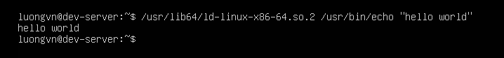
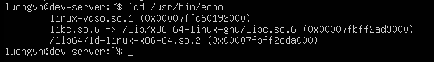

# MANAGING SHARED LIBRABRIES
## Library Princibles
- Library là tập hợp các hàm (functions) được nhiều chương trình dùng chung
- Hai loại thư viện trọng Linux:

| Loại               | Phần mở rộng | Nạp khi nào   | Đặc điểm                                         |
| ------------------ | ------------ | ------------- | ------------------------------------------------ |
| **Static Library** | `.a`         | Khi biên dịch | Mã được chép vào file chương trình, chạy độc lập |
| **Shared Library** | `.so`        | Khi chạy      | Nhiều chương trình dùng chung, tiết kiệm bộ nhớ  |

- Quy ước đặt tên:
```bash
lib<libraryname>.so.<version>
```
Ví dụ: `libm.so.6`, `libc.so.6`

- Vị trí:
`/lib`, `/usr/lib`, `/usr/local/lib`, `/lib64`

- Lệnh hữu ích:
```bash
ldd <program>      # xem chương trình dùng thư viện nào
ldconfig -p        # liệt kê thư viện trên hệ thống
```

## Locating Library Files
Khi chương trình cần dùng hàm trong thư viện chia sẻ(shared library), hệ thống sẽ tìm thư viện đó theo thứ tự sau:

1) Các thư mục được khai báo trong biến môi trường `LD_LIBRARY_PATH`

2) Các thư mục trong `PATH` của chương trình

3) Thư mục cấu hình `/etc/ld.so.conf.d/`

4) File cấu hình `/etc/ld.so.conf`

5) Các thư mục hệ thống: `/lib*`/, `/usr/lib*/`

- Ý nghĩa các thư mục:
  - `/lib*/` -> chứa thư viện cho các tiện ích hệ thống(trong `/sbin/`, `/bin`)
  - `/usr/lib*/` -> chứa thư viện cho các phần mềm người dùng

## Loading Dynamically
- Khi chạy một chương trình, dynamic linket(ld-linux.so) sẽ:

1) Tìm các thư viện chia sẻ(.so) mà chương trình cần.
2) Nạp chúng vào bộ nhớ
3) Liên kết với chương trình đẻ chạy được

- Dynamic linker thường nằm ở:
`/usr/lib64/ld-linux-x86-64.so.2`

- Ví dụ:


## Library Management Commands
### Managing the Library Cache
- Library cache là bộ nhớ tạm chứa danh sách tất cả các thư viện động (.so) trên hệ thống và đường dẫn của chúng.

- Hệ thống dùng cache này để tìm thư viện nhanh hơn khi chạy chương trình (thay vì phải tìm khắp nơi).

- Khi bạn thêm thư viện mới, cache này phải được cập nhật — thực hiện bằng lệnh: `sudo ldconfig`

### Troubleshooting Shared Library Dependencies
- `ldd` là công cụ giúp kiểm tra các thư viện động(`.so`) mà một chương trình cần để chạy.
- Dùng khi ứng dụng báo lỗi thiếu thư viện(missing shared library).

- Cách dùng:
```bash
ldd /đường_dẫn_đến_chương_trình
```
- Ví dụ
```bash
ldd /usr/bin/echo
```

