# MANAGING PROCESS
## Examining Process Lists

### Viewing Processes with ps

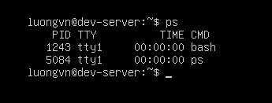

Xem mọi tiến trình chạy trên hệ thống sử dụng option `-ef`:

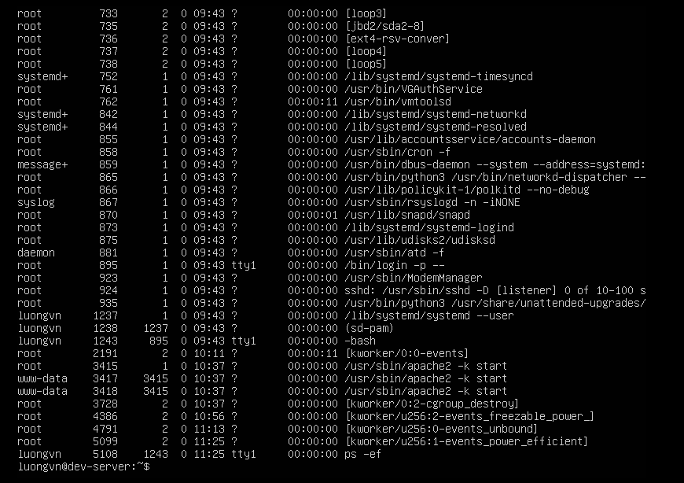

- `UID`: Người dùng chạy tiến trình
- `PID`: ID của tiến trình
- `PPID`: ID của tiến trình mẹ nếu nó được sinh ra từ tiến trình khác
- `C`: mức sử dụng CPU trong suốt vòng đời của tiến trình
- `TIME`: Thời gian hệ thống bắt đầu tiến trình
- `TTY`: Thiết bị đầu cuối mà từ đó tiến trình được bắt đầu
- `TIME`: Thời gian chuẩn bị cpu cần thiết để chạy tiến trình
- `CMD`: Tên chương trình bắt đầu tiến trình này

### Understanding Process States 
Linux chia tiến trình thành các trạng thái như `running`, `sleeping` (`interruptible`/`uninterruptible`) và `zombie` để quản lý việc chờ đợi tài nguyên và xử lý tín hiệu hiệu quả hơn.

1) `Sleeping(ngủ)`:
- Tiến trình bị "hoán đổi" (swapped) vào bộ nhớ ảo và tạm dừng hoạt động, chờ một sự kiện xảy ra.
- Ví dụ: Chường trình chờ người dùng nhập dữ liệu, hoặc chờ ổ cứng phản hồi
2) `Interruptible Sleep`:
- Tiến trình có thể bị đấnh thức ngay khi nhận tín hiệu từ `kernel` 
- Dạng ngủ "linh hoạt", có thể thức dậy bất cứ lúc nào có sự kiện.
3) `Uninterruptible Sleep`:
- Tiến trình không thể bị đánh thức bằng tín hiệu thông thường.
- Chỉ tỉnh dậy khi sự kiện phần cứng hoặc tài nguyên mà nó chở đợi đã sẵn sàng.
4) `Zombie`:
- Tiến trình đã kết thúc, nhưng tiến trình cha chưa ghi nhận (acknowledge) việc đó.
- Vì vậy nó vẫn tồn tại trong bảng tiến trình ở trạng thái “xác sống” — không chạy, không bị xóa, chỉ chờ cha “chôn”.

### Selecting Processes with ps 
Xem process của user:

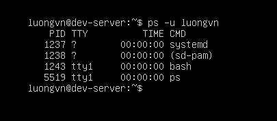

- Phân biệt `real user` và `effective user`:
  - `Real user`(UID): Người thật sự đăng nhập vào hệ thống
  - `Efective user`(EUID): người hoặc quyền mà tiến trình đang chạy dưới định danh của họ
    -> Ví dụ: lệnh `passwd` chạy với quyền root dù đang ở user thường.
    -> Nếu muốn chắc chắn thấy toàn bộ tiến trình của 1 user, nên dùng:
    ```bash
    ps -u username -U username
    ```

### Viewing Processes with top
Sử dụng lệnh top để có thểm thông tin về các tiến trình đang chạy, nó được update real-time

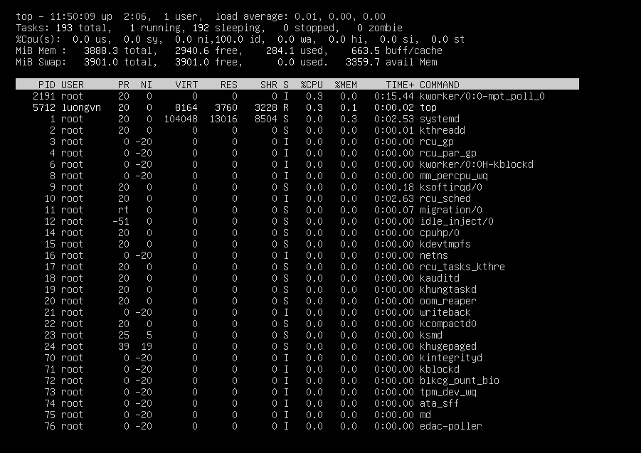

Sử dụng lệnh `free -h` để xem trạng thái ram của hệ thống

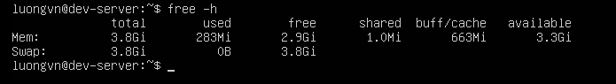

## Employing Multiple Screens

`screen` command cho phép tạo cửa sổ làm việc. Khi đăng nhập ssh vào linux, hãy gõ `screen`, 1 cửa sổ làm việc sẽ được tạo.

- Kiểm tra danh sách session hiện có: `screen -ls`

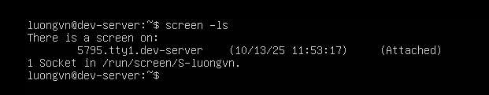

-> Có 1 phiên screen đang mở.

- Tách khỏi session: `Ctrl + A + D`

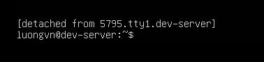

- Gắn lại session: `screen -r <ID>`

- Khi mở một terminal, Linux gán một pseudo-terminal(pts).
  - Ví dụ: `pts/0`, `pts/5`, ...
  - Nghĩa là terminal ảo #0, #5 đang đc dùng.
  - Khi dùng `screen`, nó sẽ tạo các pts mới(ví dụ `pts/5`)

- Các phím tắt(prefix = Ctrl + A)

| Phím (sau Ctrl+A) | Mô tả                                   |                   |
| ----------------- | --------------------------------------- | ----------------- |
| `D`               | Tách (detach) khỏi screen               |                   |
| `K`               | Kill cửa sổ hiện tại                    |                   |
| `N`               | Chuyển sang cửa sổ kế tiếp              |                   |
| `P`               | Quay lại cửa sổ trước đó                |                   |
| `Shift+S`         | Chia ngang màn hình                     |                   |
| `Tab`             | Di chuyển qua lại giữa các vùng (focus) |                   |
| `\`               | Thoát và kill tất cả cửa sổ             |                   |
| `C`               | Tạo cửa sổ mới (Command shell mới)      |                   |

**NOTE**: "shift+|": chia dọc màn hình

### Tạo layout 3 cửa sổ(3 focuses) để giám sát song song
- Cửa sổ 1: chạy `top`

- Cửa sổ 2: theo dõi log (`tail -f /var/log/syslog`)

- Cửa sổ 3: nhập lệnh thủ công

- Các bước:
1) `screen` → nhấn Enter

2) Chạy `top`

3) `Ctrl+A Shift+S` → chia ngang thành 2 vùng

4) `Ctrl+A Tab` → chuyển xuống vùng dưới

5) `Ctrl+A C` → tạo shell mới

6) Chạy `tail -f /var/log/syslog`

7) `Ctrl+A Shift+|` → chia dọc vùng dưới thành 2 phần

8) `Ctrl+A Tab` → sang vùng mới

9) `Ctrl+A C` → tạo shell mới thứ 3

10) Gõ lệnh bất kỳ.

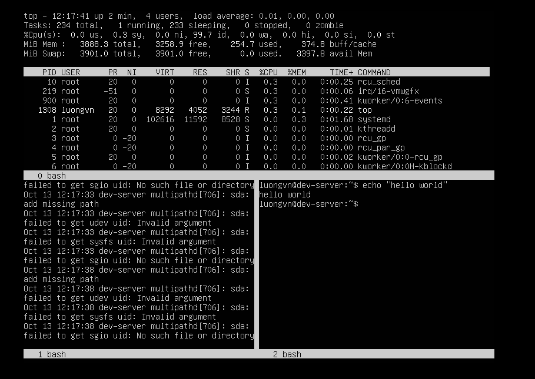

## Understanding Foreground and Background Processes
### Sending a Job to the Background
- Khi thêm `&` sau 1 lệnh(ví dụ `sleep 3000&`), lệnh đó sẽ chạy ở chế độ nền(background), cho phép tiếp tục nhập lệnh khác mà không cần chờ nó kết thúc.
- Hệ thống hiện thị:
  - Job number(trong ngoặc vuông, ví dụ [1])
  - PID(sôd định danh tiến trình) 

  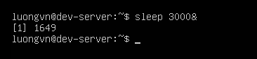

- Có thể dùng lệnh `jobs` để xem các tiến trình chạy nền, hoặc `jobs -l` để xem cả PID.
  
  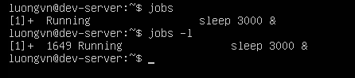

- Khi tiến trình kết thúc, terminal sẽ báo:

  `[1]+ Done sleep 3000` - nghĩa là job số 1 hoàn tất

### Sending Multiple Jobs to the Background
- Có thể chạy nhiều tiến trình nền (background jobs) cùng lúc bằng cách thêm `&` sau mỗi lệnh.
- Mỗi job được gán:
  - job number
  - PID
- Dấu `+` -> chỉ job được tạo gần nhất(job hiện tại)
- Dấu `-` -> chỉ job được tạo ngay trước đó.

### Bringing Jobs to the Foreground
- Để chuyển 1 tiến trình từ background thành foreground ta dùng lệnh `fg % + STT` - STT của tiến trình đó trên background


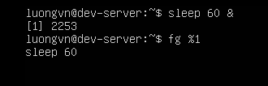

### Sending a Running Program to the Background

- Để chuyển 1 tiến trình đang chạy vào phần background ta làm các bước sau:
  - Nhấn `ctrl + z`
  - Nhập `bg % + STT` - STT của tiến trình khi nhập `ctrl + z`

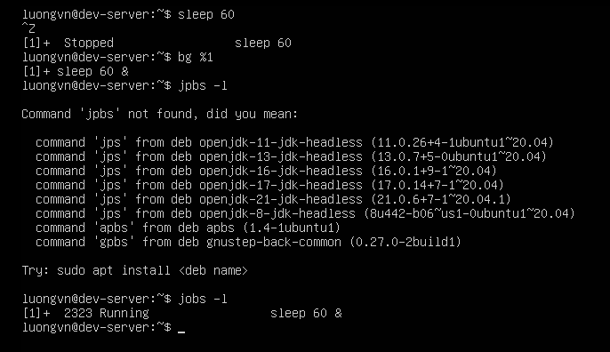

### Stopping a Job

Sử dụng `kill -l` để liệt kê các tín hiệu

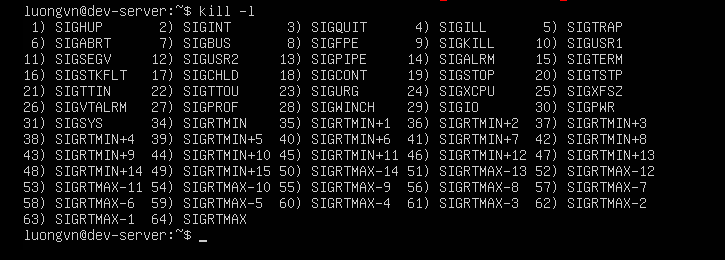

Để loại bỏ hoàn toàn 1 tiến trình: `kill -9 PID`

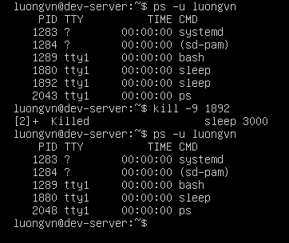


## Managing Process Pririties
### Scheduling Priority(lập lịch mức độ ưu tiên)
- Xác định thứ tự mà tiến trình được CPU và bộ nhớ cấp phát tài nguyên.
- Khi nhiều tiến trình chạy đồng thời, tiến trình có priority cao hơn sẽ được CPU phục vụ trước.

### Công cụ điều chỉnh mức độ ưu tiên(`nice` và `renice`)

| Lệnh     | Chức năng                                                    |
| -------- | ------------------------------------------------------------ |
| `nice`   | Khởi chạy chương trình mới với giá trị “nice” được chỉ định. |
| `renice` | Thay đổi giá trị “nice” của tiến trình **đang chạy**.        |

### Lệnh `nice`
- Cú pháp:
```bash
nice -n VALUE COMMAND
```

- `VALUE` là số từ -20 -> +19:
  - Giá trị thấp(âm) -> Ưu tiên cao hơn
  - Giá trị cao(dương) -> Ưu tiên thấp hơn
- Mặc định tiến trình chạy với `VALUE = 0`

- Ví dụ:

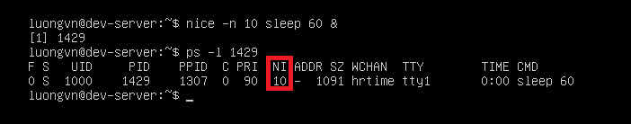

### Thay đổi mức ưu tiên của tiến trình đang chạy bằng `renice`
- Cú pháp: 
```bash
renice PRIORITY [-p PID] [-u USER] [-g GROUP]
```
- Cho phép thay đổi mức ưu tiên dựa trên:
  - `PID` (ID tiến trình cụ thể),
  - `USER` (tất cả tiến trình của người dùng),
  - `GROUP` (tất cả tiến trình của nhóm).

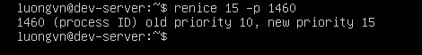

### Tăng mức ưu tiên(giảm giá trị nice) với quyền Superuser

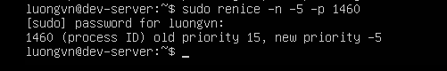

