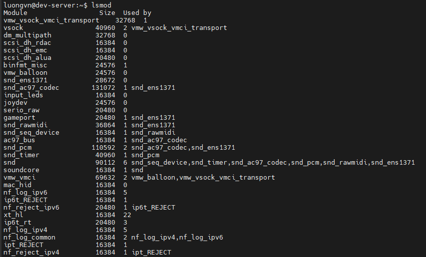
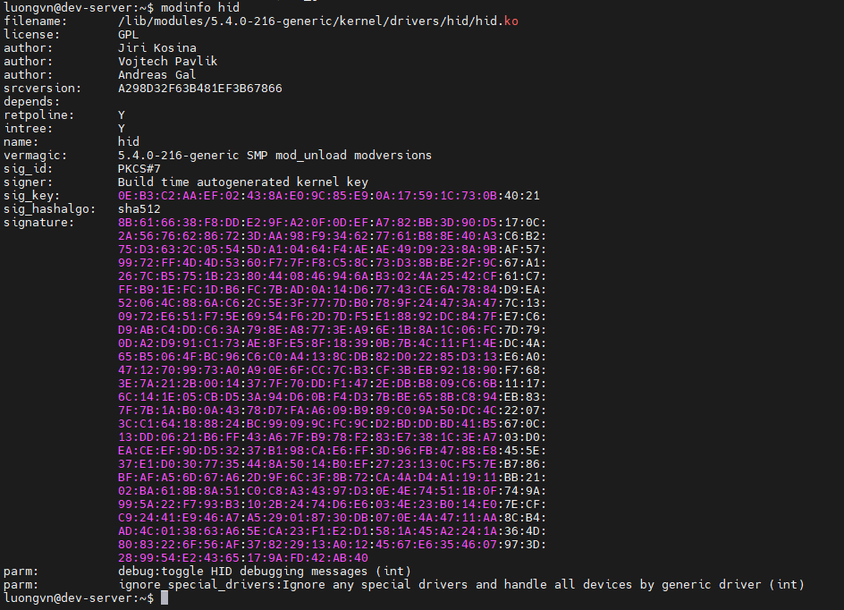

# CONFIGURING THE FIRMWARE AND CORE HARDWARE
## Understanding the Role of Firmware 
Tất cả máy chủ tương thích IBM đều có firmware để điều khiển quá trình khởi động hệ điều hành.
- Trước đây, firmware này là BIOS(basic input/output system)
- Được thay thế bởi UEFI (Unified Extensible Firmware Interface).

## Device Interfaces
- Mỗi thiết bị kết nối với hệ thống Linux đều dùng giao thức chuẩn để trao đổi dữ liệu với phần cứng.
- Hiện nay, có 3 chuẩn phổ biến để kết nối thiết bị: PCI, USB và GPIO.

### PCI Boards
- PCI (Peripheral Component Interconnect) ra đời năm 1993, dùng để gắn các bo mạch mở rộng (hardware boards) vào bo mạch chủ.

### USB Interface
- Giao diện USB (Universal Serial Bus) phổ biến do tính dễ sử dụng và khả năng hỗ trợ truyền dữ liệu tốc độ cao.
- Các phiên bản USB

| Phiên bản | Tốc độ truyền tối đa |
| --------- | -------------------- |
| USB 1.0   | 12 Mbps              |
| USB 2.0   | 480 Mbps             |
| USB 3.2   | 20 Gbps              |

- Các thiết bị dùng USB phổ biến: máy in, camera, bàn phím, chuột, ...

### The GPIO Interface
- cung cấp nhiều đường tín hiệu số (digital lines) có thể điều khiển riêng từng bit.

- thường được điều khiển qua IC chuyên dụng, được ánh xạ vào vùng nhớ hệ thống.
- Ứng dụng:
  - Đọc trạng thái công tắc hoặc cảm biến (nhiệt độ, áp suất, chuyển động)
  - Điều khiển bật/tắt thiết bị

## The `/dev` Directory
1) Chức năng của `/dev`

- Khi nhân Linux (Linux kernel) nhận diện được một thiết bị phần cứng, nó cần một cách để trao đổi dữ liệu (gửi/nhận) với thiết bị đó.
- Linux tạo ra các “device files” (tệp thiết bị) trong thư mục `/dev`.
  - Các tệp này đại diện cho thiết bị phần cứng thật
  - Khi một chương trình cần đọc hoặc ghi dữ liệu lên thiết bị, nó chỉ cần đọc/ghi vào file trong `/dev` - kernel sẽ lo phần phức tạp còn lại.

2) Ưu điểm:
- Ứng dụng không cần biết cách giao tiếp trực tiếp với phần cứng.
- Chỉ cần biết đọc/ghi dữ liệu vào file trong `/dev` là đủ.

## The `/proc` Directory
- `/proc` không phải là thư mục vật lý trên ổ cứng, mà là thư mục ảo (virtual directory).
- Nó được kernel tự động sinh ra (populate) khi hệ thống đang chạy.
- Mục đích:
  - Cung cấp thông tin chi tiết về phần cứng, tiến trình, và trạng thái hệ thống theo thời gian thực.

### Interrupt Requests
- Là cơ chế để thiết bị báo cho CPU biết khi có dữ liệu cần xử lý
- Mỗi thiết bị sẽ có 1 IRQ(Interrupt Requests) để tránh xung đột
- `cat /proc/interrupts`
- Cho biết:
  - IRQ nào đang được sử dụng
  - Bởi thiết bị nào
  - Số lần thiết bị đó gửi tín hiệu ngắt(interupt count)

### I/O Ports 
- I/O Port là vị trí trong bộ nhớ nơi CPU giao tiếp trực tiếp với thiết bị.
- Mỗi thiết bị phải có vùng địa chỉ (port range) riêng để tránh trùng lặp.
- `sudo cat /proc/ioports`

### Direct Memory Access
- DMA là cơ chế cho phép thiết bị gửi dữ liệu thẳng vào bộ nhớ (RAM) mà không cần CPU can thiệp liên tục, giúp tăng tốc độ truyền dữ liệu.

- Mỗi thiết bị có thể có một kênh DMA riêng.
- `cat /proc/dma`

## The `/sys` Directory
- `/sys` là thư mục ảo (virtual directory) do kernel tạo ra để chứa thông tin về phần cứng của hệ thống.
- Nó  giống `/proc` nhưng tập trung vào thiết bị (devices) chứ không phải tiến trình. 
- Một số thư mục con quan trọng:

  - `block/` – thiết bị lưu trữ

  - `class/` – nhóm thiết bị (mạng, âm thanh…)

  - `devices/` – danh sách thiết bị thật

  - `module/` – các module kernel

  - `power/` – quản lý năng lượng

## Working with Devices
### Finding Devices
- Sử dụng lệnh `lsdev` - list device để hiển thị thông tin về các thiết bị phần cứng được cài đặt trên hệ thống.


- Lệnh `lsblk` -list block devices dùng để hiển thị thông tin về các thiết bị khối (block devices) trên hệ thống Linux — như ổ cứng, SSD, USB, phân vùng, ...


### Working with PCI Cards
- Lệnh `lspci` cho phép xem các thẻ PCI - Peripheral Component Interconnect hiện được cài đặt và công nhận trên hệ thống Linux.
- pci card là card mở rộng phần cứng để bổ sung các chức năng không có sẵn, ví dụ như card âm thanh, card mạng

### Working with USB Devices
- Có thể xem các thông tin cơ bản về các thiết bị USB được kết nối vào hệ thống Linux bằng `lsusb`


## Hardware Module
- Kernel và driver: Linux kernel cần driver để giao tiếp với phần cứng. Việc biên dịch tất cả driver vào kernel sẽ làm kernel quá lớn.

- Kernel modules: Linux dùng module – các file driver riêng lẻ có thể nạp vào kernel khi cần, giúp kernel nhẹ hơn. Các file module có đuôi `.ko`.

- Vị trí lưu trữ: Thư mục chuẩn chứa module là `/lib/modules/<version>/`. Mỗi kernel version có thư mục riêng cho module.

- Các file quan trọng:

  - `/etc/modules`: liệt kê các module sẽ nạp khi boot.

  - `/etc/modules.conf`: cấu hình tham số module.

  - `/lib/modules/<version>/modules.dep`: xác định dependencies giữa các module.

### Listing Installed Modules 
- `lsmod` giúp liệt kê các module kernel được tải 



### Getting Module Information
- Xem thêm thông tin về module sử dụng `modinfo`



### Installing New Modules
1) 2 lệnh chính để cài đặt module thủ công:
- `insmod`: Nạp trực tiếp file module `.ko`. Cần chỉ định đường dẫn chính xác tới file.
  - Ví dụ:
    ```bash
    sudo insmod /lib/modules/3.13.0-49-generic/kernel/drivers/bluetooth/btusb.ko
    ```
  - Nhược điểm: nếu module này phụ thuộc vào module khác chưa nạp, sẽ báo lỗi.
- `modprobe`: Nạp module theo tên, tự động giải quyết dependencies. Không cần chỉ định file đầy đủ.
  - Ví dụ:
    ```bash
    sudo modprobe btusb
    ```

2) Vị trí lưu module
- Các file .ko nằm trong `/lib/modules/<kernel-version>/kernel/drivers/...`
- Mỗi loại phần cứng có thư mục riêng (ví dụ: `bluetooth`), chứa các module tương ứng.

### Removing Modules
1) Lệnh chính để gỡ module:
- `rmmod`: gỡ module trực tiếp theo tên module
  ```bash
  sudo rmmod btusb
  ```
- `modprobe -r`: gỡ module và tự xử lý dependencies
  ```bash
  sudo modprobe -r btusb
  ```

2) Kiểm tra module đã gỡ:
```bash
lsmod | grep btusb
```
- Nếu không có gì xuất hiện, module đã được gỡ thành công