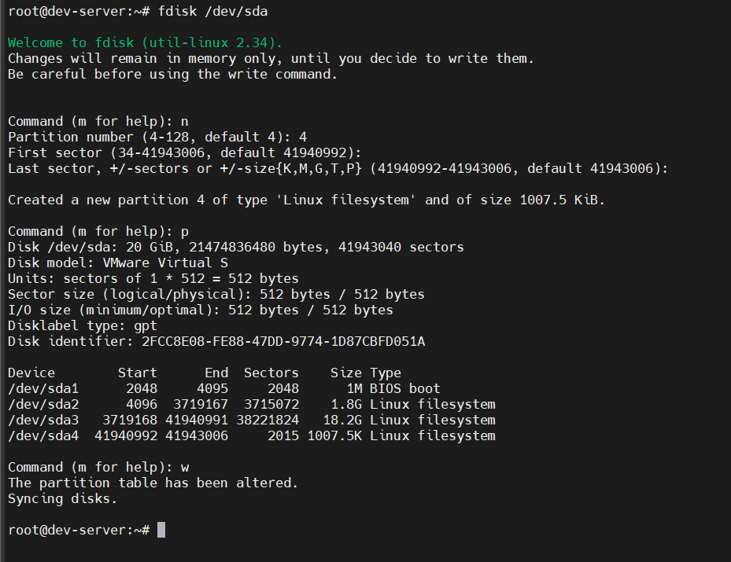

# PARTITIONING TOOLS
## Working with `fdisk`
- `fdisk` là công cụ phổ biến để tạo, xóa, xem, và chỉnh sửa phân vùng trên ổ đĩa dùng MBR
- MBR hỗ trợ 4 phân vùng chính, không thể xử lý ổ đĩa có dung lượng lớn hơn 2TB

## Working with `gdisk`
- `gdisk` là công cụ để tạo, xóa, xem các phân vùng trên ổ đĩa GPT
- GPT hỗ trợ 128 phân vùng, kích thước giới hạn vào hệ điều hành và hệ thống tập tin của hệ điều hành.

## The GNU parted Command
- `parted` là một chương trình dòng lệnh cho phép người dùng quản trị:
  - Tạo, xóa, thay đổi kích thước các phân vùng trên ổ đĩa
  - làm việc được ở cả hai loại phân vùng: MBR và GPT

## Graphical Tools
- Ngoài các công cụ dòng lệnh như `fdisk`, `gdisk`, và `parted`, Linux còn cung cấp `GParted` (GNOME Partition Editor) – công cụ đồ họa phổ biến giúp quản lý phân vùng dễ dàng hơn.
- Cho phép người dùng:
  - Tạo, xóa, định dạng, gắn kết (mount/unmount) phân vùng.
  - Thay đổi kích thước hoặc di chuyển phân vùng chỉ bằng thao tác chuột phải.