# USING FILE MANAGEMENT COMMANDS
## Naming and Listing Files
### Displaying Filenames with the `ls` command
- Câu lệnh đơn giản nhất để xem tên của file và các metadata khác nhau của nó là lệnh `ls`
- metadata là thông tin mô tả và cung cấp thêm chi tiết về dữ liệu

- Cú pháp:
```bash
$ls [OPTION] [FILE]
```

- Các option:
  - `-a, --all`: liệt kê tất cả file và thư mục

  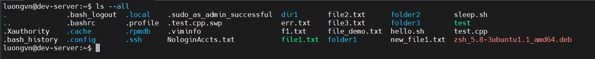

  - `ls -x`: sắp xếp đầu ra tệp theo thứ tự bảng chữ cái

  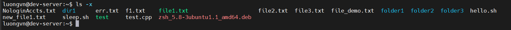

  - `ls -t: modification time`: sắp xếp tệp mới theo thời gian

  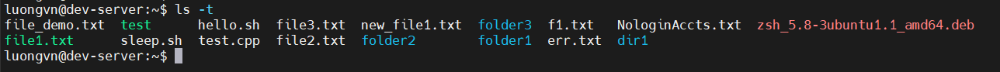


  - `ls -l: long format`: hiển thị các file và thư mục, các phân quyền, kich thước, ngày sửa đổi, chủ sở hữu, tên 

  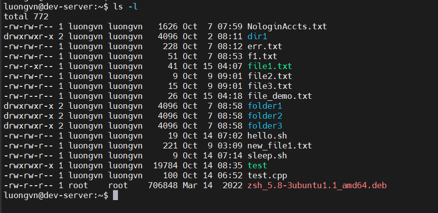

  - `ls -F: classify`: chỉ ra loại tệp

  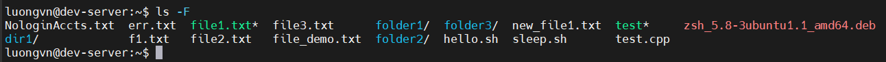

    - **NOTE**: 
      - `@` : là 1 symbol link
      - `(*)` : là 1 thực thi
      - `/` : là 1 thư mục

  - `ls --hide=*.rpm`: ẩn 1 loại tệp cụ thể khi xuất ra màn hình

  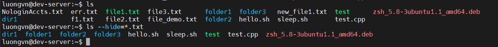

  - `ls --author`: hiển thị tên tác giả 
    - Thêm `-l` để hiển thị mỗi 

  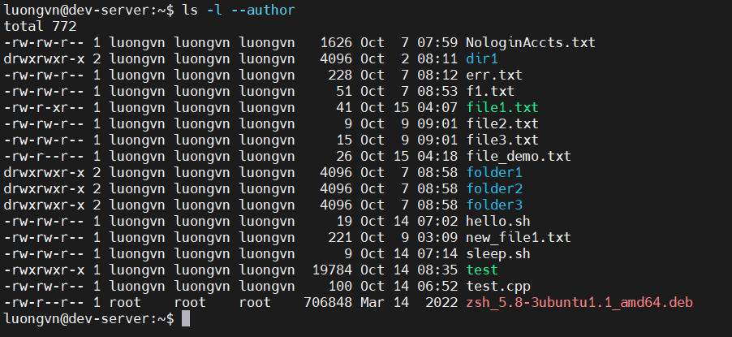

  - `ls -lt: l - long format, t - modification time`:

  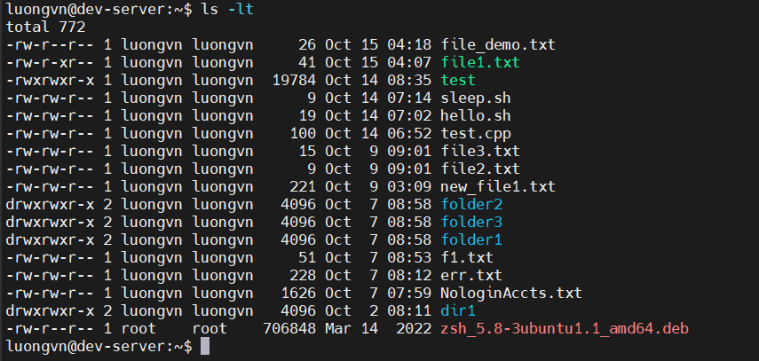


## Creating and Naming Files

- Sử dụng `touch` để tạo 1 file trống mới

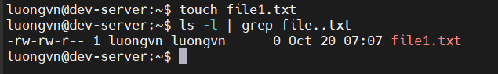

- Có thể dùng `touch + greater than 1 files`: để tạo nhiều file cùng lúc

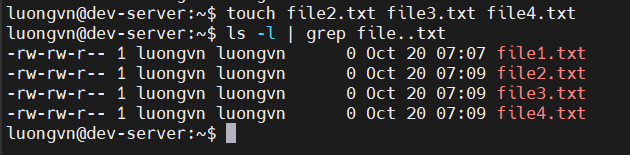

- Dùng `file` để xác định loại của 1 tệp

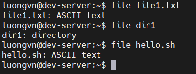

### Exploring Wildcard Expansion Rules

1) Khái niệm File Globbing
- File Globbing là quá trình mở rộng ký tự đại diện trong tên tệp
- Ví dụ:
```bash
ls c*.txt
```

-> Hệ thống sẽ tự động mở rộng thành danh sách các file bắt đầu bằng `c` và kết thúc là `.txt`

2) Các loại Wildcards chính

a. Dấu sao `*`

- Đại diện cho bất kì chuỗi ký tự nào (kể cả trống)
```bash
ls c*.txt
```
  -> Khớp với `cake.txt`, `carmelPie.txt`, `carrotCake.txt`

b. Dấu hỏi `?`

- Đại diện cho một ký tự duy nhất

```bash
ls b?t
```
  -> Khớp với `bat`, `bet`, `bit`, ... 

c. Ngoặc vuông `[]`
- Dùng để chỉ một tập hợp ký tự có thể xuất hiện ở vị trí đó

```bash
ls b[eio]t
```
  -> Khớp với `bet`, `bit`, `bot`

d. Nhiều ngoặc vuông liên tiếp 
- Mỗi cặp `[]` đại diện cho một vị trí kí tự

```bash
ls b[eu][an]t
```

e. Phạm vi kí tự `[a-z]`
- Dấu gạch nối `-` biểu thị một phạm vi kí tự

f. Phủ định ký tự `[^...]`
- Dấu mũ `^` trong ngoặc vuông để loại trừ ký tự