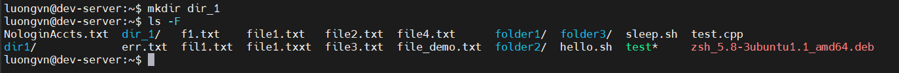
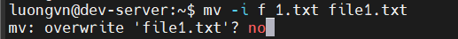
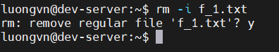
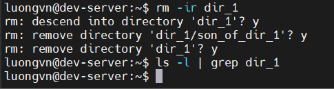
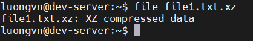
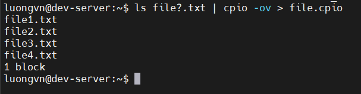
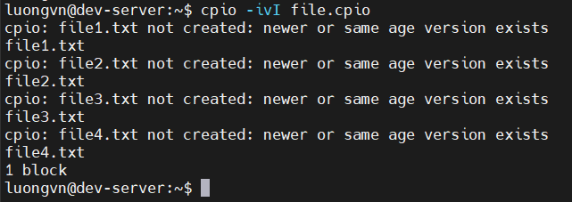
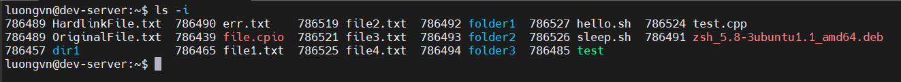
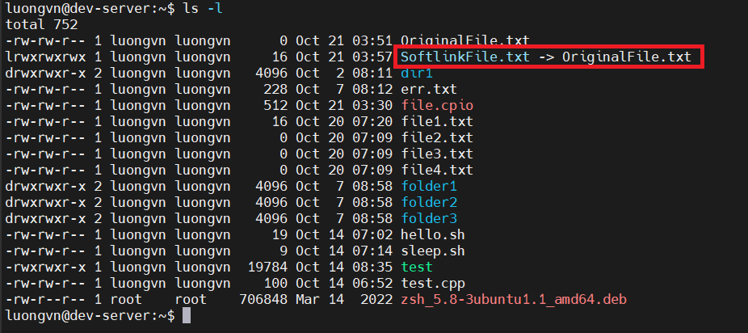
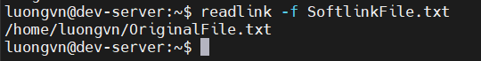

# USING FILE MANAGEMENT COMMANDS
## Naming and Listing Files
### Displaying Filenames with the `ls` command
- Câu lệnh đơn giản nhất để xem tên của file và các metadata khác nhau của nó là lệnh `ls`
- metadata là thông tin mô tả và cung cấp thêm chi tiết về dữ liệu

- Cú pháp:
```bash
$ls [OPTION] [FILE]
```

- Các option:
  - `-a, --all`: liệt kê tất cả file và thư mục

  

  - `ls -x`: sắp xếp đầu ra tệp theo thứ tự bảng chữ cái

  

  - `ls -t: modification time`: sắp xếp tệp mới theo thời gian

  


  - `ls -l: long format`: hiển thị các file và thư mục, các phân quyền, kich thước, ngày sửa đổi, chủ sở hữu, tên 

  

  - `ls -F: classify`: chỉ ra loại tệp

  

    - **NOTE**: 
      - `@` : là 1 symbol link
      - `(*)` : là 1 thực thi
      - `/` : là 1 thư mục

  - `ls --hide=*.rpm`: ẩn 1 loại tệp cụ thể khi xuất ra màn hình

  

  - `ls --author`: hiển thị tên tác giả 
    - Thêm `-l` để hiển thị mỗi 

  

  - `ls -lt: l - long format, t - modification time`:

  


## Creating and Naming Files

- Sử dụng `touch` để tạo 1 file trống mới


- Có thể dùng `touch + greater than 1 files`: để tạo nhiều file cùng lúc


- Dùng `file` để xác định loại của 1 tệp


### Exploring Wildcard Expansion Rules

1) Khái niệm File Globbing
- File Globbing là quá trình mở rộng ký tự đại diện trong tên tệp
- Ví dụ:
```bash
ls c*.txt
```

-> Hệ thống sẽ tự động mở rộng thành danh sách các file bắt đầu bằng `c` và kết thúc là `.txt`

2) Các loại Wildcards chính

a. Dấu sao `*`

- Đại diện cho bất kì chuỗi ký tự nào (kể cả trống)
```bash
ls c*.txt
```
  -> Khớp với `cake.txt`, `carmelPie.txt`, `carrotCake.txt`

b. Dấu hỏi `?`

- Đại diện cho một ký tự duy nhất

```bash
ls b?t
```
  -> Khớp với `bat`, `bet`, `bit`, ... 

c. Ngoặc vuông `[]`
- Dùng để chỉ một tập hợp ký tự có thể xuất hiện ở vị trí đó

```bash
ls b[eio]t
```
  -> Khớp với `bet`, `bit`, `bot`

d. Nhiều ngoặc vuông liên tiếp 
- Mỗi cặp `[]` đại diện cho một vị trí kí tự

```bash
ls b[eu][an]t
```

e. Phạm vi kí tự `[a-z]`
- Dấu gạch nối `-` biểu thị một phạm vi kí tự

f. Phủ định ký tự `[^...]`
- Dấu mũ `^` trong ngoặc vuông để loại trừ ký tự

## Understanding the File Commands
### Creating Directories
1) Creating Directories with `mkdir`
- Cú pháp:
```bash
mkdir [OPTION] dir_name
```
- Nếu không có thêm option thì sẽ tạo thư mục mới trong thư mục hiện tại



- Ta có thể tạo thư mục bằng đường dẫn tuyết đối

```bash
mkdir /home/luongvn/dir_1/dir_2
# Tạo thư mục dir_2 trong /home/luongvn/dir_1
```

- Dùng thêm OPTION `-v : --verbose` để xem thông báo xác nhận mỗi khi tạo thư mục

```bash
$ mkdir -v Galaxy
mkdir: created directory 'Galaxy'
```

2) Copying Files and Directories with `cp`
- Cú pháp:
  ```bash
  cp [OPTION] SOURCE DEST
  # SOURCE: tệp hoặc thư mục gốc.
  # DEST: tệp hoặc thư mục đích.
  # Nếu không chỉ định DEST → lỗi: “missing destination file operand”.
  ```

- Sao chép thư mục
  - Để sao chép 1 thư mục và toàn bộ nội dung của nó:
    ```bash
    cp -R Emphasis Story-line
    ```
    -> Kết quả: 
      - Tạo thư mục mới Story-line
      - Sao chép toàn bộ file và thư mục con từ Emphasis

### Moving/Renaming Files and Directories
1) Lệnh `mv`

Lệnh mv (move) trong Linux được dùng để:

- Di chuyển (move) tệp hoặc thư mục từ vị trí này sang vị trí khác, hoặc

- Đổi tên (rename) tệp/thư mục ngay tại chỗ

Cú pháp:
```bash
mv [OPTION] SOURCE DEST
```

2) Đổi tên tệp

Ví dụ:
```bash
$ mv space-warfare.txt risk-taking.txt
```
→ Tệp space-warfare.txt được đổi tên thành risk-taking.txt trong cùng thư mục.

3) Tránh ghi đè `-i, --interactive`



4) Đổi tên thư mục:
- Cú pháp hoàn toàn tương tự đổi tên file
- Không cần thêm bất kỳ tùy chọn đặc biệt nào

```bash
$ mv -i Story-line Story-topics
```

5) Di chuyển và đổi tên cùng lúc
```bash
$ mv Emphasis/risk-taking.txt Story-Topics/risks.txt
```
→ File được chuyển từ thư mục `Emphasis` sang `Story-Topics` và đổi tên thành `risks.txt`.

### Deleting Files and Directories
1) Lệnh `rm`
- Dùng để xóa file hoặc thư mục
- Cú pháp:
```bash
rm [OPTION] FILE
```

2) Xóa 1 file



- Tùy chọn `-i, --interactive` để hỏi xác nhận trước khi xóa
- Sau khi xóa xong nếu dùng lại lệnh sẽ báo lỗi, hoặc dùng `-f, --force` sẽ không hiển thị gì

3) Xóa thư mục chứa file
- Thư mục chứa file không thể xóa bằng rm thông thường — bạn cần tùy chọn đệ quy `-r: recursion` hoặc `-R`.



4) Xóa thư mục rỗng `rmdir`
- Dùng khi thư mục ko chứa file

```bash
rmdir -v EmptyDir
```

```bash
rmdir: removing directory, 'EmptyDir/'
```

5) Xóa cây thư mục rỗng(`rmdir -p, --parents`)
- Xóa thư mục và các thư mục cha nếu chúng đều rỗng:
```bash
rmdir -vp EmptyDir/EmptySubDir
```

```bash
rmdir: removing directory, 'EmptyDir/EmptySubDir'
rmdir: removing directory, 'EmptyDir'
```

6) Chỉ xóa thư mục rỗng trong cây thư mục: `rm -d, --dir`
- `rm -d` chỉ xóa thư mục rỗng, còn thư mục có file bên trong thì sẽ báo lỗi.

## Compressing File Commands
- Các công cụ nén phổ biến trên linux

| Tiện ích  | Năm ra đời         | Thuật toán     | Phần mở rộng | Ghi chú                                              |
| --------- | ------------------ | -------------- | ------------ | ---------------------------------------------------- |
| **gzip**  | 1992               | LZ77           | `.gz`        | Nhanh, hiệu quả (nén ~60–70%)                        |
| **bzip2** | 1996               | Huffman coding | `.bz2`       | Nén mạnh hơn gzip, chậm hơn                          |
| **xz**    | 2009               | LZMA2          | `.xz`        | Nén mạnh nhất, thay thế bzip2 cho kernel             |
| **zip**   | 1989 (đa nền tảng) | Deflate        | `.zip`       | Lưu nhiều file trong một archive; không xóa file gốc |

- Cách dùng cơ bản:
  - `gzip/gunzip`

    ```bash
    gzip file.txt        # Nén → file.txt.gz
    gunzip file.txt.gz   # Giải nén lại file.txt

    # gzip xóa file gốc sau khi nén
    ```

  - `bzip2/bunzip2`

    ```bash
    bzip2 data.log        # Nén → data.log.bz2
    bunzip2 data.log.bz2  # Giải nén lại file gốc
    ```

  - `xz/unxz`

    ```bash
    xz backup.img         # Nén → backup.img.xz
    unxz backup.img.xz    # Giải nén lại file gốc
    ```

  - `zip/unzip`

    ```bash
    zip archive.zip file1.txt file2.txt
    unzip archive.zip

    # zip không xóa file gốc, mà tạo bản sao nén
    # Có thể chứa nhiều file hoặc thư mục trong file ".zip"
    ```

- Mức độ nén(-#)
  - Hầu hết các công cụ (trừ zip) cho phép chọn mức nén từ 1 - 9:

    | Tùy chọn         | Ý nghĩa                          |
    | ---------------- | -------------------------------- |
    | `-1`             | Nhanh nhất, nén yếu              |
    | `-9`             | Chậm nhất, nén mạnh nhất         |
    | (mặc định: `-6`) | Cân bằng giữa tốc độ và hiệu quả |

- Có thể xem nội dung file mà không cần giải nén

  | Tiện ích  | Câu lệnh         | Dùng cho |
  | --------- | ---------------- | -------- |
  | **zcat**  | `zcat file.gz`   | gzip     |
  | **bzcat** | `bzcat file.bz2` | bzip2    |
  | **xzcat** | `xzcat file.xz`  | xz       |

  `zcat = gunzip -c`

  `bzcat = bzip2 -dc`

  `xzcat = xz --decompress --stdout`

- Nhận diện loại tệp nén: `file filename`



## Archiving File Commands
### Copying with `cpio`
- `cpio: copy in and out`
- Dùng để:
  - Tạo bản sao lưu(backup) các file và thư mục
  - Di chuyển dữ liệu giữa hệ thống hoặc phân vùng
  - Giải nén / khôi phục dữ liệu từ bản sao lưu

- Hai chế độ chính của `cpio`

  | Chế độ       | Tuỳ chọn chính        | Chức năng                                   |
  | :----------- | :-------------------- | :------------------------------------------ |
  | **Copy-out** | `-o` hoặc `--create`  | Tạo một file archive (nén nhiều file vào 1) |
  | **Copy-in**  | `-i` hoặc `--extract` | Giải nén / phục hồi file từ archive         |

- Cách dùng cơ bản:
  - Tạo file archive
    ```bash
    ls file.txt | cpio -ov > file.cpio
    ```
    - `ls` tạo danh sách file → gửi qua pipe (|) → cpio đọc từ stdin.

    - `-o`: tạo archive.

    - `-v`: hiển thị tên file khi sao chép.

    - `>`: ghi output (archive) vào file.cpio.

    

  - Xem nội dung archive

    ```bash
    cpio -itvI file.cpio
    ```
    - `-i`: copy-in (đọc file archive)
    - `-t`: chỉ hiển thị danh sách, không giải nén
    - `-v`: verbose
    - `-I file.cpio`: chỉ định file archive
  - Giải nén lại

    ```bash
    cpio -ivI file.cpio
    ```

    - vì không có option `-t` nên nó sẽ giải nén được

    

### Archiving with `tar`
- `tar - type archiver` - Gom & nén file
- Cú pháp: 

  ```bash
  tar [options] -f archive_name files...
  ```

- Tạo achive:

  ```bash
  tar -cvf file.tar files...
  ```

- Tạo và nén(gzip):

  ```bash
  tar -zvcf file.tar.gz files...
  ```

- Giải nén:

  ```bash
  tar -xvf file.tar        # không nén
  tar -zxvf file.tar.gz    # nén gzip
  tar -Jxvf file.tar.xz    # nén xz
  ```

- Xem nội dung:

  ```bash
  tar -tf file.tar.gz
  ```
- **NOTE**: File gốc không bị xóa khi nén hay giải nén.

### Duplicating with `dd`
- `dd` - sao chép & nhân bản
- cú pháp
 
  ```bash
  dd if=<nguồn> of=<đích> [option]
  ```

- tùy chọn

  | Tùy chọn  | Ý nghĩa                                                 |
  | --------- | ------------------------------------------------------- |
  | `if=`     | (input file) — nguồn dữ liệu, thường là ổ đĩa hoặc file |
  | `of=`     | (output file) — nơi ghi dữ liệu                         |
  | `bs=`     | kích thước block (mặc định 512 byte)                    |
  | `count=`  | số block cần sao chép                                   |
  | `status=` | hiển thị tiến trình (`none`, `noxfer`, `progress`)      |

- Ví dụ:
1) Sao chép toàn bộ ổ đĩa

  ```bash
  dd if=/dev/sdb of=/dev/sdc status=progress
  ```

2) Tạo file ảnh (image) của ổ đĩa:

  ```bash
  dd if=/dev/sda of=/backup/system.img status=progress
  ```

3) Ghi image ngược lại(phục hồi)

  ```bash
  dd if=/backup/system.img of=/dev/sda status=progress
  ```

4) Xóa sạch ổ đĩa(ghi toàn số 0)

  ```bash
  dd if=/dev/zero of=/dev/sdc status=progress
  ```

## Managing Links
### 1. Khái niệm
Linux có 2 loại link:
- Hard link(liên kết cứng)
- Soft link(symbolic link / liên kết mềm)

Cả 2 đều giúp tạo nhiều tên(đường dẫn) cho cùng một tệp hoặc tệp khác.

### 2. Hard link
- Đặc điểm:
  - Cùng inode => cùng dữ liệu thật
  - Nếu xóa 1 tên file, dữ liệu vẫn còn(vì vẫn còn link khác)
  - Phải ở cùng filesystem(ko thể liên kết giữa 2 ổ đĩa khác nhau)
  - ko thể link đến thư mục
- Tạo hard link:
  ```bash
  ln OriginalFile.txt HardlinkFile.txt
  ```
- Cả 2 có cùng inode khi xem



### 3. Soft Link(symbolic link)
- Đặc điểm:
  - là file trỏ(poiter) tới file khác
  - Có inode riêng, ko trỏ đến dữ liệu thật mà chỉ trỏ tới đường dẫn.
  - Có thể trỏ tới file ở filesystem khác.
  - Nếu file gốc bị xóa -> link trở thành `stale` (liên kết chết)
- Tạo soft link:
  ```bash
  ln -s OriginalFile.txt SoftlinkFile.txt
  ```
- Hiển thị link:

  

- Đích cuối của link:

  ```bash
  readlink -f SoftlinkFile.txt
  # -f: canonicalize: chuẩn tuyệt đối
  ```

  