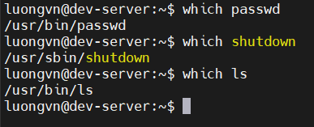

# LOCATING FILES
## Getting to Know the FHS
- FHS(Filesystem Hirarchy Standard) là gì?
  - Là chuẩn cấu trúc thư mục của Linux, quy định thư mục nào dùng để làm gì — giúp hệ thống nhất quán, dễ quản lý, dễ tìm file.
- Một số thư mục quan trọng theo FHS

| Thư mục      | Chức năng                                  |
| ------------ | ------------------------------------------ |
| `/`          | Thư mục gốc của toàn bộ hệ thống           |
| `/boot`      | Chứa file khởi động (bootloader, kernel)   |
| `/dev`       | Chứa file thiết bị (device files)          |
| `/home`      | Chứa dữ liệu của người dùng                |
| `/lib`       | Thư viện chia sẻ và module kernel          |
| `/media`     | Điểm mount cho thiết bị rời (USB, CD...)   |
| `/mnt`       | Điểm mount tạm thời cho thiết bị           |
| `/opt`       | Phần mềm bên thứ ba (optional packages)    |
| `/tmp`       | File tạm thời                              |
| `/usr`       | Dữ liệu chương trình Linux tiêu chuẩn      |
| `/usr/bin`   | Chương trình của người dùng                |
| `/usr/lib`   | Thư viện của chương trình trong `/usr/bin` |
| `/usr/local` | Phần mềm cài riêng trên máy (local only)   |
| `/usr/sbin`  | Công cụ quản trị hệ thống                  |

- **NOTE**: Không phải bản phân phối nào (Ubuntu, CentOS, Arch…) cũng tuân theo FHS hoàn toàn, nhưng đa số đều dựa trên chuẩn này.

## Employing Tools to Locate Files
### Using the `which` Command
- `which` dùng để hiển thị đường dẫn đầy đủ đến chương trình (lệnh) mà bạn nhập trên shell. Giúp biết lệnh đó nằm ở đâu trong hệ thống
- Cách hoạt động:
  - `which` tìm kiếm các lệnh trong các thư mục được liệt kê trong biến môi trường `$PATH`
  - Các thư mục trong `$PATH` được ngăn cách bằng dấu hai chấm (:).
    
    ```bash
    luongvn@dev-server:~$ cat $PATH
    cat: '/usr/local/sbin:/usr/local/bin:/usr/sbin:/usr/bin:/sbin:/bin:/usr/games:/usr/local/games:/snap/bin': No such file or directory
    ```
- Ví dụ:

  

### Using the `whereis` command
- `whereis` dùng để tìm vị trí của các file liên quan đến một lệnh, gồm:
  - Binary(chương trình thực thi)
  - Source code(mã nguồn)
  - Manual pages(trang hướng dẫn)


-> File thực thi: `/usr/bin/diff`

-> File hướng dẫn(man): `/usr/share/man/...`


### Using the `locate` command
- `locate` dùng để tìm kiếm file nhanh chóng bằng cách tra trong cơ sở dữ liệu `mlocate.db`(lưu ở `/var/lib/mlocate/`)
- Cú pháp: 
  ```bash
  locate [OPTION] PATTERN
  ```
  - `PATTERN` là tên hoặc mẫu muốn tìm
  - Dùng được regex và nhiều pattern cùng lúc
- Ví dụ:

  ```bash
  $ locate Project42.txt
  /home/Christine/Answers/Project42.txt
  ```

  - Tìm chính xác tên “passwd” (không dùng wildcard):

    ```bash
    $ locate -b '\passwd'
    /etc/passwd
    /usr/bin/passwd
    ```

  - Tìm nhiều pattern

    ```bash
    $ locate -b '\passwd' '\group'
    ```

### Using the `find` command
- Cú pháp:
```bash
find [PATH...] [OPTION] [EXPRESSION]
```
- PATH: thư mục bắt đầu tìm(dùng `.` cho thư mục hiện tại)
- OPTION/EXPRESSION: điều kiện lọc file

| Tùy chọn        | Ý nghĩa                                                                         |
| --------------- | ------------------------------------------------------------------------------- |
| `-name pattern` | Tìm file theo tên (dạng `*.txt`). Dùng `-iname` để bỏ qua phân biệt hoa/thường. |
| `-maxdepth n`   | Giới hạn độ sâu tìm kiếm.                                                       |
| `-size n`       | Tìm theo kích thước (ví dụ `+1M`, `-100k`).                                     |
| `-user name`    | Tìm file của người dùng.                                                        |
| `-group name`   | Tìm file thuộc nhóm.                                                            |
| `-perm mode`    | Tìm file có quyền cụ thể (vd: `/4000` tìm file có SUID).                        |
| `-empty`        | Tìm file hoặc thư mục rỗng.                                                     |
| `-mmin n`       | Tìm file thay đổi nội dung trong n phút.                                        |
| `-cmin n`       | Tìm file thay đổi trạng thái trong n phút.                                      |

- Ví dụ:
```bash
find . -name "*.txt"
```
-> Tìm tất cả file `.txt` trong thư mục hiện tại và các thư mục con

```bash
find . -maxdepth 2 -name "*.txt"
```

-> Chỉ tìm trong thư mục hiện tại và 1 cấp con

- **NOTE**: `find` cực mạnh vì có thể kết hợp hành động. Ví dụ:
  ```bash
  find . -name "*.log" -delete
  ```

  -> Xóa tất cả file `.log` trong thư mục hiện tại


### Using the `type` command
- `type` dùng để kiểm tra một lệnh được Bash hiểu là gì - rất hữu ích khi muốn biết: 

  > Câu lệnh này là alias, builtin hay là chương trình thực sự trong hệ thống?

- Cú pháp:
  ```bash
  type [OPTION] COMMAND
  ```

- `type` cho biết cách Bash diễn giái một lệnh

  | Loại                        | Ý nghĩa                                  | Ví dụ                                |
  | --------------------------- | ---------------------------------------- | ------------------------------------ |
  | **alias**                   | Tên viết tắt được định nghĩa sẵn         | `ls is aliased to 'ls --color=auto'` |
  | **builtin**                 | Lệnh tích hợp sẵn trong shell            | `cd is a shell builtin`              |
  | **file / external command** | Lệnh là chương trình thật trong hệ thống | `find is /usr/bin/find`              |

- Các tùy chọn phổ biến:

  | Option | Ý nghĩa                                                      | Ví dụ                          |
  | ------ | ------------------------------------------------------------ | ------------------------------ |
  | `-t`   | Chỉ hiển thị loại ngắn gọn (`alias`, `builtin`, `file`)      | `type -t ls → alias`           |
  | `-a`   | Hiển thị **tất cả** các phiên bản của lệnh (nếu trùng tên)   | `type -a echo`                 |
  | `-p`   | Chỉ hiển thị đường dẫn đến **file thực thi** (giống `which`) | `type -p find → /usr/bin/find` |

- Ví dụ:

  ```bash
  $ type ls
  ls is aliased to 'ls --color=auto'

  $ type cd
  cd is a shell builtin

  $ type find
  find is /usr/bin/find

  $ type -t cd
  builtin

  $ type -a ls
  ls is aliased to 'ls --color=auto'
  ls is /usr/bin/ls
  ```