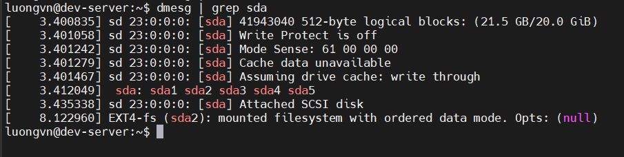

# UNDERSTANDING THE BOOT PROCESS
## The Boot Process
Quá trình khởi động diễn ra theo các bước sau:

- `B1`: `BIOS/UEFI`
  - Khi bấm nút nguồn, máy tính bật lên, nó kiểm tra:
    - RAM còn sống không?
    - CPU còn hoạt động không?
    - Ổ cứng có gắn chưa?
    - Bàn phím, chuột ok không?
  - Nếu mọi thứ đều ổn, nó tìm kiếm xem sẽ hoạt động từ đâu?(ổ cứng, USB hay đĩa CD)
  - Khi tìm thấy, nó trao quyền điều khiển cho: `bootloader`
- `B2`: `Bootloader`
  - bootloader giúp máy tính chọn hệ điều hành để khởi động (Linux, Windows, v.v.).
  - Nó hiện 1 menu:
    ```markdown
    1. Ubuntu
    2. Window 10
    ...
    ```

  - Chọn 1 -> Bootloader nạp kernel của Linux vào RAM
- `B3`: `Kernel`
  - Khi được nạp, nó bắt đầu:
    - Kích hoạt RAM, CPU, ổ đĩa, chuột, bàn phím, mạng.
    - Gắn kết hệ thống tệp (để đọc dữ liệu trong ổ cứng).
    - Tạo một môi trường làm việc 
- `B4`: `Systemd/Init`
  - Gọi dịch vụ mạng để có Internet
  - Mở trình điều khiển màn hinh
  - Chạy các chương trình nền(ssh, ...)
- `B5`: `login`

## Extracting Information about the Boot Process
- Mục đích:
  - Giúp theo dõi và khắc phục lỗi khởi động(boot problems) trong linux bằng cách xem lại các thông báo hệ thống khi máy khởi động.
- Cách xem thông tin boot:

  1) Trực tiếp trên màn hình khi khởi động - các thông báo này chạy nhanh nên khó đọc hết
  2) Dùng lệnh `dmesg: display message`
       - Hiển thị các thông báo của kernel trong kernel ring buffer(vùng nhớ vòng)
       - Cú pháp:

         ```bash
         dmesg | less
         ```

       - Có thể lọc kết quả:

         ```bash
         dmesg | grep sda
         ```

         

  3) Dùng `juarnalctl` (nếu có systemd)
       - Xem log kernel

  4) Xem file log lưu sẵn:

       - Debian: `/var/log/boot`
       - Red hat: `/var/log/boot.log`
