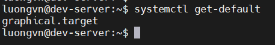
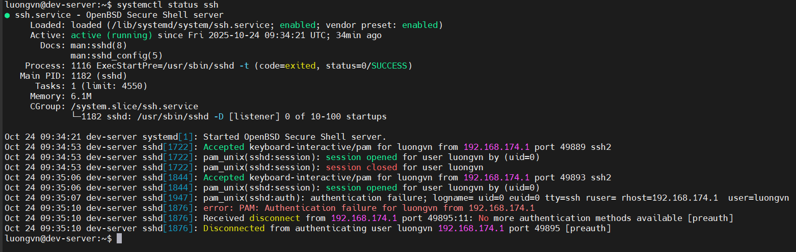

# USING THE SYSTEMD INITIALIZATION PROCESS
## Exploring Unit Files
- Unit là 1 đối tượng mà systemd quản lý(service, mount, target, ...)
- Có 12 loại unit chính: `automount`, `device`, `mount`, `path`, `scope`, `service`, `slice`, `snapshot`, `socket`, `swap`, `target`, `timer`
- Mỗi unit có tên và phần mở rộng(type):
  - `sshd.service`-> dịch vụ SSH
  - `graphical.target` -> nhóm dịch vụ khởi động giao diện đồ họa


- Quản lý unit bằng `systemctl`

  ```bash
  systemctl [OPTION] command [NAME]
  ```

  | Lệnh                              | Chức năng                              |
  | --------------------------------- | -------------------------------------- |
  | `systemctl list-units`            | Liệt kê các unit đang tải và hoạt động |
  | `systemctl start sshd.service`    | Khởi động dịch vụ SSH                  |
  | `systemctl stop sshd.service`     | Dừng dịch vụ SSH                       |
  | `systemctl status sshd.service`   | Xem trạng thái dịch vụ                 |
  | `systemctl enable sshd.service`   | Tự động khởi động cùng hệ thống        |
  | `systemctl disable sshd.service`  | Ngừng tự động khởi động                |

- `Target unit`
  - Là nhóm nhiều dịch vụ cần khởi động cùng nhau.

  - Hệ thống dùng `default.target` để xác định chế độ khởi động mặc định.


    
    
- Một số target thường dùng:

  | Tên target            | Mô tả                                               |
  | --------------------- | --------------------------------------------------- |
  | **graphical.target**  | Chế độ **đa người dùng + giao diện đồ họa (GUI)**   |
  | **multi-user.target** | Chế độ **đa người dùng, không GUI** (chỉ dòng lệnh) |

##  Focusing on Service Unit Files
- Service Unit File là tệp cấu hình của `systemd service`, mô tả:
  - Khi nào dịch vụ khởi động
  - Dịch vụ phụ thuộc vào gì
  - Câu lệnh nào để start/stop.
  - Mục tiêu (target) nào cần nó.
- Ví trị ưu tiên của Unit File(thấp -> cao):
  1) `/usr/lib/systemd/system/` -> mặc định của hệ thống
  2) `/run/systemd/system/` -> file tạm thời
  3) `/etc/systemd/system/` -> ưu tiên cao nhất(tùy chỉnh người dùng)

##  Looking at `systemctl`

Lệnh systemctl được sử dụng để quản lý các dịch vụ hệ thống.

- Có thể dùng `systemctl` để xem trạng thái

  

- Sử dụng `systemctl` đặt dịch vụ khởi động cùng hệ thống:

  ```bash
  root@dev-server:~# systemctl enable ssh
  ```

- Sử dụng `systemctl` để dừng các dịch vụ:

  ```bash
  root@dev-server:~# systemctl stop ssh
  ```

## Stopping the System

- `halt`: Dừng tất cả các processes và tắt CPU

- `poweroff`: Tắt nguồn

- `reboot`: Khởi động lại hệ thống

- `shutdown`: Tắt nguồn