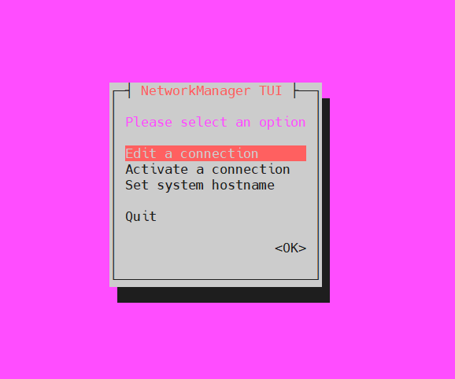
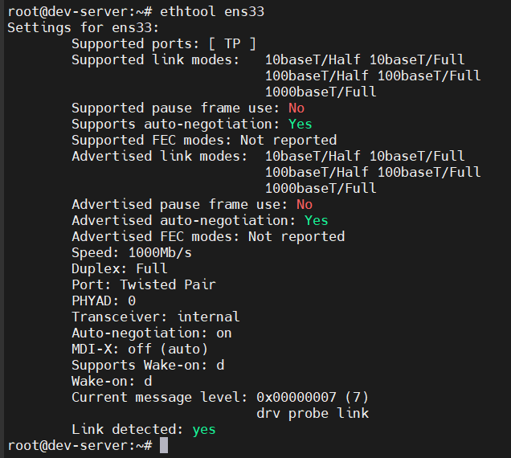
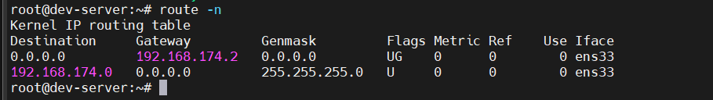

# CONFIGURING NETWORK FEATURES
## Network Configuration Files
- Khi linux khởi động, `systemd-networkd` sẽ:
  - phát hiện các network interfaces (card mạng, ...)
  - tự tạo hoặc đọc các file cấu hình tương ứng để thiết lập IP, gateway, DNS, ...
- Mỗi distro đặt file cấu hình mạng ở vị trí khác nhau
  - Ubuntu mới(>= 17.04) - dùng Netplan

    ```bash
    /etc/netplan/*.yaml
    ```

    - Dùng `sudo netplan apply` sau khi sửa

- File hostname: Lưu tên của hệ thống linux
- File `/etc/hosts` và `/etc/nsswitch.conf`:
  - `/etc/hosts`: ánh xạ tên host ↔ IP (các host cục bộ).

  - `/etc/nsswitch.conf`: quyết định thứ tự tra cứu (trước DNS hay trước /etc/hosts).

## Command-Line Tools
### Network Manager Command-Line Tools
1) `nmtui` - giao diện dạng menu trong terminal
- Viết tắt của Network Manager Text User Interface 
- Có menu điều hướng bằng phím mũi tên
- Chạy bằng `sudo nmtui`

  


2) `nmcli` - Network Manager Command Line Interface
- Đây là công cụ mạnh hơn, cho phép script hoặc cấu hình mạng mà không cần giao diện.

  ```
  nmcli
  ```

### Legacy Tools
- `ethtool`: hiển thị cài đặt ethernet cho giao diện mạng 
- `ifconfig`: Hiển thị hoặc đặt địa chỉ ip 
- `iwconfig`: Đặt SSID và mật khẩu `key s`
- `route`: cấu hình gateway và xem bảng định tuyến

  


  ```bash
  sudo ifconfig enp0s3 10.0.2.10 netmask 255.255.255.0 up
  # up: kích hoạt interface
  # down: tắt interface
  ```

  ```bash
  sudo iwconfig wlan0 essid "MyNetwork" key s:mypassword
  # essid -> tên wifi
  # key s: -> mật khẩu ASCII
  ```

  

## Getting Network Settings Automatically 

https://github.com/Bimmie226/system-intership/tree/main/LuongVN/NETWORK/11.DHCP

## Bonding Network Cards 
- Bonding là gộp nhiều card mạng vật lý thành 1 interface ảo
- Linux sẽ coi interface ảo này là một thiết bị duy nhất, nhưng tận dụng nhiều card vật lý.
- Lợi ích:
  - Tăng băng thông (aggregation)
  - Load balancing (chia tải)
  - Fault tolerance (dự phòng nếu một card hỏng)
- Các loại Bonding cơ bản:
  - Load balancing -> chia lưu lượng giữa các interface
  - Aggregation -> gộp nhiều interface thành "một ống" băng thông lớn
  - Active/passive -> một interface chính, các interface khác dự phòng