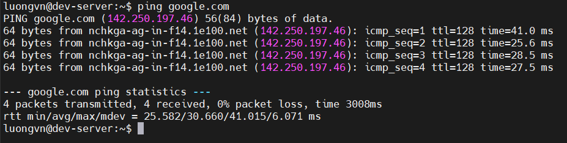
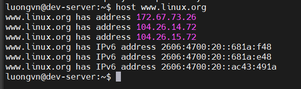
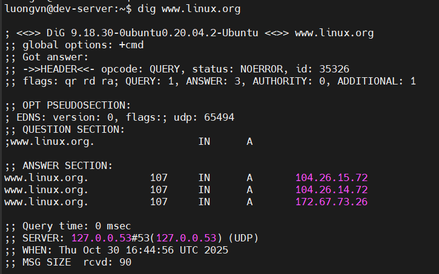
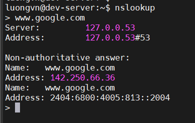

# BASIC NETWORK TROUBLESHOOTING
## Sending Test Packets
- lệnh `ping` được dùng để kiểm tra kết nội mạng(network connectivity) giữa máy bạn và máy khác(remote host)
- Cách hoạt động:
  - `ping` gửi gói tin ICMP(Internet Control Message Protocol) đến máy đích
  - Nếu máy đích hỗ trợ ICMP, nó sẽ gửi lại gói phản hồi(reply)
  - Dựa vào gói phản hồi đó, hệ thống sẽ biết được:
    - Mạng có kết nối không(packet loss)
    - Thời gian trê(latency/round-trip time)
    - Số gói tin gửi và nhận

  

  - `icmp_seq`: số thứ tự của gói tin
  - `ttl`(Time to live): số lần gói tin có thể nhảy qua router
  - `time`: thời gian trễ
  - `packet loss`: phần trăm gói tin bị mất
  - `avg`: thời gian trung bình của các gói tin

## Tracing Routes
- Dùng `tracepath` trong LINUX để có thể biết được gói tin đi qua những thiết bị(router) nào và `MTU`(Maximum transmission unit): kích thước gói tin tối đa là bao nhiêu

```bash
[root@dev-server ~]# tracepath 10.10.30.9
 1?: [LOCALHOST]                                         pmtu 1500
 1:  gateway                                               0.881ms
 1:  gateway                                               0.826ms
 2:  10.10.30.9                                            1.339ms reached
    Resume: pmtu 1500 hops 2 back 2
```

## Finding Host Information
1) `host` command
  
    - Tra cứu thông tin DNS(tên miền <-> địa chỉ IP)

      

2) `dig` command(Domain Information Groper)
    - Hiển thị tất cả bản ghi DNS

      

3) `nslookup` command
    - Tra cứu DNS một cách tương tấc

      