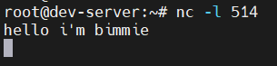
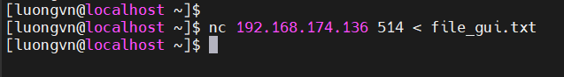

# Advanced Network Troubleshooting
## The `netstat` command
- `netstat`(network statistics) là lệnh hiển thị thông tin về:
  - Các kết nối mạng đang hoạt động
  - Các cổng port mà hệ thống đang lắng nghe
  - Các socket unix nội bộ
  - Thống kê hoạt động của các giao thức mạng(IP, TCP, UDP, ...)

- Một số OPTION hay dùng:

  | Lệnh         | Ý nghĩa                                                                    |
  | ------------ | -------------------------------------------------------------------------- |
  | `netstat`    | Hiển thị tất cả kết nối mạng đang hoạt động                                |
  | `netstat -t` | Chỉ hiển thị **TCP connections**                                           |
  | `netstat -u` | Chỉ hiển thị **UDP connections**                                           |
  | `netstat -l` | Hiển thị các **port đang LISTEN** (chờ kết nối đến)                        |
  | `netstat -s` | Hiển thị **thống kê chi tiết** theo từng giao thức (IP, TCP, UDP, ICMP, …) |

## Examining Sockets
- Socket là 1 điểm cuối(endpoint) của 1 kết nối mạng
- Nó gắn liền với:
  - Giao thức TCP hoặc UDP
  - Địa chỉ IP + cổng port
  - Thường được gắn với 1 tiến trình cụ thể trên hệ thống
- Câu lệnh `ss -anpt`
  - `-a`: hiển thị tất cả socket(đang lắng nghe + kết nối)
  - `-n`: hiển thị số port thay vì tên dịch vụ
  - `-p`: hiển thị process đang dùng socket đó(tên + PID)
  - `-t`: Giứo hạn chỉ hiển thị TCP socket

  ```bash
  root@dev-server:~# ss -anpt
  State    Recv-Q   Send-Q       Local Address:Port      Peer Address:Port    Process
  LISTEN   0        128                0.0.0.0:2222           0.0.0.0:*        users:(("sshd",pid=1219,fd=3))
  LISTEN   0        4096         127.0.0.53%lo:53             0.0.0.0:*        users:(("systemd-resolve",pid=1086,fd=13))
  LISTEN   0        128              127.0.0.1:6010           0.0.0.0:*        users:(("sshd",pid=2297,fd=11))
  ESTAB    0        0          192.168.174.136:2222     192.168.174.1:59763    users:(("sshd",pid=2297,fd=4),("sshd",pid=2194,fd=4))
  LISTEN   0        128                   [::]:2222              [::]:*        users:(("sshd",pid=1219,fd=4))
  LISTEN   0        511                      *:80                   *:*        users:(("apache2",pid=1228,fd=4),("apache2",pid=1227,fd=4),("apache2",pid=1226,fd=4))
  LISTEN   0        128                  [::1]:6010              [::]:*        users:(("sshd",pid=2297,fd=10))
  root@dev-server:~#
  ```


  - `State`: Trạng thái socket(`LISTEN`, ...)
  - `Recv-Q/Send-Q`: Byte trong hàng đợi nhận/gửi
  - `Local Address:Port`: Địa chỉ IP và port trên máy cục bộ
  - `Peer Address:Port`: Địa chỉ IP và port của máy đối tác


## The `netcat` Utility
- Một công cụ hữu ích để khắc phục sự cố mạng là tiện ích netcat
- `nc` command có thể đọc và ghi vào bất kỳ cổng mạng nào

  ```bash
  nc [OPTION] [IP or HOSTNAME] [PORT]
  ```

  |OPTION|Chức năng|Ví dụ|
  |---|---|---|
  |`-l: listen`|chuyển máy thành server để lắng nghe kết nối tới|`nc -l 1234`|
  |`-u: UDP`|dùng UDP thay vì TCP|`nc -u -l 514`|
  |`-v: verbose`|hiển thị thông tin kết nối, debug tiện lợi|`nc -v 192.168.1.10 22`|
  |`-z: zero I/O`|chỉ kiểm tra cổng đang mở hay ko, ko gửi dlieu|`nc -zv 192.168.1.10 20-1024`|
  |`-o <file>`|ghi log dữ liệu nhận/ghi vào file|`nc -l 1234 -o session.txt`|

- server: `ubuntu 192.168.174.136`
- client: `rocky9 192.168.174.135`

### Tạo máy chủ TCP đơn giản

- Trên máy sv mở kết nối để cho các client kết nối tới:

  

  - **NOTE**: nhớ mở port trên server
- Trên máy client kết nối tới server:

  

- Nhập văn bản ở client thì trên terminal của server cũng sẽ hiện và ngược lại

  

  

- 1 trong 2 bên `CTRL + C` thì sẽ ngắt kết nối của cả 2

### Gửi và nhận file qua TCP
- Trên sv mở port 514 và ghi dữ liệu nhận vào `file_nhan.txt`

  

- Trên client gửi dữ liệu từ file `file_gui.txt` với nội dung là:

  ```vim
  hello world
  this is a test file
  ```

  

- Xem thừ file `file_nhan.txt` trên server

  


### Quét cổng port
- Muốn kiểm tra xem server có đang mở port nào không

  ```bash
  nc -zv <IP_SERVER> [PORT]
  ```

  - Nếu cổng mở thấy `succeeded`
  - Ngược lại sẽ là `timed out`
  - Nếu hiện `connection refused` tức là port đó có phản hồi, nhưng không có chương trình nào đang lắng nghe tại port đó.