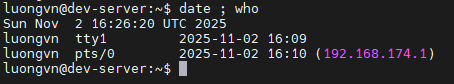
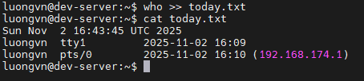
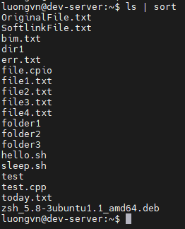
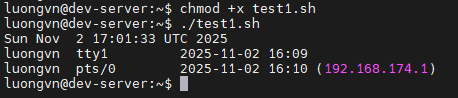

# THE BASIC OF SHELL SCRIPTING
## Running Multiple Commands
- Ta có thể nhập nhiều lệnh trên cùng 1 dòng lệnh và linux sẽ xử lý tất cả chúng
- Mỗi lệnh sẽ cách nhau bởi dấu `;`

  

  - Chạy lệnh `date` trước hiện thị kết quả sau đó chạy lệnh `who` và hiển thị kết quả nối tiếp từ lệnh đầu tiên

## Redirecting Output
- Ta có thể lưu output 1 câu lệnh vào 1 file 

- Cú pháp cơ bản: 

  ```bash
  command > filename
  ```

  - `>`: ký hiệu chuyển hướng đầu ra
  
- Ví dụ:

  

  - **NOTE**: Nếu `today.txt` đã tồn tại, lệnh `>` sẽ xóa toàn bộ nội dung cũ và ghi đè nội dung mới.

- Nếu muốn ghi thêm nội dung vào cuối file, ta dùng `>>`

  

## Piping Data
- Để kết hợp đầu ra của lệnh trước thành đầu vào của lệnh sau ta sử dụng `|`

  

## The Shell Script Format
- Một shell script là tập hợp các lệnh Linux được ghi lại trong 1 file text để có thể chạy tự động thay vì phải gõ từng lệnh thủ công
- Khi chạy file, linux thực thi từng lệnh trong file theo thứ tự.

- file script thường có đuôi là `.sh`
- Mọi shell script đều phải bắt đầu bằng 1 dòng đặc biệt là `shebang`:

  ```bash
  #!/bin/bash
  ```

  - `#!` (đọc là “shebang”) cho hệ điều hành biết shell nào sẽ thực thi file.
  - `/bin/bash` là đường dẫn của chương trình Bash shell.
- Sau dòng `shebang`, viết các lệnh linux bình thường

  ```bash
  #!/bin/bash
  date
  who
  ```

### Running the Shell Script

- Cấp quyền thực thi và chạy:

  

