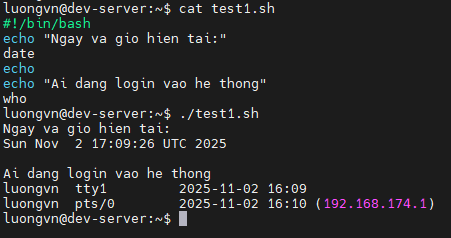
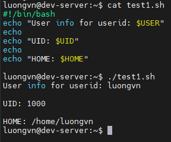
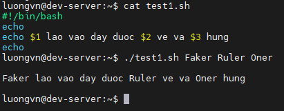
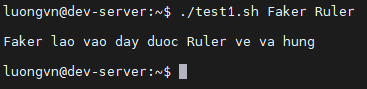
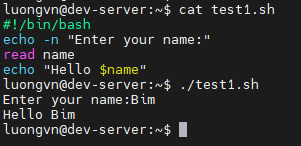
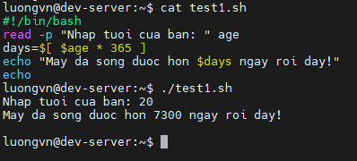
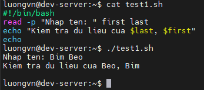
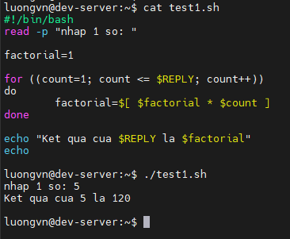
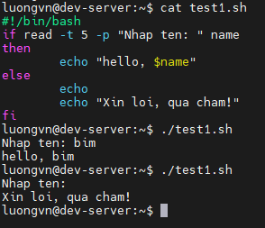
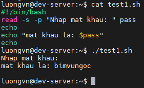

# Advanced Shell Scripting
## Displaying Messages
- Có thể sử dụng `echo` để phân cách đầu ra các lệnh giúp dễ nhìn hơn

  

## Using Variables in Scripts
### Using Global Environment Variables
- Để lấy giá trị của một biến môi trường, ta đặt dấu `$` trước tên biến

  

### Defining Local Variables
- Hầu hết biến trong shell scripts là biến cục bộ được dùng để lưu trữ dữ liệu của chính bạn trong shell cript đó

  

## Command-Line Arguments
- Khi chạy 1 shell script, ta có thể truyền thêm dữ liệu trực tiếp từ dòng lệnh

  

- **NOTE**: Nếu truyền thiếu đối số, script vẫn chạy nhưng đối số nào thiếu sẽ hiện rỗng

  

## Getting User Input
- Ta có thể cho phép nhập dữ liệu trong lúc mà script đang chạy

### Basic Reading 
- Lệnh `read` nhận dữ liệu từ bàn phím và gán dữ liệu cho biến

  

- option `-p` trong `read` cho phép chỉ định trực tiếp 1 lời nhắc thay vì dùng `echo`

  

- Ta có thể nhập nhiều lời nhắc cho cùng 1 lệnh `read`

  

- Ta cũng có thể ko chỉ định biến nào trên dòng lệnh `read`, khi đó dữ liệu sẽ được nhận vào biến môi trường đặc biệt `REPLY`

  

### Timing Out
- Nếu muốn script tiếp tục chạy bất kể người dùng có nhập dữ liệu hay ko ta có thể dùng option `-t` để chỉ định thời gian.

  

### Silent Reading
- Nếu không muốn dữ liệu nhập xuất hiện tren màn hình, sử dụng option `-s`

  

## The Exit Status
- Mỗi lệnh hoặc shell script khi chạy xong đều trả về một mã số trạng thái 
  - Giá trị này cho biết lệnh có thành công hay thất bại
  - Shell lưu giá trị đó trong biến `$?`

- Ta có thể chỉ định exit status bằng lệnh `exit`