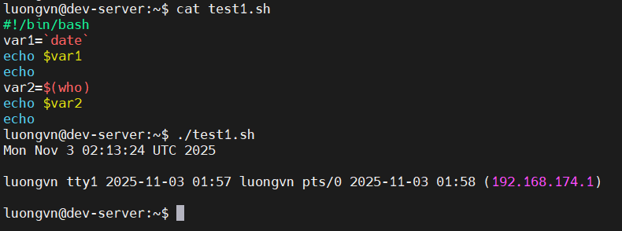
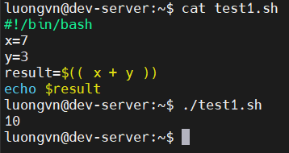
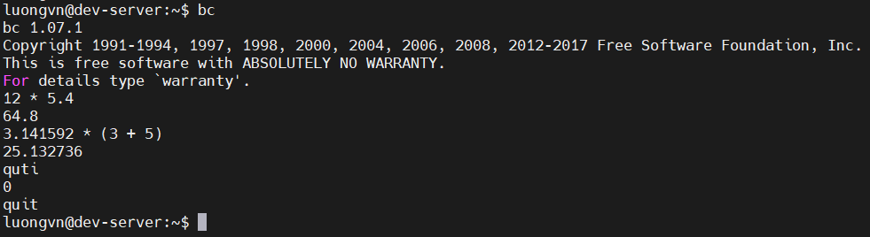
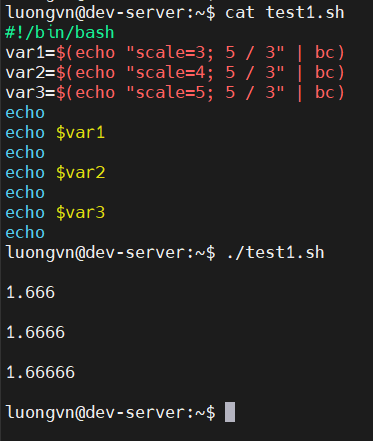
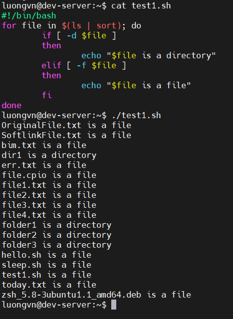
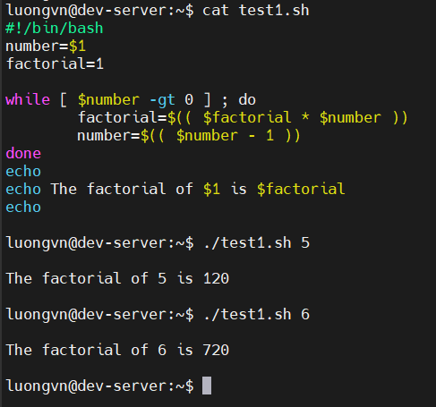

# WRITING SCRIPT PROGRAMS
## Command Substitution
- Ta có thể gán đầu ra lệnh cho 1 biến

  

## Performing Math
- bash hỗ trợ phép toàn số nguyên bằng cú pháp:
  ```bash
  result = $(( 25 * 5 ))
  ```

  

- Để làm việc với số thực ta dùng `bc`

  

- Biến `scale` trong `bc`
  - `scale` xác định số chữ số thập phân hiển thị trong phép chia hoặc tính toán số thực.

    ```bash
    $ bc -q
    3.44 / 5
    0        # vì mặc định scale=0 (chỉ giữ số nguyên)
    scale=4  # đặt 4 chữ số thập phân
    3.44 / 5
    .6880
    quit
    ```
- Dùng `bc` trong script

  

## Logic Statements
### The `if` Statement
- Sử dụng `if` để đặt các điều kiện
- Cấu trúc `if`: 
  
  ```bash
  if [ condition ]
  then
    commands
  fi
  ```

- Condition test:
  - So sánh số học:
  
    | Toán tử     | Ý nghĩa                                  | Ví dụ                |
    | ----------- | ---------------------------------------- | -------------------- |
    | `n1 -eq n2` | Bằng nhau (**equal**)                    | `[ 5 -eq 5 ]` → true |
    | `n1 -ne n2` | Khác nhau (**not equal**)                | `[ 5 -ne 3 ]` → true |
    | `n1 -gt n2` | Lớn hơn (**greater than**)               | `[ 7 -gt 4 ]` → true |
    | `n1 -ge n2` | Lớn hơn hoặc bằng (**greater or equal**) | `[ 5 -ge 5 ]` → true |
    | `n1 -lt n2` | Nhỏ hơn (**less than**)                  | `[ 3 -lt 7 ]` → true |
    | `n1 -le n2` | Nhỏ hơn hoặc bằng (**less or equal**)    | `[ 5 -le 6 ]` → true |

  - So sánh chuỗi:

    | Toán tử        | Ý nghĩa                                   | Ví dụ              |
    | -------------- | ----------------------------------------- | ------------------ |
    | `str1 = str2`  | Hai chuỗi giống nhau                      | `[ "$x" = "$y" ]`  |
    | `str1 != str2` | Hai chuỗi khác nhau                       | `[ "$x" != "$y" ]` |
    | `str1 < str2`  | str1 nhỏ hơn str2 (theo **thứ tự ASCII**) | `[ "$x" \< "$y" ]` |
    | `str1 > str2`  | str1 lớn hơn str2 (ASCII)                 | `[ "$x" \> "$y" ]` |
    | `-n str1`      | Chuỗi có **độ dài > 0**                   | `[ -n "$x" ]`      |
    | `-z str1`      | Chuỗi có **độ dài = 0**                   | `[ -z "$x" ]`      |

    - **NOTE**: Trong `[ ]`, khi dùng `<` hoặc `>`, bạn phải escape (thêm dấu `\`) để tránh Bash hiểu nhầm là ký hiệu redirection.

  - Kiểm tra file:

    | Toán tử           | Ý nghĩa                                                | Ví dụ                         |
    | ----------------- | ------------------------------------------------------ | ----------------------------- |
    | `-d file`         | File tồn tại **và là thư mục**                         | `[ -d /etc ]`                 |
    | `-e file`         | File **tồn tại**                                       | `[ -e myfile.txt ]`           |
    | `-f file`         | File tồn tại **và là file thường (regular file)**      | `[ -f /bin/bash ]`            |
    | `-r file`         | File **đọc được**                                      | `[ -r myfile.txt ]`           |
    | `-w file`         | File **ghi được**                                      | `[ -w myfile.txt ]`           |
    | `-x file`         | File **thực thi được**                                 | `[ -x script.sh ]`            |
    | `-s file`         | File tồn tại **và không rỗng**                         | `[ -s data.txt ]`             |
    | `-O file`         | File **thuộc sở hữu người dùng hiện tại**              | `[ -O myfile.txt ]`           |
    | `-G file`         | File có **nhóm (group)** trùng với người dùng hiện tại | `[ -G myfile.txt ]`           |
    | `file1 -nt file2` | `file1` **mới hơn** `file2` (newer than)               | `[ file1.txt -nt file2.txt ]` |
    | `file1 -ot file2` | `file1` **cũ hơn** `file2` (older than)                | `[ file1.txt -ot file2.txt ]` |

### The `case` Statement

- `case` cho phép ta kiểm tra nhiều giá tri của 1 biến đơn lẻ ở định dạng hướng danh sách:

  ```bash
  case EXPRESSION in

    PATTERN_1)
      STATEMENTS
      ;;

    PATTERN_2)
      STATEMENTS
      ;;

    PATTERN_N)
      STATEMENTS
      ;;

    *)
      STATEMENTS
      ;;
  esac
  ```

## Loops
### The `for` loop
- Câu lệnh `for` lặp qua mọi phần tử trong 1 chuỗi, chẳng hạn như các file trong thư mục hoặc các dòng trong 1 văn bản.
- Cú pháp:
  
  ```bash
  for variable in series ; do
      commands
  done
  ```

  

### The `while` loop
- Cú pháp:

  ```bash
  while [ condition ] ; do
      commands
  done
  ```

  

## Functions
- Có thể khởi tạo hàm theo 2 cách:

  ```bash
  function name {
    commands
  }
  ```

  hoặc

  ```bash
  name() {
    commands
  }
  ```

- Nếu hàm có đối số khi gọi ta sẽ thêm các đối số vào:

  ```bash
  name arugument1 argument2 ...
  ```

  