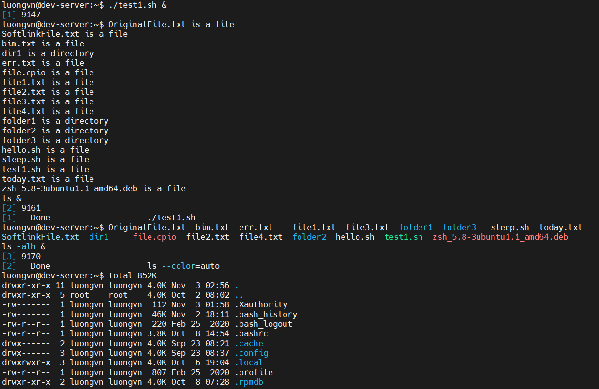

# RUNNING SCRIPT IN BACKGROUND MODE
## Running in the Background
- Để chạy script ở chế độ nền ta đặt thêm ký hiện `$` sau lệnh

  ```bash
  luongvn@dev-server:~$ ./test1.sh &
  ```

## Running Multipls Background Jobs
- Ta có thể chạy nhiều script nền cùng lúc bằng cách đưa `$` vào sau mỗi lệnh

  

  