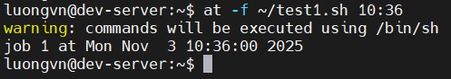

# RUNNING LIKE CLOCKWORK
- Ta có thể chạy script vào 1 thời điểm được trước bằng 2 cách:
  - command `at`
  - bảng `cron`

## Scheduling a Job Using the `at` Command
- `at` cho phép chỉ định thời gian mà hệ thống chạy 1 script
- Các script khi được khởi tạo với `at` chỉ chạy duy nhât 1 lần

### The `at` Command Format

  ```bash
  at [OPTION] runtime
  ```

  

### Listing Pending Jobs

- `atq` để xem các công việc đang chờ trên hệ thống

  ```bash
  $ at -f test21.sh 19:15 
  warning: commands will be executed using /bin/sh 
  job 7 at 2007-11-04 10:15 
  $ at -f test21.sh 4PM 
  warning: commands will be executed using /bin/sh 
  job 8 at 2007-11-03 16:00 
  $ at -f test21.sh 1PM tomorrow 
  warning: commands will be executed using /bin/sh 
  job 9 at 2007-11-04 13:00 
  $ atq 
  7  2007-11-04 10:15 a 
  8  2007-11-03 16:00 a 
  9  2007-11-04 13:00 a
  ```

### Removing Jobs
- `atrm` để xóa 1 công việc chờ 

  ```bash
  $ atrm 8
  $ atq
  7  2007-11-04 10:15 a 
  9  2007-11-04 13:00 a
  ```

## Scheduling Regular Scripts
- Ta có thêm 1 tiện ích để lập lịch tiến trình đó là `crontab`
- Khác với `at`, `crontab` lặp đi lặp lại vào cùng 1 thời điểm mỗi ngày hoặc mỗi tuần, mỗi tháng.
- Mỗi người dùng có 1 bảng cron riêng của họ để chạy các công việc đã lên lịch. Để xem bản cron của mình, hãy sử dụng option `-l: list`.

  

- Để thêm 1 cron mới trong hệ thống sử dụng option `-e: edit`


