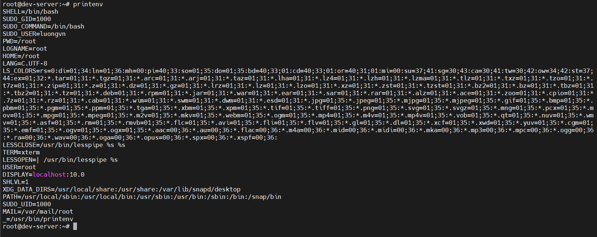
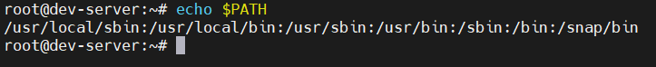
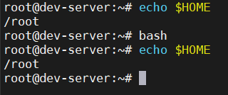
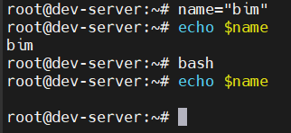
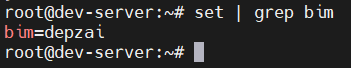
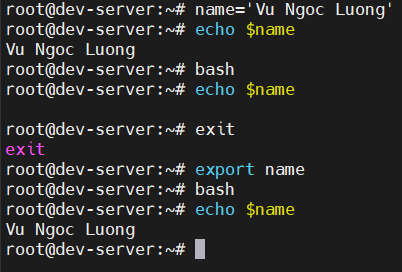
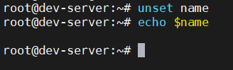

# SHELL VARIABLES
Có 2 kiểu biến môi trường trong BASH SHELL
- Global variables: biến toàn cục
- Local variables: biến cục bộ
## Global Environment Variables
- Là các biến môi trường có phạm vi toàn cục 
  - Hiển thị trong shell hiện tại
  - Và mọi tiến trình con được tạo ra từ shell này đều có thể truy cập được
- Khi login vào hệ thống, Linux tự động set nhiều biến môi trường toàn cục:
  - `HOSTNAME`: tên máy
  - `SHELL`: loại shell đang dùng
  - `USER`: tên người dùng hiện tại
  - `PATH`: danh sách thư mục để tìm các lệnh
  - `HOME`: thư mục cá nhân người dùng
  - `PWD`: thư mục hiện tại
- Sử dụng `printenv` để xem các Global Environment Variables
  
  

- Sử dụng `echo` kết hợp `$` để xem giá trị của 1 lệnh cụ thể

  

- Biến toàn cục truyền xuống tiến trình con:
  - Khi chạy lệnh `bash` tức là mở 1 shell mới thì biến toàn cục vẫn được kế thừa

    

## Local Environment Variables
- Là các biến chỉ tồn tại trong shell hiện tại (local process) nơi nó được tạo ra.
- Ko được truyền xuống cho child process

  

  -> `name` chỉ tồn tại trong shell đầu tiên -> biến cục bộ

- Nếu muốn chuyền xuống tiến trình con ta phải `export`(biến thành global)
- Để xem các biến local ta dùng `set`. Tuy nhiên `set` hiện cả biến local và global nên sẽ rất nhiều thông tin in ra, ta có thể lọc bằng `grep`

  

## Setting Local Environment Variables
- Cách tạo biến cục bộ:
  ```bash
  ten_bien=gia_tri
  ```
- Ví dụ:
  ```bash
  name=bim
  echo $name # bim
  ```

- Khi giá trị chứa khoảng trắng, ta dùng dấu `'` hoặc `"` đẻ gói lại

  ```bash
  test='testing a long string'
  echo $test
  ```
- Quy ước viết tên biến:
  - biến do người dùng tạo -> viết chữ thường(`test`, `count`, `name`, ...)
  - biến hệ thống hoặc toàn cục -> viết chữ hoa(`PATH`, `HOME`, `USER`, ...)

## Setting Global Environment Variables

- Dùng `export` nếu muốn chuyển biến từ local -> global 

  

- Xóa biến ta dùng `unset`

  

### Locating System Environment Variables
- Tùy cách bash khởi chạy nó sẽ đọc các file khởi động khác nhau.

#### Login Shell(khi vừa đăng nhập vào hệ thống)
- Khi bạn đăng nhập vào Linux (qua console, SSH, TTY,...), Bash là login shell.
- Nó sẽ chạy các shell theo thứ tự:
  - `/etc/profile` → chứa cấu hình chung cho toàn hệ thống (ví dụ PATH, LANG, umask, ...).
  - `~/.bash_profile`
  -  `~/.bash_login`
  -  `~/.profile`
- Bash sẽ dừng lại khi gặp file đầu tiên tồn tại trong 3 file người dùng ở trên.
- Ví dụ: nếu `~/.bash_profile` tồn tại thì `.bash_login` và `.profile` sẽ bị bỏ qua.
- Các file này là nơi nên thêm biến môi trường cá nhân để tự động thiết lập khi login

#### Non-interactive shell (khi chạy script)