# Lab: Quản lý Permission trong Linux
## Mục tiêu
1) Hiểu cơ chế owner, group, others và quyền rwx.
2) Thực hành xem và thay đổi quyền file/thư mục với chmod.
3) Thực hành thay đổi owner và group với chown
4) Kiểm tra quyền truy cập bằng lệnh ls

## Chuẩn bị môi trường
```bash
# Tạo user để thử nghiệm
sudo useradd -m bim
sudo passwd bim
sudo useradd -m mie
sudo passwd mie

# Tạo group thử nghiệm
sudo groupadd dev
sudo usermod -g dev bim
sudo usermod -g dev mie
```

Vào file `/etc/passwd` và `/etc/group` để kiểm tra xem user `bim` và `mie` đã thuộc cùng 1 group `dev` chưa:

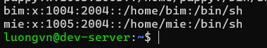

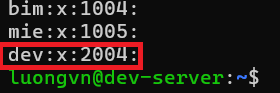

> Ta thấy cả `bim` và `mie` đều thuộc gid = 2004 - `dev`

```bash
# Tạo thư mục lab
mkdir ~/lab_permission
cd ~/lab_permission
```

## Xem quyền cơ bản
```bash
# Tạo file và thư mục
touch file1.txt
mkdir dir1

# Xem quyền
ls -l
```

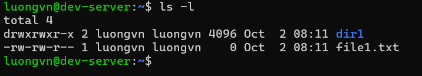

Ta thấy:
- Thư mục `dir1` có dạng `drwxrwxr-x` -> `owner`: đọc, sửa, thực thi; `group`: đọc, sửa, thực thi; `other`: đọc, thực thi
- File `file1.txt` có dạng `-rw-rw-r--` -> `ownder`: đọc, sửa; `group`: đọc, sửa; `other`: đọc

## Thay đổi quyền với chmod
### 2.1. Chmod dạng symbolic
```bash
chmod u+x file1.txt     # thêm quyền thực thi cho owner
chmod g+w file1.txt     # thêm quyền ghi cho group
chmod o-r file1.txt     # bỏ quyền đọc cho others
```

- Dùng `ls -l` để kiểm tra lại quyền trong file `file1.txt`

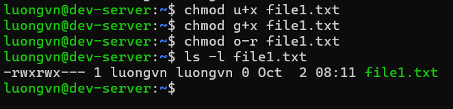

Ta thấy:
- File `file1.txt` có dạng `-rwxrwx--- ` -> `owner` và `group` có thêm quyền thực thi, còn `other` thì đã không còn quyền đọc nữa

### 2.2. Chmod dạng octal
```bash
chmod 654 file1.txt 
# owner: rw-, group: r-x, others: r--
```

- Dùng `ls -l` để kiểm tra lại quyền trong file `file1.txt`

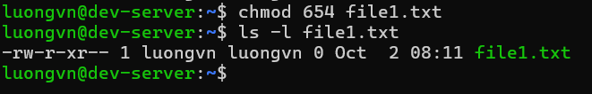

Ta thấy: 
- File `file1.txt` có dạng `-rw-r-xr--` -> `owner`: có quyền đọc, sửa; `group`: đọc, thực thi; `others`: chỉ đọc.

## Thay đổi owner
```bash
# Chỉ định owner
sudo chown bim file1.txt      # bim là owner
sudo chown bim:dev file1.txt   # bim là owner, dev là group 
```

- Dùng `ls -l` để kiểm tra lại quyền trong file `file1.txt`

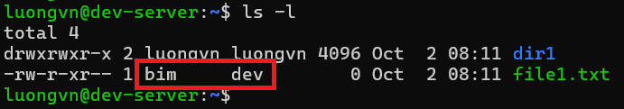

## Kiểm tra quyền
- Bước 1: Thoát khỏi user hiện tại và vào user `bim` để kiểm tra xem có thể đọc và ghi không?

```bash
exit # đăng xuất

# Truy cap vao user "bim" 

whoami # kiem tra xem da vao duoc "bim" hay chua?
```

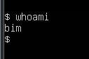

- Bước 2: Vào file1.txt và ghi nội dung sau đó dùng cat xem nội dung file đã được chỉnh sửa chưa

```bash
nano file1.txt
```

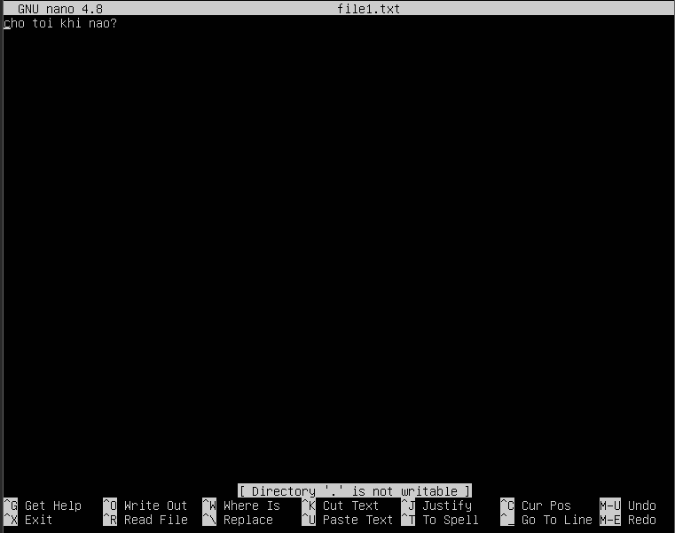

```bash
# Lưu và dùng cat để kiểm tra
cat file1.txt
```

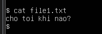

> Kiểm tra quyền của `bim` thành công.

- Bước 3: Đăng xuất và vào user `mie` xem có thể chỉnh sửa không? 

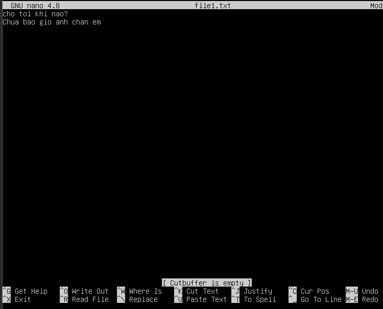

Ta lưu và cat thử để kiểm tra

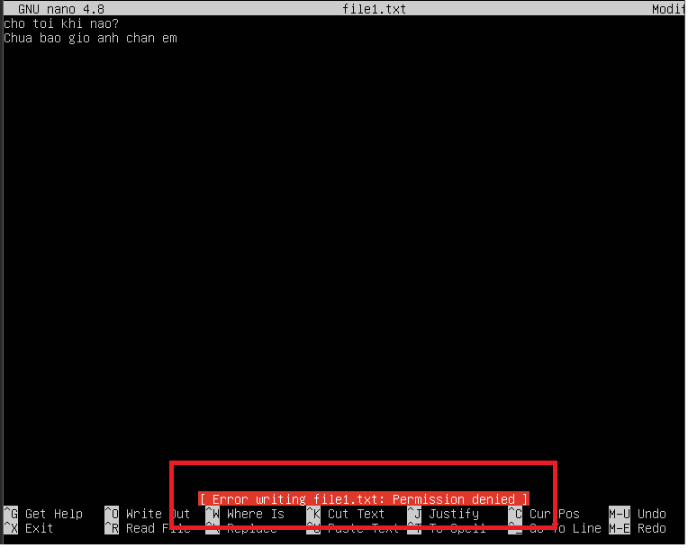

Ta thấy có dòng `Error writing file1.txt: Permission denied`

-> `mie` không có quyền chỉnh sửa -> Kiểm tra quyền thành công.