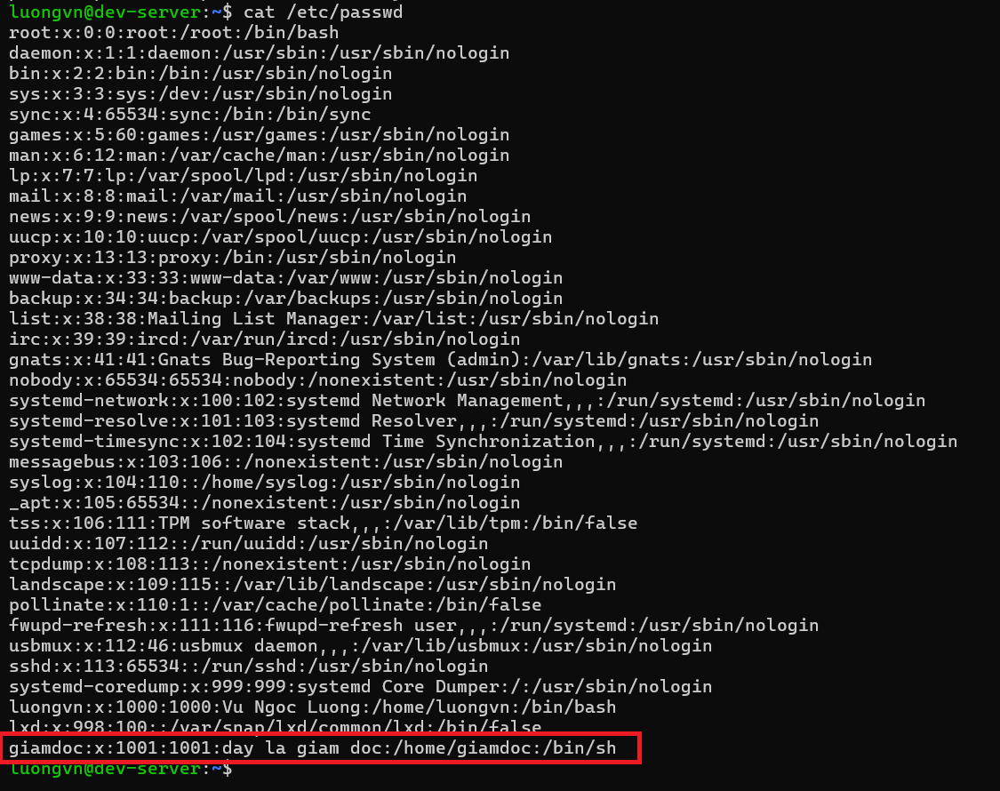

# Lab: Quản lý User và Group trong Ubuntu
## Mục tiêu
- Biết cách tạo, xóa, liệt kê user trong hệ thống.
- Biết cách tạo, xóa group.
- Biết cách thêm user vào group và kiểm tra thành viên group.

## 1. Chuẩn bị môi trường
- Máy ảo ubuntu
- Quyền sudo

## 2. Thực hiện
### Tạo user mới
```bash
sudo useradd -c "day la giam doc" giamdoc

# tạo user "giamdoc" với thông tin "Đây là giám đốc"
```

### Đặt password
```bash
sudo passwd giamdoc
```

### Mở file /etc/passwd xem có thông tin của user: giamdoc chưa

```bash
cat /etc/passwd
```



