# Linux command

## Summary

|1 - 10|11 - 20|21 - 30|31 - 40|41 - 50|
|---|---|---|---|---|
|[1.man](#1-lệnh-manmanual---hướng-dẫn-sử-dụng)|[11.mv](#11-lệnh-mv)|[21.alias](#21-lệnh-alias)|  |  |
|[2.pwd](#2-lệnh-pwd-print-working-directory)|[12.rename](#12-lệnh-rename)|[22.tee](#22-lệnh-tee)|  |  |
|[3.cd](#3-lệnh-cdchange-directory)|[13.head](#13-lệnh-head)|[23.grep](#23-lệnh-grep)|   |   |
|[4.ls](#4-lệnh-lslist)|[14.tail](#14-lệnh-tail)|[24.cut](#24-lệnh-cut)|   |   |
|[5.mkdir](#5-lệnh-mkdir-make-directory---tạo-thư-mục)|[15.cat](#15-lệnh-cat)|[25.tr](#25-lệnh-tr)|   |   |
|[6.rmdir](#6-lệnh-rmdirremove-directory---xóa-thư-mục)|[16.tac](#16-lệnh-tac)|   |   |   |
|[7.file](#7-lệnh-file)|[17.more & less](#17-lệnh-more-và-less)|   |   |   |
|[8.touch](#8-lệnh-touch)|[18.strings](#18-lệnh-strings)|   |   |   |
|[9.rm](#9-lệnh-rm---remove)|[19.echo](#19-lệnh-echo)|  |   |   |
|[10.cp](#10-lệnh-cp)|[20.type & which](#20-lệnh-type-và-which)|   |   |   |


## 1. Lệnh `man`(manual - hướng dẫn sử dụng)
### 1.1 `man $command`
- Xem thông tin của 1 lệnh nào đó: công dụng, options, ...

  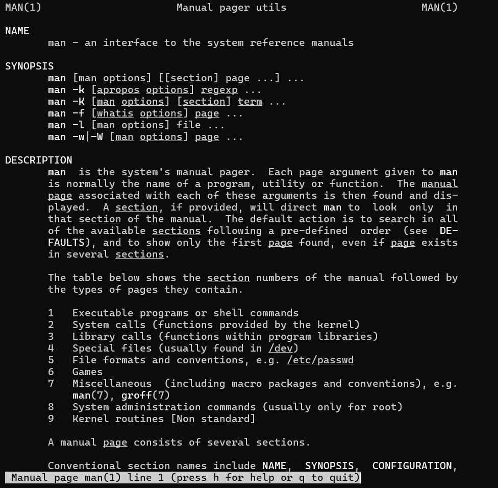

### 1.2. `man $config_file`
- Xem hướng dẫn các file config. VD: `man sshd_config`

  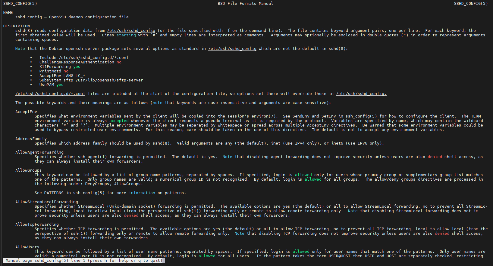

### 1.3. `man $daemon`
- Xem thông tin các tiến trình chạy nền. VD: `man sshd`

  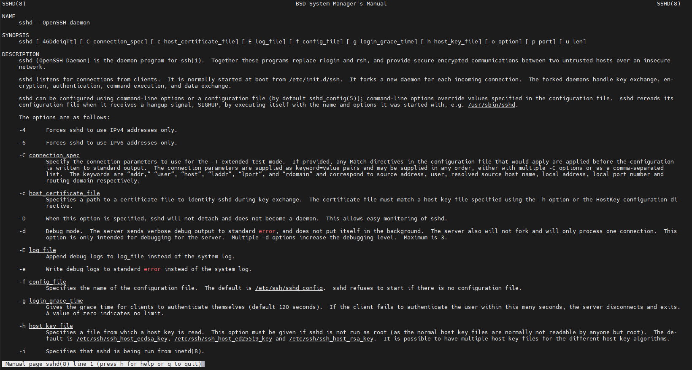

### 1.4. `man -k`
- Hiển thị mô tả ngắn các trang hướng dẫn của từ khóa trong tiêu đề 

  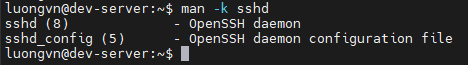

### 1.5. `whatis`

Xem mô tả trang hướng dẫn của từ sau nó

Ví dụ:

- `whatis mkdir`

  

- `whatis echo`

  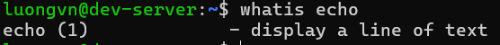

### 1.6. `whereis`
- Tìm kiếm các file liên quan đến 1 lệnh gồm:
  - File thực thi(binary)
  - file source code
  - file man page

- Ví Dụ: 

  

  - `/usr/sbin/sshd` → file thực thi

  - `/usr/share/man/man8/sshd.8.gz` → man page
  
- OPTION:
  - `-b` -> chỉ tìm file binary
  - `-m` -> chỉ tìm file man
  - `-s` -> chỉ tìm source code

## 2. Lệnh `pwd` (Print Working Directory)

- Lệnh `pwd` dùng để hiển thị đường dẫn dến thư mục đang làm việc hiện tại:

  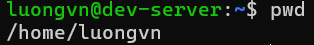

## 3. Lệnh `cd`(Change Directory)

- Chuyển đổi thư mục làm việc.

  - `cd /home/luongvn/Documents/foder1`: chuyển tới thư mục folder1.
  - `cd`: chuyển về thư mục chính của người dùng.
  - `cd A && ls`: chuyển tới thư mục A và hiện danh sách các file của nó.
  - `cd -`: chuyển về thư mục đang làm việc trước đó.
  - `cd ..`: chuyển về thư mục cha.
  - `cd ~`: Thay đổi thư mục hiện tại về thư mục chính.

## 4. Lệnh `ls`(List)
### 4.1. `ls`

- Hiển thị các tệp tin và thư mục trong thư mục.

  

### 4.2. `ls -t`

- Hiển thị các thư mục và file theo thời gian chỉnh sửa.

  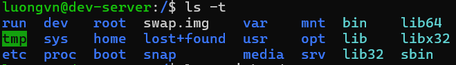

- Để show ra các file cuối cùng được chỉnh sửa. Thêm `head -(số_file)`

  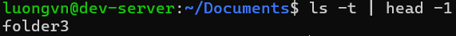

### 4.3. `ls -1`

- Hiển thị mỗi mục trên 1 dòng

  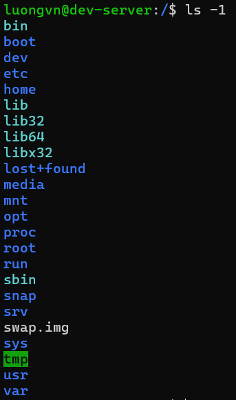

### 4.4. `ls -l`

- Hiển thị tất cả thông tin các mục

  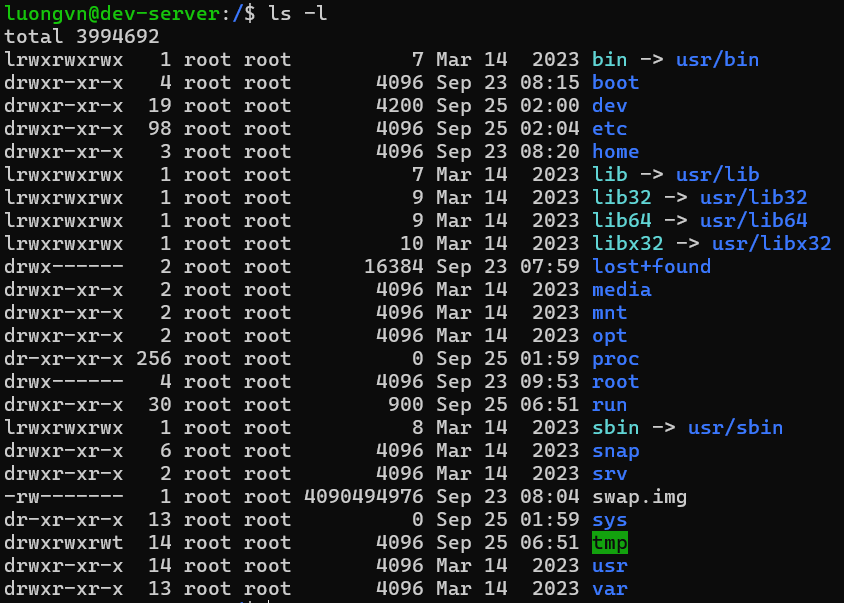

- Trong đó:
  - Kí tự đầu tiên: định dạng
    - `-`: file bình thường
    - `d`: thư mục
    - `s`: file socket
    - `l`: link file
  - Trường 1: File permission
  - Trường 2: Số lượng liên kết đến tệp hay thư mục đó
  - Trường 3: Chủ sở hữu của tệp, thư mục
  - Trường 4: Nhóm của tệp, thư mục
  - Trường 5: Kích thước của tệp, thư mục đó(đơn vị: byte)
  - Trường 6: Thời gian sửa đổi cuối cùng
  - Trường 7: Tên của tệp, thư mục

### 4.5. `ls -lh`

- Giống `ls -l` nhưng hiển thị trường 5(kích thước) ở dạng dễ đọc. M là MB, K là KB, G là GB.

  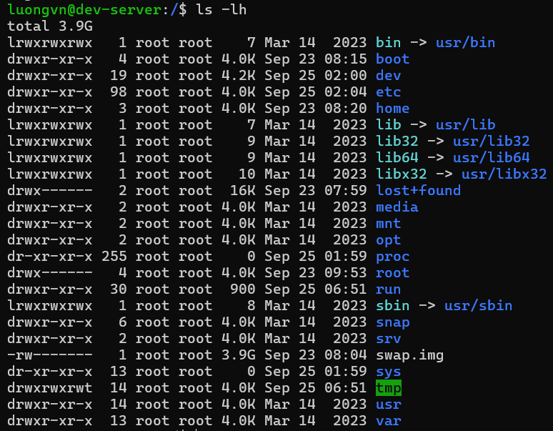

### 4.6. `ls -a`

- Như lệnh `ls` nhưng hiển thị cả những file ẩn. Trong linux, các file có tên bắt đầu bằng dấu chấm được gọi là file ẩn và nó không hiển thị cùng các file bình thường.

  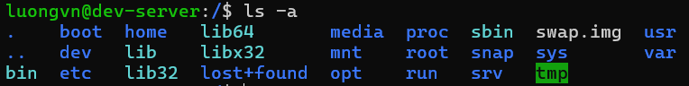

### 4.7. `ls -ld`

- Hiển thị thông tin thư mục

  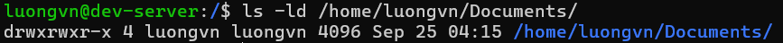

### 4.8. `ls -r`

- Giống `ls` nhưng sắp xếp ngược lại. Có thể kết hợp với option `-l` và `-t` để được kết quả như sau:

  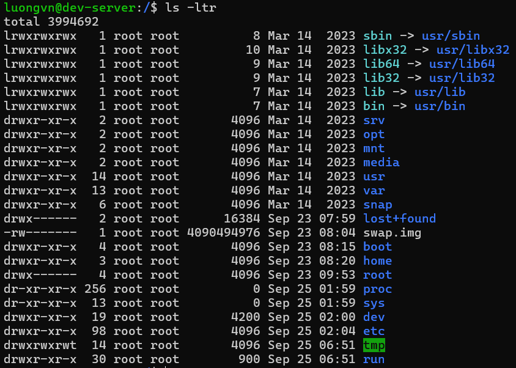

### 4.9. `ls -F`

- Nếu chỉ cần biết các mục là file hay thư mục ta sử dụng `ls -F`:

  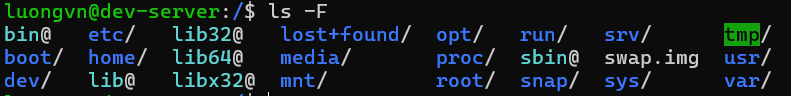

- Trong đó: 
  - `/`: Thư mục
  - Nothing: tệp bình thường
  - `*`: Tập tin thực thi
  - `@`: link file

### 4.10. `ls -S`

- Hiển thị danh sách nội dung theo kích thước giảm dần.

  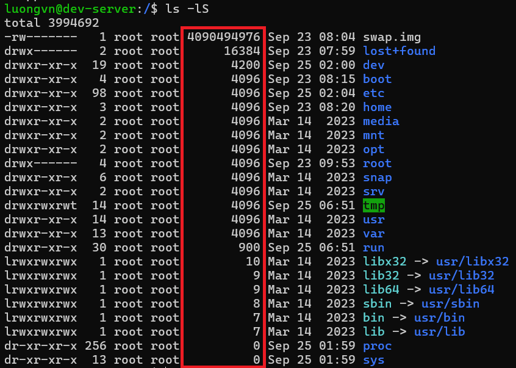

## 5. Lệnh `mkdir` (make directory - tạo thư mục)
### 5.1. Một số thông tin
- `mkdir --version`: Hiển thị thông tin phiên bản, giấy phép, tác giả.

  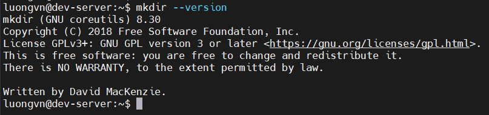

- `mkdir --help`: các option của `mkdir`

  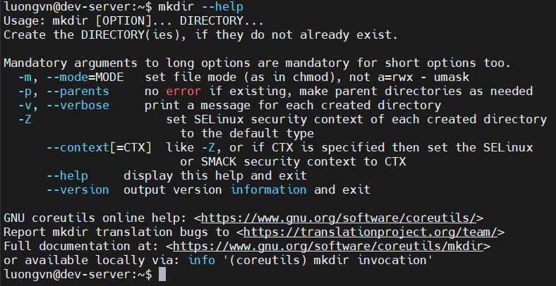

### 5.2. `mkdir <tên_thư_mục>`
- Tạo thư mục mới tại thư mục hiên tại
- Có thể tạo nhiều thư mục cùng lúc

  ```bash
  luongvn@dev-server:~$ mkdir folder_1 folder_2 folder_3 ...
  ```

### 5.3. `mkdir -v <tên_thư_mục>`
- Tạo thư mục với hiển thị thông báo

  

### 5.4. `mkdir -p`
- Tạo thư mục kèm thư mục cha khi cần thiết

  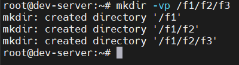

### 5.5. `mkdir -m`
- Tạo thư mục đi kèm với cấp permission 

  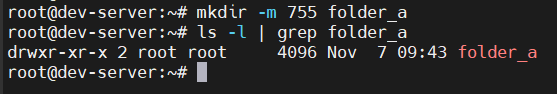

## 6. Lệnh `rmdir`(remove directory - xóa thư mục)
### 6.1. `rmdir + <tên_thư_mục>`
- Xóa thư mục rỗng

  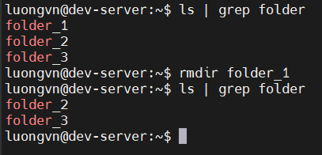

- Khi dùng lệnh này với thư mục không rỗng sẽ tạo ra lỗi

  

### 6.2. `rmdir -p <ten_thu_muc>`
- Xóa đệ quy cho tới khi gặp thư mục không rỗng

  

  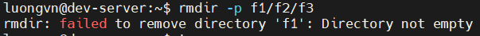

  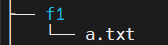

### 6.3. `rmdir -v <ten_thu_muc>`
- Hiển thị thông báo khi xóa lên màn hình

  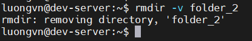

## 7. Lệnh `file`

- Cú pháp:

  ```bash
  file [OPTION] [file_name]
  ```

- Lệnh `file` được sừ dụng để xác định loại tệp

  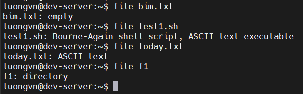

- Lệnh `file` sử dụng tệp `magic` nằm ở `/usr/share/file/magic` chứa các mẫu để nhận dạng các loại tệp. 

### 7.1. `file -b: brief` - tóm tắt
- Hiển thị kiểu file 1 cách ngắn gọn dễ hiểu

  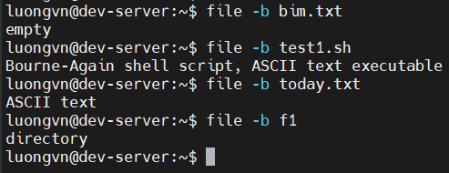

### 7.2. `file *`
- Hiển thị tất cả các file trong thư mục đang đứng

  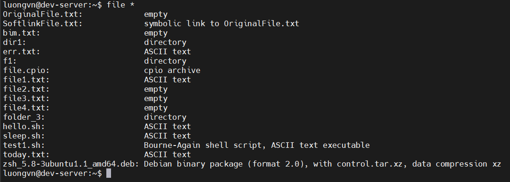

- Hiển thị tất cả các loại file trong thư mục nào đó

  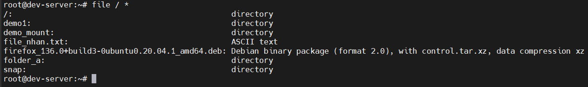

### 7.3. `file [range]*`
- Hiển thị kiểu file của các file trong khoảng nào đó

  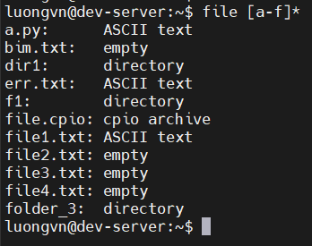

### 7.4. `file -s`
- Hiển thị các loại tệp của tệp đặc biệt như các tệp trong `/dev`

  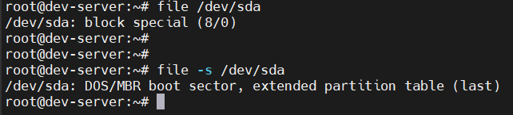

### 7.5. `file -f -`
- Kiểm tra kiểu file của nhiều file. Mỗi file gõ trên 1 dòng

  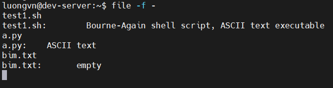

### 7.6. `file <file_name_1> <file_name_2> ...`
- Hiển thị loại tệp của nhiều tệp

  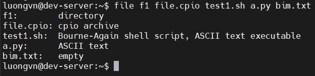

### 7.7. `file -z <file_nén>`

- Lệnh này sẽ cố gắng nhìn vào bên trong file nén

  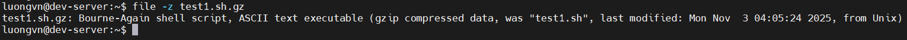

## 8. Lệnh `touch`
- Là 1 cách đơn giản để tạo 1 file trống hoặc thay đổi thời gian (timestamps) của file
- timestamps của file:
  - accesstime
  - modifytime
  - changetime

### 8.1. Tạo file trống
- Tạo 1 file:
  
  ```bash
  touch <filename>
  ```

  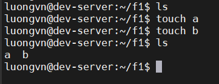

- Tạo nhiều file:

  ```bash
  touch <filename_1> <filename_2> ...
  ```

  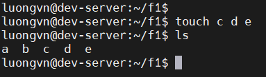

### 8.2. `touch -a <file_name>`
- Thay đổi thời gian lần cuối truy cập vào file bằng thời gian hiện tại

  

- `touch -m`: thay đổi thời gian sửa đổi(modifytime)

### 8.3. `touch -c <file_name>`
- Khi dùng option này với 1 file chưa có sẵn -> không tạo file mới 
- Dùng để thay đổi tất cả timestamps thành thời gian hiện tại

  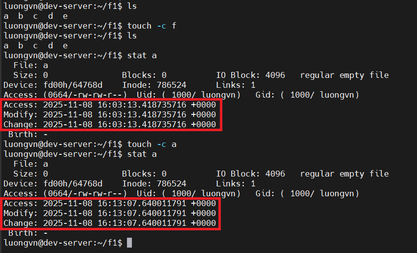

### 8.4. `touch -t YYYYMMDDHHMM <file_name>`

- Tạo 1 tệp tin với thời gian được chỉ định sẵn
- Có thể dùng để thay đổi thời gian của 1 tệp có sẵn

  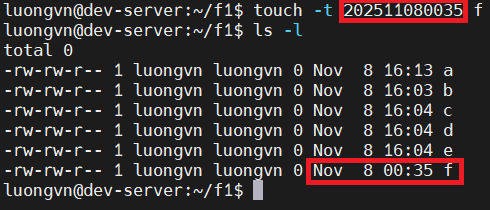

## 9. Lệnh `rm` - remove
- Dùng để xóa file hoặc thư mục

### 9.1. `rm <file_name>`

  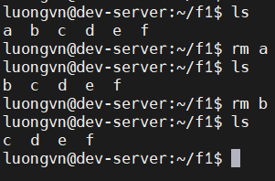

- Xóa nhiều file cùng lúc:

  ```bash
  rm <filename_1> <filename_2> ...
  ```

### 9.2. `rm -i`
- Xóa file hiện xác nhận trước khi xóa

  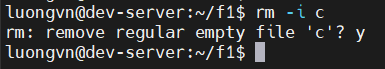

### 9.3. `rm -f`
- Xóa file không xác nhận

  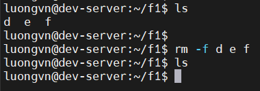

### 9.4. `rm -I file*`
- Xóa hàng loạt file có tên gần giống nhau

  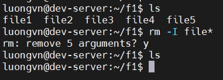

### 9.5. `rm -d <folder_name>`
- Xóa thư mục rỗng
- Nếu thư mục không rỗng ta không thể xóa!!

  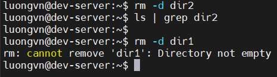

### 9.6. `rm -r <folder_name>`
- Nếu gặp thư mục, sẽ xóa tất cả file và thư mục con bên trong nó, rồi xóa luôn chính thư mục đó.

  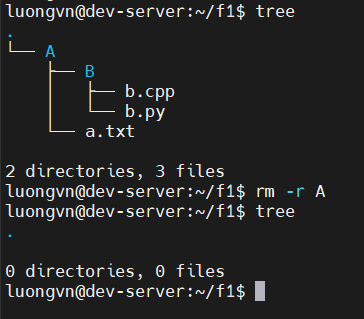

### 9.7. `rm -v`
- Hiển thị thông báo khi xóa

  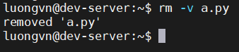

## 10. Lệnh `cp`
- Dùng để sao chép file hoặc thư mục

### 10.1. Copy nội dung 1 file vào 1 file khác

- Sao chép nội dung 1 file vào 1 file khác. Nếu file đích đó chưa tồn tại thì sẽ tạo ra file đó với nội dung giống hệt file nguồn.

  ```bash
  $ cp <file_nguồn> <file_đích>
  ```

  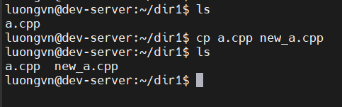

### 10.2. Copy file vào thư mục khác

  ```bash
  $ cp <file_1> <file_2> ... <thư mục đích>
  ```

  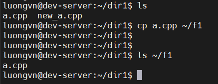

### 10.3. `cp -r/-R <thư_mục_nguồn> <thư_mục_đích>`
- Copy 1 thư mục vào thư mục khác, `-r: recursion`

  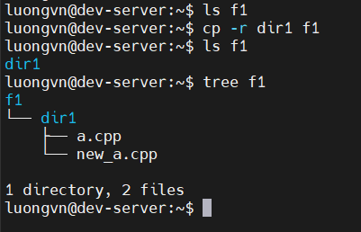

### 10.4. `cp -i`
- `-i: interactive`

- Hỏi người dùng có muốn ghi đè không khi mà có 1 file có tên trùng với file đích 

  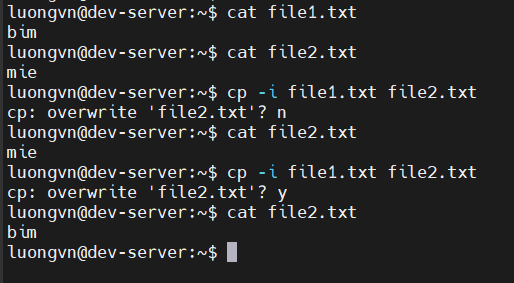

### 10.5. `cp -b`
- `-b: backup`
- Tạo bản sao lưu cho 1 file trong cùng thư mục, nếu tên của bản sao lưu trùng với tên 1 file nào đó nó sẽ tự động thêm `~` vào cuối tên file

  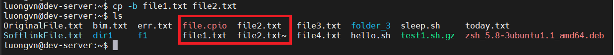

### 10.6. `cp -f`
- `-f: force`: ép buộc
- Khi hệ thống không thể mở tệp đích để thực hiện thao tác ghi vì người dùng không có quyền ghi cho tệp này thì ta sử dụng tùy chọn `-f`. Khi này, tệp đích sẽ bị xóa trước rồi sau đó copy nội dung từ tệp nguồn tới tệp đích. Nó thay đổi luôn cả quyền của tệp đích.

  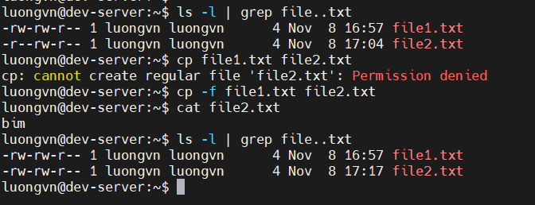

### 10.7. `cp -p`
- `-p: preserve`: bảo quản
- Khi sử dụng `-p`, lệnh cp sẽ bảo toàn các đặc điểm sau của tệp nguồn: timestamp, quyền sở hữu (owner, chỉ khi nó có quyền) và permission.

  

### 10.8. `cp -n`
- `-n: no clobber`: 
- không ghi đè lên tệp đã có sẵn

  

### 10.9. `cp -v`
- `-v: verbose`
- Hiển thị thông báo quá trình

  

## 11. Lệnh `mv`
- `mv - move(rename) file`: được sử dụng để di chuyển 1 hoặc nhiều tệp hoặc thư mục từ nơi này sang nơi khác
- Nó có 2 chức năng riêng biệt:
  - Đổi tên file hoặc thư mục
  - Di chuyển 1 nhóm các tệp tin vào thư mục khác.

### 11.1. Đổi tên file, thư mục

```bash
$ mv <old_name> <new_name> 
```


### 11.2. `mv -i`
- `-i: interactive`: tương tác
- Xác nhận di chuyển và ghi đè lên 1 tệp tin có sẵn

  

### 11.3. `mv -f`
- `-f: force`: ép buộc
- Khi dùng lệnh này để ghi đè với các file không có quyền ghi lên. `-f` sẽ cho ta ghi đè lên tệp mới và xóa tệp ban đầu

  


### 11.4 `mv -n`
- `-n: no clobber`: không cho ghi đè lên 1 tệp có sẵn

  


### 11.5. `mv -b`
- `-b: backup`: tạo 1 bản sao lưu tệp tin sẽ bị ghi đè

  

### 11.6. Di chuyển tệp tin, thư mục
- Chuyển tệp tin tới 1 thư mục khác

  

- Chuyển thư mục tới thư mục khác

  

## 12. Lệnh `rename`

- Thường dùng để đổi tên hàng loạt các file có tên cấu trúc gần giống nhau.

  ```bash
  $ rename [OPTION] expression replacement file...
  ```

### 12.1. Đổi tên nhiều file 

- Đổi đuôi tệp:

  

- Đổi chữ hoa/thường:

  

### 12.2. `rename -v`
- `-v: verbose`: hiển thị quá trình

  

## 13. Lệnh `head`
- Dùng để in phần đầu của tệp tin 

### 13.1. `head <file_name>`
- Mặc định in ra 10 dòng đầu file

  

- Có thể dùng cho nhiều file 

  

### 13.2. `head -n number`
- `-n: number`: in ra số dòng theo yêu cầu!!

  

### 13.3. `head -c number`
- In ra `number` byte đầu tiên!!
- Mỗi kí tự = 1 byte, dòng mới = 1 byte

  

### 13.4. `head -q`
- `-q: quiet --silent`: Khi in ra nhiều tệp cùng lúc không có dòng tên tệp hiện ra

  

### 13.5. `head -v`
- `-v: verbose`: luôn in ra tên tệp khi in ra

  

### 13.6. Ứng dụng của `head`
- Khi ta muốn in ra những dòng giữa của file. Ví dụ từ `k -> o` của file `list.txt`

  

- Khi ta sử dụng các lệnh có thông tin in ra màn hình ta có thể dùng `|` sau đó kết hợp `head` hoặc 1 số lệnh khác để in ra thông tin mình muốn!!

  

## 14. Lệnh `tail`
- In những dòng cuối cùng của file

### 14.1. `tail <file_name>`
- Mặc định in 10 dòng cuối của file

  

- Áp dụng với nhiều file

  

### 14.2. `tail -n number`
- In ra số dòng xác định cuối cùng của file

  

- Có thể không cần kí tự `n`:

  

- Hoặc dùng `+` để in từ dòng `number` đến cuối file:

  

### 14.3. `tail -c number`
- In ra số byte cuối cùng của tệp

  

- Dùng `+` để bỏ qua `number` byte đầu tiên:

  

### 14.4. `tail -q`

- Không in kèm theo tên file. Sử dụng khi áp dụng với nhiều file

  

### 14.5. `tail -f`
- `-f: follow`: dùng để theo dõi sự thay đổi của file(thường là file log)
- Tùy chọn này sẽ in ra 10 dòng cuối cùng của tệp và cập nhật liên tục

  

### 14.6. `tail -v`
- In ra luôn đi kèm tên file

  

## 15. Lệnh `cat`
- `cat: concatenate`: nối tiếp
- Lệnh này dùng để tạo, xem, nối nội dung cac file với nhau

  

### 15.1. `cat file_name_1 file_name_2 ...`
- Xem nội dung của 1 tệp:

  

- Nối nội dung của nhiều tệp và in ra màn hình:

  

### 15.2. `cat -n file_name`
- `-n: number`
- Xem nội dung của file và đánh số dòng

  

- Nhiều file:

  

### 15.3. `cat > new_file`
- Tạo file:

  

### 15.4. `cat file_nguồn > file_đích`
- Sao chép file:

  

### 15.5. `cat -s`
- `-s: squeeze-blank`: bỏ những dòng trôgns ở đầu file

  

### 15.6. `cat file1 >> file2`
- Nối nội dung `file1` vào cuối `file2`

  

### 15.7. `cat -E file`
- `-E: show ends`: Thêm kí tự `$` vào cuối mỗi dòng

  

## 16. Lệnh `tac`
- Dùng để nối và in nội dung file ngược lại. Ngược với lệnh `cat`

  

### 16.1. `tac file1 file2`
- Nối ngược nhiều tệp rồi in ra

  

### 16.2. `tac -b file_name`
- `-b: before`: Tạo dòng trắng để ngăn cách trước mỗi file

  

### 16.3. `tac -r`
- `-r: regex`: Lệnh này cho phép sử dụng regex

  

### 16.4. `tac -s string`
- `-s: seperator`: cho phép chỉ định ký tự hoặc chuỗi phân tách giữa các bản ghi thay vì theo từng dòng mặc định

- Ví dụ:
  - Đảo ngược theo dấu `.`:

    

  - Đảo ngược theo chuỗi dài hơn:

    

## 17. Lệnh `more` và `less`
### 17.1. Lệnh `more`
- Dùng để xem các tệp lớn trong 1 màn hình, có thể cuộn chuột để xem
- Dùng phím Enter để xem tiếp các dòng.
- Ở đây ta xem file `data.log`

  ```bash
  $ more /var/log/syslog
  ```

  

- `-p`: Xóa màn hình rồi hiển thị nội dung của file
- `+/<string>`: Tìm kiếm trong file và hiển thị ra

  

- `+number`: hiển thị từ dòng `number` của file

  

- Dùng để đọc đầu ra với nội dung dài:

  ```bash
  $ cat filename | more
  ```

### 17.2. Lệnh `less`
- Truy cập từng trang của file tài liệu dài:
  - `less -N`: đánh số dòng

    

  - `less -p "string"`: Tìm vị trí có `string`

    ```bash
    $ dmesg | less -p "disable"
    ```

    

## 18. Lệnh `strings`
- In ra các chuỗi kí tự có thể in trong tệp. Hiển thị các chuỗi ASCII có thể đọc được trong file nhị phân.

- Ví dụ xem file nhị phân của lệnh ls:

  

### 18.1. `strings -f`
- Hiển thị tên file trước mỗi dòng

  

## 19. Lệnh `echo`
- Dùng để hiện thị dòng văn bản được truyền vào. Nó được sử dụng chủ yếu trong các tập lệnh shell hay xuất văn bản ra màn hình hoặc tạo file.

### 19.1. `echo <string>`
- In ra màn hình chuỗi `string`

  

### 19.2. `echo -e \(mini_option)`
- `-e: escape` cho phép ta xác định sự liên tục của văn bản đầu vào

#### 19.2.1. `\b`
- `b: backspace`: Xóa 1 kí tự trước nó

  

#### 19.2.2. `\c`
- Ngắt văn bản và không xuống dòng

  

#### 19.2.3. `\n`
- `n: new line`: Xuống dòng

  

#### 19.2.4. `\t`
- `t: tab`: Tạo khoảng dấu tab

  

#### 19.2.5. `\r`
- Trả về văn bản sau nó

  

#### 19.2.6. `\v`
- `v: vertical tab`: tab đầu dòng

  

### 19.3. `echo *`
- Giống như lệnh `ls`

  

### 19.4. `echo -n`
- Ngăn không xuống dòng. Con trỏ sẽ ở vị trí cuối văn bản.

  

## 20. Lệnh `type` và `which`
- Khi muốn xem 1 lệnh cung cấp cho shell sẽ được thực thi như 1 lệnh bên ngoài shell hay 1 lệnh dựng sẵn:
  - `alias`: nếu lệnh là bí danh trong shell
  - `keyword`: nếu lệnh là 1 từ dành riêng shell
  - `builtin`: nếu lệnh là 1 shell dựng sẵn
  - `function`: nếu lệnh là 1 hàm shell
  - `file`: nếu lệnh là 1 tệp disk


    

### 20.1. `type -a`
- Được sử dụng để tìm hiểu xem đó là bí danh, từ khóa hay hàm và nó cũng hiển thị đường dẫn của 1 tệp thực thi nếu có.

  

### 20.2. `type -t`
- Hiển thị 1 từ duy nhất ở đầu ra

  

### 20.3. `which`
- Dùng để định vị tệp thực thi được liên kết với lệnh đã cho. Nó có 3 trạng thái trả về sau:
  - `0`: Nếu tất cả các lệnh được tìm thấy và thực thi
  - `1`: Nếu 1 hoặc nhiều lệnh được chỉ định không tồn tại hoặc không thể thực thi
  - `2`: Nếu 1 tùy chọn không hợp lệ được chỉ định

    

## 21. Lệnh `alias`
- Cho phép shell thay thế 1 chuỗi string bằng 1 chuỗi string khác khi thực hiện các lệnh
- Dễ hiểu là nó giống như đặt bí danh cho 1 lệnh

### 21.1. Tạo 1 `alias`

```bash
alias name="value"
```


### 21.2. Xem các `alias` hiện có
- Tất cả alias: `alias`

  

- Xem alias chỉ định: `alias name1 name2 ...`

  

### 21.3. Xóa `alias`

```bash
unalias name
```


## 22. Lệnh `tee`

- Lệnh `tee` đọc đầu vào tiêu chuẩn và ghi nó vào cả đầu ra tiêu chuẩn của một hoặc nhiều tệp

### 22.1. `tee`
- Ghi đè tên tệp

  

### 22.1. `tee -a`
- `-a: append`: không ghi đè tệp mà viết thêm vào tệp

  - Đầu vào từ `cat a`

    

  - Đầu vào từ `echo`

    

## 23. Lệnh `grep`
- Là 1 bộ lọc để tìm kiếm trong tệp theo từ khóa và in các dòng chưa từ khóa đó ra.
- Cú pháp:

  ```bash
  grep [OPTION] pattern [FILE]
  ```

### 23.1. `grep`
- In ra dòng chứa từ khóa, tính cả dạng chuỗi con. Có phân biệt hoa thường

  

### 23.2. `grep -i`
- `-i: ignore case`: không phân biệt chữ hoa, thường

  

### 23.3. `grep -c`
- `-c: -count`: đếm số dòng có kết quả tìm kiếm

  

### 23.4. `grep -l`
- Tìm kiếm và in ra tên file có từ khóa

  

### 23.5. `grep -w`
- `-w: word regexp`: chỉ hiển thị khi nó là từ, bỏ qua chuỗi con 

  

### 23.6. `grep -o`
- `-o: only matching`: chỉ hiển thị từ khóa cần tìm

  

### 23.7. `grep -n`
- `-n: line number`: in kết quả kèm số dòng của nó

  

### 23.8. `grep -v`
- In các dòng không chứa từ khóa

  

### 23.9. `grep ^string`

- Tìm các dòng bắt đầu bằng từ khóa

  
  
### 23.10. `grep string$`
- Tìm các dòng kết thúc bằng từ khóa

  

## 24. Lệnh `cut`
- Dùng để cắt các phần tử mỗi dòng của tệp và ghi kết quả ra đầu ra tiêu chuẩn
- Lệnh `cut` bắt buộc phải đi cùng option. Nếu không sẽ gây ra lỗi

  

### 24.1. `cut -b`
- `-b: byte`: dùng để chọn các vị trí byte cần in ra. Dùng dấu `,` để phân tách các vị trí byte. Có thể dùng dấu `-` để biểu thị liên tục các chuỗi

  

### 24.2. `cut -c`
- `-c: character`: lấy ra các kí tự theo vị trí

  

### 24.3. `cut -f`
- Cắt nội dung theo trường, xác định bởi dấu phân cách `space`

#### 24.3.1 `cut -f`
- Khi không dùng `-d` thì mặc định dấu phân cách được định là dấu `tab`
- Ví dụ, không sử dụng dấu `tab` nên nó sẽ in ra cả dòng trong file dưới đây:

  

#### 24.3.2 `cut -d "delimiter" -f (field number)`
- Xác định dấu phân cách bằng `-d`

  

## 25. Lệnh `tr`
- `tr: translate`: dùng đẻ dịch hoặc xóa các kí tự
- cú pháp:

  ```bash
  tr [OPTION] SET1 [SET2]
  ```

### 25.1. `tr`
- Đổi chữ hoa - thường:

  

- Đổi khoảng trắng thành `tab`:

  

- Đổi kiểu ngoặc:

  

### 25.2. `tr -s`
- `-s: squeeze repeat`: loại bỏ sự lặp lại

  

### 25.3. `tr -d`
- `-d: delete`: Xóa bỏ kí tự được chỉ định

  

- Xóa bỏ chữ số khỏi văn bản:

  