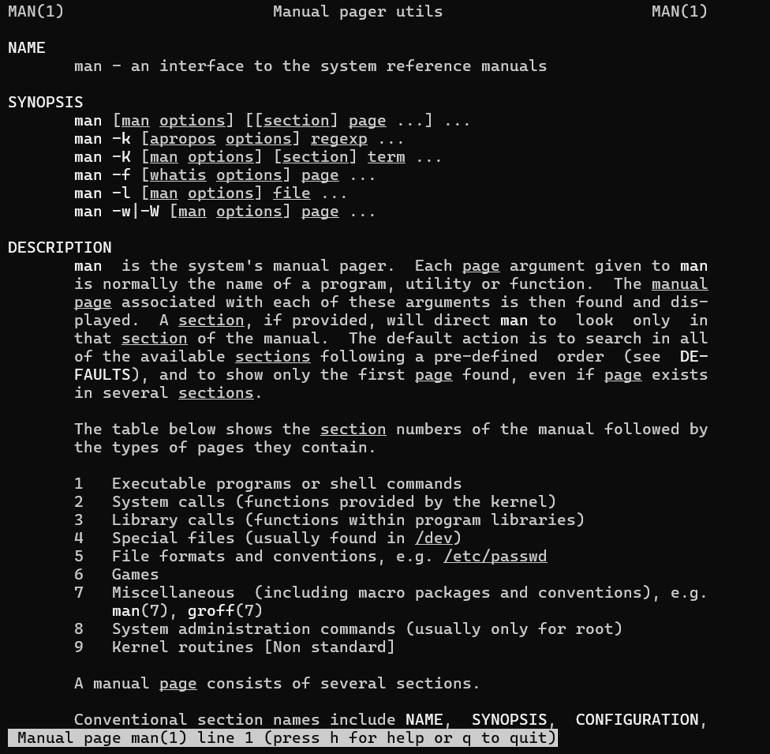
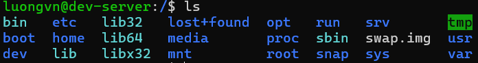
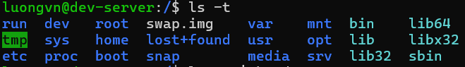
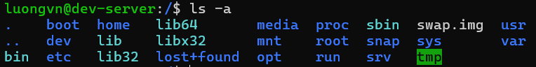
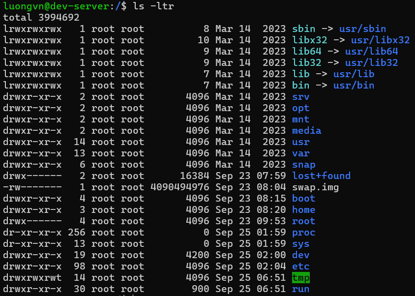

# Linux command
## 1. Lệnh `man`(manual - hướng dẫn sử dụng)
### 1.1 `man $command`
- Xem thông tin của 1 lệnh nào đó: công dụng, options, ...

  

### 1.2. `man $config_file`
- Xem hướng dẫn các file config. VD: `man sshd_config`

  

### 1.3. `man $daemon`
- Xem thông tin các tiến trình chạy nền. VD: `man sshd`

  

### 1.4. `man -k`
- Hiển thị mô tả ngắn các trang hướng dẫn của từ khóa trong tiêu đề 

  

### 1.5. `whatis`

Xem mô tả trang hướng dẫn của từ sau nó

Ví dụ:

- `whatis mkdir`

  

- `whatis echo`

  

### 1.6. `whereis`
- Tìm kiếm các file liên quan đến 1 lệnh gồm:
  - File thực thi(binary)
  - file source code
  - file man page

- Ví Dụ: 

  

  - `/usr/sbin/sshd` → file thực thi

  - `/usr/share/man/man8/sshd.8.gz` → man page
  
- OPTION:
  - `-b` -> chỉ tìm file binary
  - `-m` -> chỉ tìm file man
  - `-s` -> chỉ tìm source code

## 2. Lệnh `pwd` (Print Working Directory)

- Lệnh `pwd` dùng để hiển thị đường dẫn dến thư mục đang làm việc hiện tại:

  

## 3. Lệnh `cd`(Change Directory)

- Chuyển đổi thư mục làm việc.

  - `cd /home/luongvn/Documents/foder1`: chuyển tới thư mục folder1.
  - `cd`: chuyển về thư mục chính của người dùng.
  - `cd A && ls`: chuyển tới thư mục A và hiện danh sách các file của nó.
  - `cd -`: chuyển về thư mục đang làm việc trước đó.
  - `cd ..`: chuyển về thư mục cha.
  - `cd ~`: Thay đổi thư mục hiện tại về thư mục chính.

## 4. Lệnh `ls`(List)
### 4.1. `ls`

- Hiển thị các tệp tin và thư mục trong thư mục.

  

### 4.2. `ls -t`

- Hiển thị các thư mục và file theo thời gian chỉnh sửa.

  

- Để show ra các file cuối cùng được chỉnh sửa. Thêm `head -(số_file)`

  

### 4.3. `ls -1`

- Hiển thị mỗi mục trên 1 dòng

  

### 4.4. `ls -l`

- Hiển thị tất cả thông tin các mục

  

- Trong đó:
  - Kí tự đầu tiên: định dạng
    - `-`: file bình thường
    - `d`: thư mục
    - `s`: file socket
    - `l`: link file
  - Trường 1: File permission
  - Trường 2: Số lượng liên kết đến tệp hay thư mục đó
  - Trường 3: Chủ sở hữu của tệp, thư mục
  - Trường 4: Nhóm của tệp, thư mục
  - Trường 5: Kích thước của tệp, thư mục đó(đơn vị: byte)
  - Trường 6: Thời gian sửa đổi cuối cùng
  - Trường 7: Tên của tệp, thư mục

### 4.5. `ls -lh`

- Giống `ls -l` nhưng hiển thị trường 5(kích thước) ở dạng dễ đọc. M là MB, K là KB, G là GB.

  

### 4.6. `ls -a`

- Như lệnh `ls` nhưng hiển thị cả những file ẩn. Trong linux, các file có tên bắt đầu bằng dấu chấm được gọi là file ẩn và nó không hiển thị cùng các file bình thường.

  

### 4.7. `ls -ld`

- Hiển thị thông tin thư mục

  

### 4.8. `ls -r`

- Giống `ls` nhưng sắp xếp ngược lại. Có thể kết hợp với option `-l` và `-t` để được kết quả như sau:

  

### 4.9. `ls -F`

- Nếu chỉ cần biết các mục là file hay thư mục ta sử dụng `ls -F`:

  

- Trong đó: 
  - `/`: Thư mục
  - Nothing: tệp bình thường
  - `*`: Tập tin thực thi
  - `@`: link file

### 4.10. `ls -S`

- Hiển thị danh sách nội dung theo kích thước giảm dần.

  

## 5. Lệnh `mkdir` (make directory - tạo thư mục)
### 5.1. Một số thông tin
- `mkdir --version`: Hiển thị thông tin phiên bản, giấy phép, tác giả.

  

- `mkdir --help`: các option của `mkdir`

  

### 5.2. `mkdir <tên_thư_mục>`
- Tạo thư mục mới tại thư mục hiên tại
- Có thể tạo nhiều thư mục cùng lúc

  ```bash
  luongvn@dev-server:~$ mkdir folder_1 folder_2 folder_3 ...
  ```

### 5.3. `mkdir -v <tên_thư_mục>`
- Tạo thư mục với hiển thị thông báo

  

### 5.4. `mkdir -p`
- Tạo thư mục kèm thư mục cha khi cần thiết

  

### 5.5. `mkdir -m`
- Tạo thư mục đi kèm với cấp permission 

  

## 6. Lệnh `rmdir`(remove directory - xóa thư mục)
### 6.1. `rmdir + <tên_thư_mục>`
- Xóa thư mục rỗng

  

- Khi dùng lệnh này với thư mục không rỗng sẽ tạo ra lỗi

  

### 6.2. `rmdir -p <ten_thu_muc>`
- Xóa đệ quy cho tới khi gặp thư mục không rỗng

  

  

  

### 6.3. `rmdir -v <ten_thu_muc>`
- Hiển thị thông báo khi xóa lên màn hình

  

## 7. Lệnh `file`

- Cú pháp:

  ```bash
  file [OPTION] [file_name]
  ```

- Lệnh `file` được sừ dụng để xác định loại tệp

  

- Lệnh `file` sử dụng tệp `magic` nằm ở `/usr/share/file/magic` chứa các mẫu để nhận dạng các loại tệp. 

### 7.1. `file -b: brief` - tóm tắt
- Hiển thị kiểu file 1 cách ngắn gọn dễ hiểu

  

### 7.2. `file *`
- Hiển thị tất cả các file trong thư mục đang đứng

  

- Hiển thị tất cả các loại file trong thư mục nào đó

  

### 7.3. `file [range]*`
- Hiển thị kiểu file của các file trong khoảng nào đó

  

### 7.4. `file -s`
- Hiển thị các loại tệp của tệp đặc biệt như các tệp trong `/dev`

  

### 7.5. `file -f -`
- Kiểm tra kiểu file của nhiều file. Mỗi file gõ trên 1 dòng

  

### 7.6. `file <file_name_1> <file_name_2> ...`
- Hiển thị loại tệp của nhiều tệp

  

### 7.7. `file -z <file_nén>`

- Lệnh này sẽ cố gắng nhìn vào bên trong file nén

  