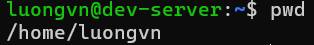
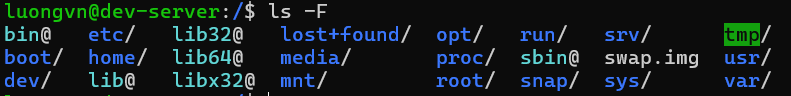
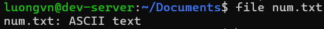

- [Linux command](#linux-command)
  - [1. Lệnh `man`(manual - hướng dẫn sử dụng)](#1-lệnh-manmanual---hướng-dẫn-sử-dụng)
    - [1.1. whatis](#11-whatis)
  - [2. Lệnh `pwd` (Print Working Directory)](#2-lệnh-pwd-print-working-directory)
  - [3. Lệnh `cd`(Change Directory)](#3-lệnh-cdchange-directory)
  - [4. Lệnh `ls`(List)](#4-lệnh-lslist)
    - [4.1. `ls`](#41-ls)
    - [4.2. `ls -t`](#42-ls--t)
    - [4.3. `ls -1`](#43-ls--1)
    - [4.4. `ls -l`](#44-ls--l)
    - [4.5. `ls -lh`](#45-ls--lh)
    - [4.6. `ls -a`](#46-ls--a)
    - [4.7. `ls -ld`](#47-ls--ld)
    - [4.8. `ls -r`](#48-ls--r)
    - [4.9. `ls -F`](#49-ls--f)
    - [4.10. `ls -S`](#410-ls--s)
  - [5. Lệnh `mkdir`(Make Directory - tạo thư mục)](#5-lệnh-mkdirmake-directory---tạo-thư-mục)
    - [5.1. `mkdir <ten_thu_muc>`](#51-mkdir-ten_thu_muc)
    - [5.2. `mkdir -v <ten_thu_muc>`](#52-mkdir--v-ten_thu_muc)
    - [5.3. `mkdir -p`](#53-mkdir--p)
  - [6. Lệnh `rmdir` (Remove Directory - Xóa thư mục)](#6-lệnh-rmdir-remove-directory---xóa-thư-mục)
    - [6.1. `rmdir`](#61-rmdir)
    - [6.2. `rmdir -p <thu_muc>`](#62-rmdir--p-thu_muc)
    - [6.3 `rmdir -v <thu_muc>`](#63-rmdir--v-thu_muc)
  - [7. Lệnh `file`](#7-lệnh-file)
    - [7.1. `file -b` (-b = -brief) - tóm tắt](#71-file--b--b---brief---tóm-tắt)
    - [7.2 `file *`](#72-file-)
    - [7.3 \`file \[range\]\*](#73-file-range)
    - [7.4. `file -f -`](#74-file--f--)
    - [7.5. `file <file_name1> <file_name2> ...`](#75-file-file_name1-file_name2-)
  - [8. Lệnh `touch`](#8-lệnh-touch)
    - [8.1. Tạo file trống](#81-tạo-file-trống)
  - [9. Lệnh `rm`(Remove)](#9-lệnh-rmremove)
    - [9.1. `rm <ten_file>`](#91-rm-ten_file)
    - [9.2 `rm -i`](#92-rm--i)
    - [9.3 `rm -f`](#93-rm--f)
    - [9.4. `rm -I file*`](#94-rm--i-file)
    - [9.5. `rm -d <ten_thu_muc>`](#95-rm--d-ten_thu_muc)
    - [9.6. `rm -r <ten_thu_muc>`](#96-rm--r-ten_thu_muc)
    - [9.7. `rm -v`](#97-rm--v)
  - [10. Lệnh `cp`](#10-lệnh-cp)
    - [10.1 Copy nội dung 1 file vào 1 file khác](#101-copy-nội-dung-1-file-vào-1-file-khác)
    - [10.2. Copy file vào thư mục khác](#102-copy-file-vào-thư-mục-khác)
    - [10.3. `cp -r/-R <thư_mục_nguồn> <thư_mục_đích>`](#103-cp--r-r-thư_mục_nguồn-thư_mục_đích)
    - [10.4. `cp -i`](#104-cp--i)
    - [10.5. `cp -b`](#105-cp--b)
    - [10.6. `cp -n`](#106-cp--n)

# Linux command
## 1. Lệnh `man`(manual - hướng dẫn sử dụng)
- Để giải thích việc sử dụng của 1 câu lệnh. 
- Cung cấp thông tin chi tiết về tên, tóm tắt, mô tả, các option, ...

Ví dụ: `man man`

### 1.1. whatis

Xem mô tả trang hướng dẫn của từ sau nó

Ví dụ:

`whatis mkdir`

`whatis echo`

## 2. Lệnh `pwd` (Print Working Directory)

Lệnh `pwd` dùng để hiển thị đường dẫn dến thư mục đang làm việc hiện tại:

## 3. Lệnh `cd`(Change Directory)

Chuyển đổi thư mục làm việc.

- `cd /home/luongvn/Documents/foder1`: chuyển tới thư mục folder1.
- `cd`: chuyển về thư mục chính của người dùng.
- `cd A && ls`: chuyển tới thư mục A và hiện danh sách các file của nó.
- `cd -`: chuyển về thư mục đang làm việc trước đó.
- `cd ..`: chuyển về thư mục cha.
- `cd ~`: Thay đổi thư mục hiện tại về thư mục chính.

## 4. Lệnh `ls`(List)
### 4.1. `ls`

Hiển thị các tệp tin và thư mục trong thư mục.

### 4.2. `ls -t`

Hiển thị các thư mục và file theo thời gian chỉnh sửa.

Để show ra các file cuối cùng được chỉnh sửa. Thêm `head -(số_file)`

### 4.3. `ls -1`

Hiển thị mỗi mục trên 1 dòng

### 4.4. `ls -l`

Hiển thị tất cả thông tin các mục

Trong đó:
- Kí tự đầu tiên: định dạng
  - `-`: file bình thường
  - `d`: thư mục
  - `s`: file socket
  - `l`: link file
- Trường 1: File permission
- Trường 2: Số lượng liên kết đến tệp hay thư mục đó
- Trường 3: Chủ sở hữu của tệp, thư mục
- Trường 4: Nhóm của tệp, thư mục
- Trường 5: Kích thước của tệp, thư mục đó(đơn vị: byte)
- Trường 6: Thời gian sửa đổi cuối cùng
- Trường 7: Tên của tệp, thư mục

### 4.5. `ls -lh`

Giống `ls -l` nhưng hiển thị trường 5(kích thước) ở dạng dễ đọc. M là MB, K là KB, G là GB.

### 4.6. `ls -a`

Như lệnh `ls` nhưng hiển thị cả những file ẩn. Trong linux, các file có tên bắt đầu bằng dấu chấm được gọi là file ẩn và nó không hiển thị cùng các file bình thường.

### 4.7. `ls -ld`

Hiển thị thông tin thư mục

### 4.8. `ls -r`

Giống `ls` nhưng sắp xếp ngược lại. Có thể kết hợp với option `-l` và `-t` để được kết quả như sau:

### 4.9. `ls -F`

Nếu chỉ cần biết các mục là file hay thư mục ta sử dụng `ls -F`:

Trong đó: 
- `/`: Thư mục
- Nothing: tệp bình thường
- `*`: Tập tin thực thi
- `@`: link file

### 4.10. `ls -S`

Hiển thị danh sách nội dung theo kích thước giảm dần.

## 5. Lệnh `mkdir`(Make Directory - tạo thư mục)

### 5.1. `mkdir <ten_thu_muc>`

Tạo thư mục tại vị trí thư mục đang đứng.

Có thể tạo nhiều thư mục cùng lúc:

> mkdir folder1 folder2 folder3       // Tạo 3 thư mục folder 1, 2, 3 cùng lúc

### 5.2. `mkdir -v <ten_thu_muc>`

Tạo thư mục và hiển thị thông báo tạo thu mục.

### 5.3. `mkdir -p`

Tạo thư mục kèm thư mục cha khi cần thiết.

> # mkdir -vp /F1/F2/F3

## 6. Lệnh `rmdir` (Remove Directory - Xóa thư mục)
### 6.1. `rmdir`

Xóa thư mục rỗng

Khi dùng lệnh này với thư mục không rỗng sẽ xảy ra lỗi:

### 6.2. `rmdir -p <thu_muc>`

- Xóa thư mục con chỉ định(nếu rỗng)
- Sau đó xóa tiếp thư mục cha (của nó) nếu thư mục cha cũng rỗng.
- Cứ thế xóa ngược lên trên cho đến khi gặp thư mục không rỗng hoặc không còn cha.

### 6.3 `rmdir -v <thu_muc>`

Tùy chọn này hiển thị thông tin xóa thư mục.

## 7. Lệnh `file`

> file [option] [file_name]

Lệnh `file` được sử dụng để xác định loại tệp.

OPTION:

### 7.1. `file -b` (-b = -brief) - tóm tắt

Hiển thị kiểu file 1 cách đơn giản, ngắn gọn.

### 7.2 `file *`

Hiển thị tất cả các loại file trong thư mục đang đứng

Hiển thị tất cả các loại file trong thư mục nào đó:

> file <đường_dẫn_thư_mục>/*

### 7.3 `file [range]*

Hiển thị kiểu file của các file trong khoảng nào đó.

### 7.4. `file -f -`

Kiểm tra kiểu file của nhiều file. Mỗi file gõ trên 1 dòng.

### 7.5. `file <file_name1> <file_name2> ...`

Hiển thị loại tệp của nhiều tệp.

## 8. Lệnh `touch`
Là 1 cách đơn giản để tạo 1 file trống hoặc thay đổi dấu thời gian (timestamps) của file.

Dấu thời gian có 3 loại:
- changetime: Lần cuối đọc hoặc truy cập file
- modifytime: Lần cuối nội dung file thay đổi
- changetime: Lần cuối thay đổi metadata(quyền, owner, ...).

### 8.1. Tạo file trống

Tạo 1 file: 

> touch <file_name>

Tạo nhiều file:

> touch <file_name1> <file_name2> ....

## 9. Lệnh `rm`(Remove)

Dùng để xóa file hoặc thư mục.

### 9.1. `rm <ten_file>`

Xóa nhiều file: `# rm <file_name1> <file_name2> .....`

### 9.2 `rm -i`

Xóa file có xác nhận trước khi xóa

### 9.3 `rm -f`

Xóa file không có xác nhận

### 9.4. `rm -I file*`

Xóa hàng loạt file có tên gần giống nhau.

### 9.5. `rm -d <ten_thu_muc>`

Xóa thư mục rỗng

> Không xóa được thư mục không rỗng

### 9.6. `rm -r <ten_thu_muc>`

Xóa toàn bộ thư mục kể cả không rỗng

### 9.7. `rm -v`

Hiển thị kết quả xóa.

## 10. Lệnh `cp`

Dùng để sao chép file hoặc thư mục.

### 10.1 Copy nội dung 1 file vào 1 file khác

Sao chép nội dung 1 file vào 1 file khác. Nếu file đích đó chưa tồn tại thì sẽ tạo ra file đó với nội dung giống hệt file nguồn.

> cp <file_nguồn> <file_đích>

### 10.2. Copy file vào thư mục khác 

> cp <file_name_1> <file_name2_> ... <file_name_n> <thư_mục_đích>

 

### 10.3. `cp -r/-R <thư_mục_nguồn> <thư_mục_đích>`

`r - recursive`: đệ quy.

Copy 1 thư mục vào 1 thư mục khác.

### 10.4. `cp -i`

`i - interactive`: tương tác 

Hỏi lại người dùng có muốn ghi đè không khi có tệp trùng tên. Hoặc ghi đè nội dung của file đích.

### 10.5. `cp -b`

`b - backup`: sao lưu

Tạo bản sao lưu của tệp đích trong cùng thư mục với tệp khác ở 1 định dạng khác.

### 10.6. `cp -n`

`n - no clobber`

Không ghi đè lên tệp hiện có 

