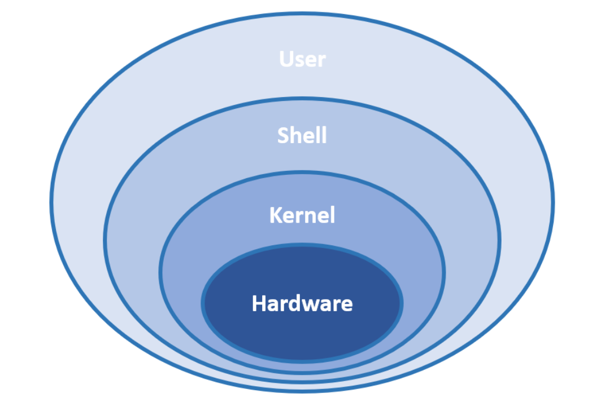
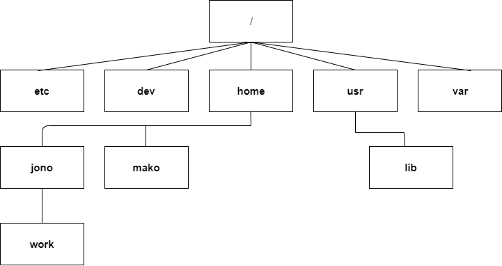
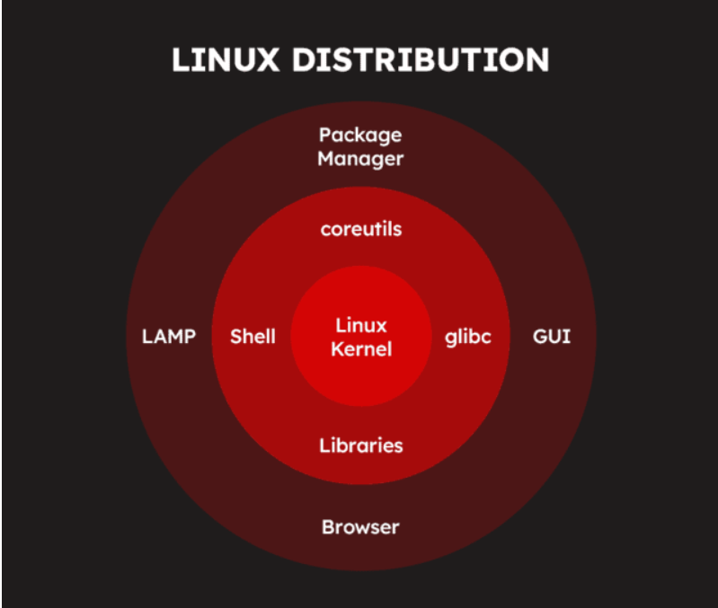
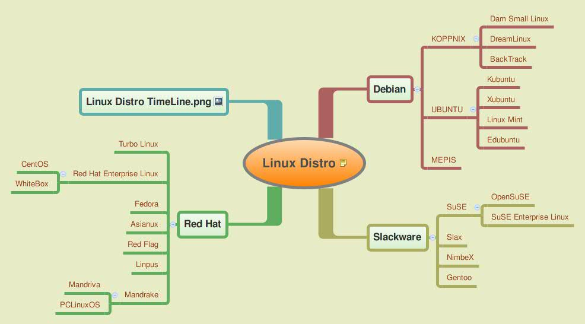

# LINUX
## I. Linux
### 1. Linux là gì?

Linux là một hệ điều hành mã nguồn mở dựa trên nhân (kernel) Linux. Nó cung cấp môi trường hoạt động cho phần mềm và phần cứng, tương tự như Windows hoặc macOS, nhưng có tính linh hoạt và bảo mật cao hơn.

### 2. Kiến trúc thành phần linux

Hệ điều hành Linux được tổ chức theo một kiến trúc phân lớp, trong đó mỗi thành phần có nhiệm vụ và vai trò riêng biệt. Cấu trúc này giúp Linux hoạt động ổn định và hiệu quả trên nhiều loại phần cứng khác nhau.

Hardware (Phần cứng) – Nền tảng vật lý:

- Không phải là một thành phần của hệ điều hành Linux, nhưng là nền tảng để hệ điều hành hoạt động.
- Gồm CPU, RAM, ổ cứng, card mạng, bo mạch chủ và các thiết bị ngoại vi khác.
- Kernel của Linux sẽ giao tiếp với phần cứng thông qua trình điều khiển thiết bị (drivers).

Kernel (Nhân hệ điều hành) – Cốt lõi của Linux:

- Thành phần quan trọng nhất của Linux, chịu trách nhiệm quản lý tài nguyên phần cứng và phân phối chúng cho các tiến trình và ứng dụng.
- Quản lý bộ nhớ, CPU, thiết bị ngoại vi và thực thi các tiến trình.
- Kernel hoạt động như một cầu nối giữa phần cứng và phần mềm.

Shell:

- Là thành phần đứng giữa người dùng và Kernel
- Làm nhiệm vụ “phiên dịch” các câu lệnh của người dùng cho Kernel hiểu để thao tác với phần cứng.

User Space (Không gian người dùng) – Ứng dụng và Chương trình:

- Là thành phần trên cùng của kiến trúc Linux, đây chính là các chương trình, ứng dụng (Program, Application) hay câu lệnh mà người dùng chạy trong quá trình sử dụng Linux.

### 3. Cấu trúc file trong linux

Linux được xây dựng trên một nền tảng riêng với cộng đồng phát triển độc lập, không dựa vào mã gốc của Windows. 

Vì vậy, bạn sẽ không thấy các thư mục quen thuộc như My Documents hay Program Files, cũng như không có khái niệm ổ đĩa C: hay D:. 

Thay vào đó, toàn bộ hệ thống được tổ chức theo dạng cây thư mục duy nhất, trong đó các ổ đĩa, thư mục home và desktop đều nằm trong cấu trúc đó. 

Điều này có nghĩa là bạn cần làm quen với một kiến trúc hệ thống tệp hoàn toàn mới. 

Tuy nhiên, thực tế việc thích nghi không quá khó dù sự khác biệt khá rõ ràng.

| thư mục | Mô tả |
|-----------|-------------|
| `/dev` | Chứa các tệp thiết bị (device) như `sda` (ổ cứng), `tty` (terminal), `cdrom`… |
| `/etc` | Chứa các tệp cấu hình hệ thống và ứng dụng, ví dụ: `/etc/passwd`, `/etc/fstab`… |
| `/home` | Thư mục chứa dữ liệu cá nhân của người dùng (Ví dụ: `/home/user1`, `/home/user2`…). |
| `/lib` | Chứa thư viện hệ thống cần thiết cho chương trình trong `/bin` và `/sbin`. |
| `/opt` | Chứa phần mềm cài đặt thủ công hoặc từ bên thứ ba (ví dụ: Google Chrome, Skype). |
| `/root` | Thư mục home của tài khoản **root** (quản trị viên). |
| `/sys` | Chứa thông tin về phần cứng hệ thống. |
| `/tmp` | Chứa các tệp tạm thời, sẽ bị xóa sau khi hệ thống khởi động lại. |
| `/usr` | Chứa các chương trình cài đặt bởi người dùng, gồm `/usr/bin`, `/usr/sbin`, `/usr/lib`… |
| `/var` | Chứa dữ liệu thay đổi liên tục như log hệ thống (`/var/log`), hàng đợi in (`/var/spool`). |

### 4. Ưu điểm và hạn chế của hệ điều hành Linux
a) Ưu điểm:
- Mã nguồn mở & miễn phí:
  - Không cần mua bản quyền như Windows.
  - Người dùng có thể chỉnh sửa, tùy biến theo nhu cầu.
- Bảo mật cao:
  - Ít bị virus và phần mềm đọc hại tấn công do có hệ thống phân quyền chặt chẽ.
  - Cộng đồng liên tục cập nhật vá lỗi nhanh chóng.
- Hiệu suất cao và ổn định:
  - Linux có khả năng hoạt động hiệu quả trên cả phần cứng cũ và mới.
  - Chạy mượt trên cả máy cấu hình thấp.
  - Ít bị lỗi treo máy, ít cần khởi động lại.
- Tùy biến linh hoạt:
  - Có nhiều bản phân phối(Ubuntu, Fedora, Kali Linux, ...) phù hợp với nhiều nhu cầu khác nhau.
- Hỗ trợ tốt cho lập trình & quản trị hệ thống:
  - Tích hợp sẵn nhiều công cụ lập trình, đặc biệt là cho Python, C/C++, Java, ...
  - Hệ thống dòng lệnh(terminal) mạnh mẽ giúp quản lý hệ thống dễ dàng.
- Đa nhiệm:
  - Linux có khả năng đa nhiệm tốt, cho phép chạy nhiều tiến trình và ứng dụng cùng lúc mà không làm giảm hiệu suất lao động.

b) Hạn chế
- Khó sử dụng với người dùng mới:
  - Giao diện khác Windows, yêu cầu làm quen với terminal.
  - Một số tác vụ yêu cầu dùng dòng lệnh thay vì giao diện đồ họa.
- Phần mềm hạn chế:
  - Một số phần mềm phổ biến như Microsoft Office, Photoshop không có bản chính thức cho Linux.
  - Phải sử dụng phần mềm thay thế(LibreOffice, GIMP) hoặc giả lập(Wine, PlayOnLinux).
- Không phù hợp cho game.

### 5. Tài khoản và quyền user

Linux có 3 loại User: Regular, Administrator(Root), Service.

- **Regular**: Là tài khoản user thông thường được tạo khi cài đặt Ubuntu trên máy tính. Tất cả các file, thư mục được lưu trữ trong `/home/` là thư mục chính của tài khoản này. User này không có quyền truy cập vào thư mục của user khác.

- **Root**: Tài khoản này được tạo ra tại thời điểm cài đặt Linux. Root là một **superuser**, có thể truy cập vào những file bị giới hạn quyền, cài đặt phần mềm và có quyền quản trị. Bất cứ khi nào muốn cài đặt phần mềm, thay đổi file hệ thống hoặc thực hiện các tác vụ cần quyền quản trị khác trên linux thì phải đăng nhập bằng tài khoản Root.

- **Service**: Linux là hệ điều hành máy chủ phổ biến. Mỗi dịch vụ(Apache, Email, ...)  thường chạy bằng tài khoản dịch vụ riêng để tăng tính bảo mật. Nhờ đó, Linux có thể cho phép hoặc hạn chế quyền truy cập tài nguyền cho từng dịch vụ.

## II. Distro Linux
### 1. Distro Linux là gì?

Distro Linux(bản phân phối linux) là một hệ điều hành được tạo dựng từ tập hợp nhiều phần mềm dựa trên hạt nhân linux và thường có một hệ thống quản lý gói tin.

### 2. Thành phần chính của một bản phân phối Linux

**Lớp lõi(Core)** - Trung tâm của hệ thống:
- **Kernel**: Nhân hệ điều hành, quản lý tài nguyên hệ thống và giao tiếp với phần cứng.

**Lớp hệ thống(System Layer)** - Cung cấp công cụ cơ bản:
- **Shell**: Giao diện dòng lệnh(CLI) giúp người dùng giao tiếp với hệ thống.
- **glibc(GNU C Library)**: Thư viện C tiêu chuẩn mà hầu hết các chương trình trong Linux sử dụng.
- **Libraries**: Các thư viện phần mềm mà ứng dụng cần để chạy.  
- **Coreutils**: Bộ công cụ dòng lệnh cơ bản(ls, cat, cp, mv, rn, etc, ...).

**Lớp ứng dụng và quản lý phần mềm**:
- **Package Manager**: Hệ thống quản lý gói phần mềm, giúp cài đặt và cập nhật ứng dụng(ví dụ: `apt`, `dnf`, `pacman`).
- **LAMP(Linux, Apache, MySQL, PHP/Python/Perl)**: Bộ công cụ cho máy chủ Web. 
- **GUI(Graphical User Interface)**: Giao diện đồ họa, giúp người dùng thao tác dễ dàng hơn.
- **Browser**: Trình duyệt web được cài sẵn trong nhiều bản phân phối.

### 3. Phân loại distro linux

a) Theo nguồn gốc(Dựa trên Distro gốc): Hầu hết các bản phân phối Linux đều phát triển từ một số ít các bản gốc, tạo thành các nhánh chính:

- `Debian-based`
  - Tiêu biểu: Ubuntu, Linux Mint, Kali linux, MX linux.
  - Đặc điểm: Ổn định, dễ dùng, quản lý gói bằng `APT`( `.deb`).
  - Ứng dụng: Máy tính cá nhân, server, bảo mật.
- `Red Hat-based`
  - Tiêu biểu: RHEL(Red Hat Enterprise Linux), CentOS, Fedora.
  - Đặc điểm: Phù hợp cho doanh nghiệp, quản lý gói bằng `DNF/YUM` (`.rpm`).
  - Ứng dụng: Server, doanh nghiệp, phát triển phần mềm.
- `Slackware-based`
  - Tiêu biểu: Slackware, Puppy Linux, Zenwalk.
  - Đặc điểm: Cổ điển, ít thay đổi, không có trình quản lý gói tự động.
  - Ứng dụng: Hệ thống ổn định, chuyên biệt.
- `Arch-based`
  - Tiêu biểu: Arch Linux, Manjaro, EndeavourOS.
  - Đặc điểm: Tối giản, dành cho người dùng nâng cao, quản lý gói bằng `Pacman`.
  - Ứng dụng: Người dùng có kinh nghiệm, hệ thống nhẹ, tùy chỉnh cao.

b) Theo mục đích sử dụng:

- `Distro dành cho Desktop` (Người dùng cá nhân)
  - Tiêu biểu: Ubuntu, Linux Mint, Fedora, Manjaro.
  - Đặc điểm: Giao diện thân thiện, hỗ trợ phần cứng tốt, dễ dùng.
  - Ứng dụng: Thay thế Windows/macOS, công việc văn phòng, giải trí.
- `Distro dành cho Server`
  - Tiêu biểu: Ubuntu Server, CentOS, RHEL, Debian Server, OpenSUSE Leap
  - Đặc điểm: Ổn định, bảo mật cao, hỗ trợ lâu dài (LTS).
  - Ứng dụng: Lưu trữ web, máy chủ doanh nghiệp, điện toán đám mây.
- `Distro dành cho bảo mật & hacking`
  - Tiêu biểu: Kali Linux, Parrot OS, BackBox.
  - Đặc điểm: Cung cấp sẵn công cụ pentest, forensic, hacking.
  - Ứng dụng: Kiểm thử bảo mật, nghiên cứu an toàn thông tin.
- `Distro dành cho máy tính cũ & nhẹ`
  - Tiêu biểu: Puppy Linux, Lubuntu, Xubuntu, Tiny Core.
  - Đặc điểm: Nhẹ, chạy nhanh trên phần cứng cũ, tối ưu RAM thấp.
  - Ứng dụng: Tái sử dụng máy tính cũ, hệ thống nhúng.
- `Distro dành cho lập trình viên & DevOps`
  - Tiêu biểu: Fedora, Arch Linux, Ubuntu, Debian.
  - Đặc điểm: Cập nhật nhanh, nhiều công cụ lập trình, hỗ trợ container.
  - Ứng dụng: Phát triển phần mềm, DevOps, Docker/Kubernetes.

c) Phân loại theo mô hình phát hành (Release Model):

- `Fixed Release` (Phát hành cố định)
  - Tiêu biểu: Ubuntu, Debian, Fedora, RHEL.
  - Đặc điểm: Cập nhật định kỳ (6 tháng – 2 năm), ổn định hơn.
  - Ứng dụng: Người dùng phổ thông, doanh nghiệp.
- `Rolling Release` (Phát hành liên tục)
  - Tiêu biểu: Arch Linux, Manjaro, OpenSUSE Tumbleweed.
  - Đặc điểm: Luôn cập nhật phiên bản mới nhất, ít cần cài đặt lại.
  - Ứng dụng: Lập trình viên, người thích cập nhật công nghệ mới.

## III. So sánh LINUX và UNIX

| **Tiêu chí**           | **UNIX**                                                    | **LINUX**                                                           |
| ---------------------- | ----------------------------------------------------------- | ------------------------------------------------------------------- |
| **Bản chất**           | Hệ điều hành **độc quyền/thương mại**                       | Hệ điều hành **mã nguồn mở (open-source)**                          |
| **Mã nguồn**           | Đóng, chỉ nhà cung cấp mới có quyền chỉnh sửa               | Mở, ai cũng có thể xem, chỉnh sửa, phân phối theo GPL               |
| **Triết lý thiết kế**  | Đặt nền móng cho các OS hiện đại (POSIX, “mọi thứ là file”) | Viết lại dựa trên triết lý Unix, tương thích POSIX                  |
| **Các biến thể chính** | AIX (IBM), HP-UX (HP), Solaris (Sun/Oracle), BSD,…          | Ubuntu, Debian, Red Hat, CentOS, Fedora, Arch Linux,…               |
| **Hỗ trợ phần cứng**   | Thường chạy trên **phần cứng riêng** của nhà sản xuất       | Chạy trên **nhiều loại phần cứng** (PC, server, nhúng, điện thoại…) |
| **Chi phí**            | Phải mua bản quyền (đắt)                                    | Miễn phí (đa số), chỉ tốn phí hỗ trợ doanh nghiệp (Red Hat, SUSE…)  |
| **Người dùng chính**   | Doanh nghiệp, tổ chức lớn                                   | Cộng đồng, cá nhân, doanh nghiệp, thiết bị nhúng                    |
| **Quan hệ với nhau**   | Là hệ điều hành gốc                                         | Là hệ điều hành “Unix-like” viết lại từ đầu                         |
