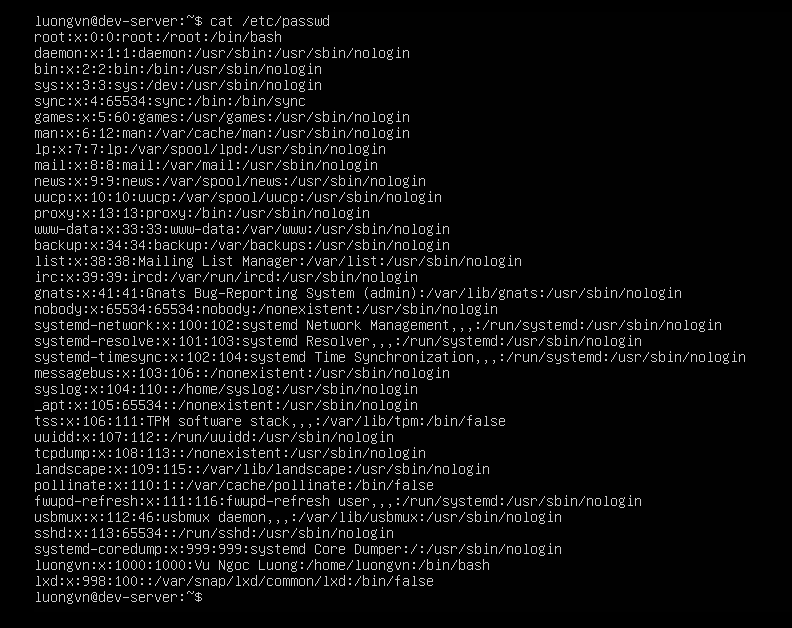
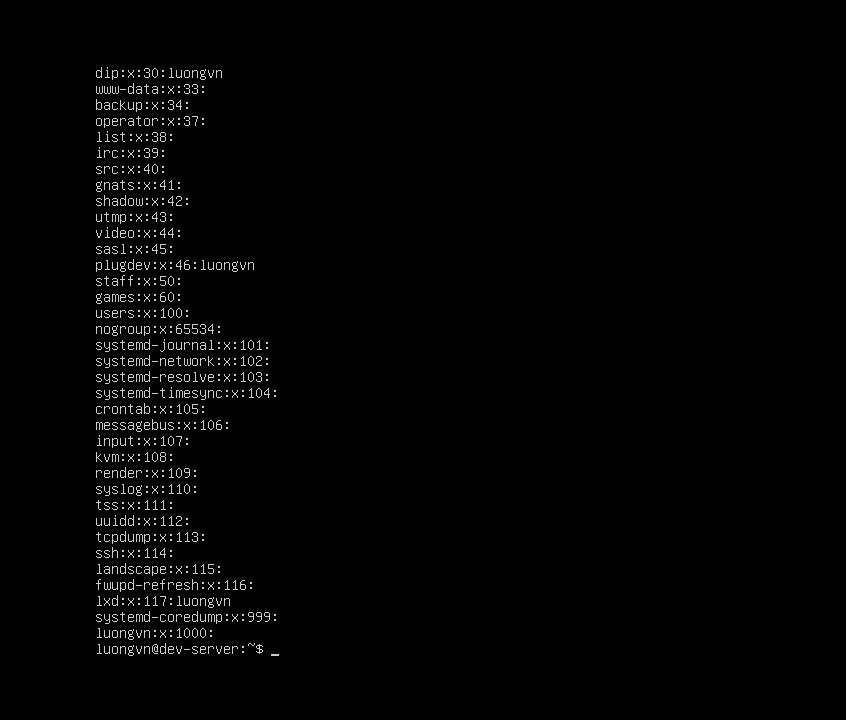

# USER
Có 2 loại User:

- User hệ thống(thực thi các module, script cần thiết phục vụ cho HĐH).
- User người dùng(login để sử dụng HĐH, gồm `super user` và `regular user`).

## Đặc điểm của user:
- Tên mỗi user là duy nhất, chỉ có thể đặt tên chữ thường, chữ hoa.
- User có username và password.
- Mỗi user có một mã định danh duy nhấy(uid).
- Mỗi user có thể thuộc về nhiều nhóm(gid).
- Tài khoản superuser có uid = gid = 0.

## File /etc/passwd

- Là file chứa thông tin người dùng.



|Cột  |Nội dung|
|---  |---  |
|Cột 1|Tên người sủ dụng|
|Cột 2|Mã liên quan đến mật khẩu cho Unix và `x` đối với Linux. 
||Linux lưu mã này trong một tập tin khác `/etc/shadow` mà chỉ có root mới có quyền đọc|
|Cột 3|user ID|
|Cột 4|group ID|
|Cột 5|Tên mô tả người sử dụng(Comment)|
|Cột 6|Thư mục home của user. Thướng sẽ nằm trong `/home/"tên_tài_khoản"`|
|Cột 7|Shell sẽ hoạt động sau khi user login, thường là `/bin/bash`|

## File /etc/shadow

- File để chứa thông tin về mật khẩu, chỉ có `root` mới đọc được file này.


|Cột  |Nội dung|
|---  |---  |
|Cột 1|tên người dùng|
|Cột 2|mật khẩu đã được mã hóa. Để trống - không có mk, Dấu "*" - tài khoản bị tạm ngưng|
|Cột 3|số ngày kể từ lần cuối đổi mật khẩu(tính từ 1/1/1970)|
|Cột 4|số ngày trước khi có thể thay đổi mật khẩu, giá trị 0 có nghĩa là thay đổi bất cứ lúc nào|
|Cột 5|số ngày mật khẩu có giá trị. 99999 có ý nghĩa mật khẩu có giá trị vô thời hạn|
|Cột 6|số ngày cảnh báo user trước khi mật khẩu hết hạn|
|Cột 7|số ngày sau khi mật khẩu hết hạn và sẽ bị xóa. Thường có giá trị 7(1 tuần)|
|Cột 8|Số ngày kể từ khi tài khoản bị khóa(tính từ 1/1/1970)|

# GROUP
- Nhóm là tập hợp nhiều user. Mỗi nhóm có tên duy nhất, và có một mã định danh duy nhất(gid).
- Khi tạo 1 user (không dùng -g: không chỉ định nhóm user ở) thì mặc định tạo 1 group mới có tên giống với user được tạo ra.

## File /etc/group
- Là file chứa thông tin các group. File này tất cả user đều có thể đọc nhưng chỉ có `root` mới có quyền thay đổi.



|Cột  |Nội dung|
|---  |---  |
|Cột 1|tên nhóm|
|Cột 2|mật khẩu đã được mã hóa. Để trống - không có mk, dấu "*" - tạm ngưng, dấu "x" đc lưu trong file /etc/gshadow|
|Cột 3|mã nhóm(gid)|
|Cột 4|danh sách các user thuộc nhóm|

# Các lệnh thực thi
## Tạo User -> Đặt password sau khi add
- Cú pháp: `# useradd [option] <username>`

```bash
-c: Thông tin người dùng
-d: Thư mục cá nhân
-g: nhóm của người dùng
```

- Ví dụ:
```bash
useradd -c "Nguyen van A - Server Admin" -g server_admin vanA`
# Tạo user tên "vanA" thuộc group "server_admin" và có thông tin là "Nguyen van A - Server Admin"
```

## Thay đổi thông tin cá nhân 
- Cú pháp: `# usermod [option] <username>`

```bash
-c: Thông tin người dùng
-d: Thư mục cá nhân
-g: nhóm của người dùng
```

- Ví dụ:
```bash
usermod -g kinhdoanh vanA
# chuyển vanA từ nhóm server_admin sang nhóm kinhdoanh
```

## Xóa người dùng
- Cú pháp: `# userdel [option] <username>`

```bash
-r: xóa cả home directory của user
-f: xóa user ngay cả khi user đang đăng nhập, đang được dùng bởi process nào đó. -> Nguy hiểm nên cẩn thận.
```

- Ví dụ: 

```bash
sudo userdel -r Bim
# Xóa user Bim, đồng thời xóa thư mục /home/Bim.
```

## Khóa/Mở khóa người dùng
- Khóa: `passwd -l <username>` hoặc `usermod -L <usernanme>`
- Mở khóa: `passwd -u <username>` hoặc `usermod -U <username>`

## Tạo nhóm
- Cú pháp: `# groupadd [option] <groupname>`

```bash
-g GID: Chỉ định group ID cho nhóm mới(thay vì để hệ thống tự chọn)
-r: Tạo system group(nhóm hệ thống). GID sẽ được lấy trong phạm vi dành cho nhóm hệ thống (thường < 1000).
-f: Nếu group đã tồn tại: không báo lỗi. Nếu GID đã dùng: chọn GID khác.
```

- Ví dụ: 
```bash
sudo groupadd -g 1500 developers
# Tạo group developers với GID = 1500.
```

## Xóa nhóm
- Cú pháp: `# groupdel <groupname>`
- Ví dụ: 
```bash
sudo groupdel deverlopers
# Xóa group deverlopers
```

## Thay đổi thông tin nhóm
- Cú pháp: `# groupmod [option] <group_name>`

```bash
-g GID: Đặt lại group ID mới cho group.
-n new_name: Đổi tên group.
```

- Ví dụ:
```bash
sudo groupmod -g 1501 developers
# đổi GID của group developers thành 1501.
sudo groupmod -n devteam developers
# đổi tên group developers thành devteam.
```