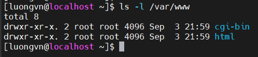
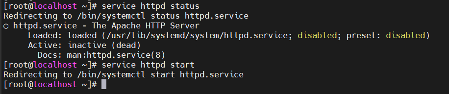
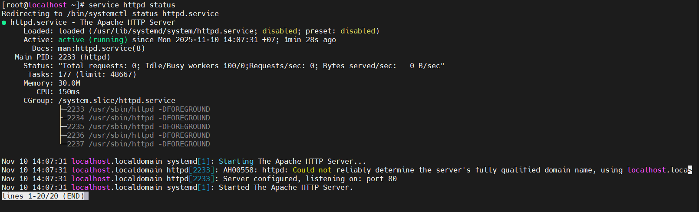
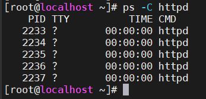
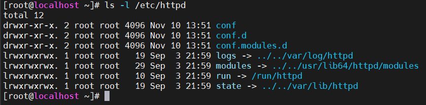
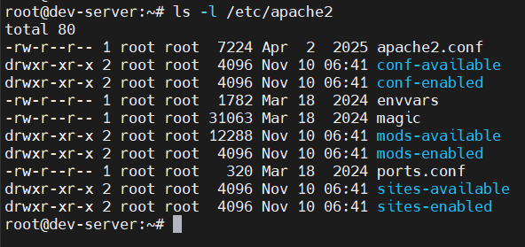

# APACHE WEB SERVER
## Introduction to Apache
### Installing on Debian
- Ban đầu ta chưa tải apache server vì chưa thấy xuất hiện thư mục `/var/www` trong hệ thống

  

- Sử dụng `apt` để tải về hệ thống ubuntu

  

- Sau khi cài đặt xong ta kiểm tra `/var/www`

  

  - Trong đây chứa file `idex.html` trang mặc định bạn thấy khi truy cập `http://localhost` hoặc IP của máy.

- Kiểm tra apache đã cài chưa:

  

  → tất cả các gói cần thiết của Apache đã được cài đặt thành công (ii nghĩa là installed and ok).


### Installing on RHEL
- Kiểm tra apache có cài chưa:

  

  - `rpm -q`: query RPM database
  
- Cài đặt apache trên Rocky

  ```bash
  [luongvn@localhost ~]$ sudo yum install httpd
  ```

- Kiểm tra lại:
  
  

  → Apache đã được cài đặt thành công.

- Thư mục mặc định của apache tren rocky:

  

### Running apache on Debian

- Cách khởi động apache2 trên ubuntu:

  

- Để xác nhận rằng đã khởi động apache dùng `service apache2 status` hoặc `ps`

  

  

- Hoặc sử dụng `wget` và `file` để xác minh rằng máy chủ web của bạn phục vụ một tài liệu html

  

### Running apache on Rocky
- Khởi chạy httpd trên Rocky bằng lệnh `service`

  

- Để xác nhận lại apache đã chạy, dùng `service httpd status` hoặc `ps`

  

  

### Index file on Rocky
- Rocky không cung cấp tệp `index.html` hoặc `index.php` chuẩn. Việc sử dụng wget đơn giản sẽ gặp lỗi.

  

- Bất kỳ tệp `index.html` tùy chỉnh nào trong `/var/www/html` sẽ ngay lập tức được sử dụng làm trang chỉ mục cho máy chủ web này.

  

### Default website
- Thay đổi trang web mặc định của một máy chủ web Apache vừa cài đặt là rất dễ dàng. Tất cả những gì bạn cần làm là tạo (hoặc thay đổi) một tệp index.html trong thư mục DocumentRoot
- Để xác định vị trí thư mục DocumentRoot trên Debian:

  

  -> `/var/www/html` là trang web mặc định

- Trên Rocky:

  


- RHEL không có trang web mặc định. Nhưng một tệp `index.html` được tạo trong `/var/www/html/` sẽ tự động được sử dụng làm trang mặc định

### Apache Configuration

- Tất cả tệp cấu hình trong RHEL được thực hiện trong `/etc/httpd`

  

- Ở ubuntu nằm ở: `/etc/apache2`

  

## Port Virtual Hosts on Debian
### Default virtual host
- Debian có một tệp cấu hình virtualhost cho trang web mặc định của nó trong `/etc/apache2/sites-available/default`.

  

- Nếu muốn chạy nhiều website trên cùng 1 IP nhưng không có tên miền khác nhau, ta có thể gán mỗi website một port riêng.
- Ví dụ:

  | Website       | Port | DocumentRoot         |
  | ------------- | ---- | -------------------- |
  | Choo Choo     | 7000 | /var/www/choochoo    |
  | Chess Club 42 | 8000 | /var/www/chessclub42 |
  | hunter2       | 9000 | /var/www/hunter2     |

- File cấu hình virtualhost:
  - Các file cấu hình virtualhost trên ubuntu cần kết thúc bằng `.conf`

    ```bash
    /etc/apache2/sites-available/choochoo.conf
    /etc/apache2/sites-available/chessclub42.conf
    /etc/apache2/sites-available/hunter2.conf
    ```
  - Ví dụ:

    

    - `*:7000`: apache lắng nghe port 7000 cho website này
    - `DocumentRoot`: thư mục chứa file web của website đó
    - `ServerAdmin`: email quản trị viên(không bắt buộc)

- Cho phép Apache lắng nghe trên các cổng mới:
  - Apache mặc định chỉ lắng nghe `80/443`, nên bạn cần chỉnh file `/etc/apache2/ports.conf`:
  - Sau đó restart Apache:

    ```bash
    sudo systemctl restart apache2
    ```

- Tạo 3 thư mục DocumentRoot và thêm 1 số trang web đơn giản vào thư mục đó

  ```bash
  mkdir /var/www/choochoo
  mkdir /var/www/chessclub42
  mkdir /var/www/hunter2
  ```

  

- Sau khi tạo file kích hoạt website bằng lệnh:

  ```bash
  sudo a2ensite choochoo.conf
  sudo a2ensite chessclub42.conf
  sudo a2ensite hunter2.conf
  ```

  - `a2ensite` sẽ tạo đường dẫn trong `sites-enabled`

- Sau đó khởi động lại Apache:

  ```bash
  sudo systemctl restart apache2
  ```

  

- Kiểm tra lại từng website:

  

## Named Virtual Hosts on Rocky
### Named Virtual Hosts
- Ta muốn truy cập trang web 1 cách dễ dàng hơn bằng các tên: `choochoo.local`, `chessclub42.local` và `hunter2.local`

- Ta tạo 3 virtualhost mới

  

### Name resolution
- Ta cần một phương pháp nào đó để phân giải tên. Có thể thực hiện với DNS. Cũng có thể nhanh chóng thêm ba tên vào tệp `/etc/hosts`.

  