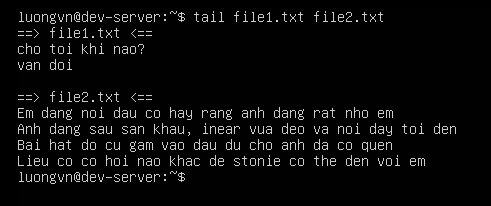
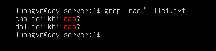

# Lab các command Chapter 1
## 1. `pwd` - print working directory
### 1.1. `pwd` -> In ra thư mục hiện tại


## 2. `cd` - change directory
### 2.1. `cd ~`, `cd`, `cd $HOME` -> Quay về thư mục home của user hiện tại


### 2.2. `cd -` -> Quay lại thư mục trước đó


Ta thấy khi `cd /var` tức là ta đã đến thư mục `var`, sau đó dùng `cd -` thì đã quay lại được `etc`.

### 2.3. `cd .` -> Thư mục hiện tại


Ta thấy ban đầu khi `pwd` ta đang ở `/home/luongvn` dùng lệnh `cd` sau đó kiểm tra đang ở đâu bằng `pwd` thấy vẫn ở `/home/luongvn`

### 2.4. `cd ..` -> Di chuyển lên thư mục cha


Ta thấy ban đầu khi `pwd` ta đang ở `/home/luongvn` dùng `cd ..` đã quay trở lại `/home`

### 2.5. `cd ../..` -> Di chuyển lên 2 cấp thư mục


Ta thấy ban đầu khi `pwd` ta đang ở `/home/luongvn` dùng `cd ../..` đã về `/`

### 2.6. `cd + đường dẫn tuyệt đối` -> Di chuyển đến thư mục bằng đường dẫn tuyệt đối


Ta thấy ở đây ta đã di chuyển được đến `dir1` nhờ đường dẫn tuyệt đối `/home/luongvn/dir1`

### 2.7. `cd + đường dẫn tương đối` -> Di chuyển đến thư mục bằng đường dẫn tương đối


Lưu ý: thư mục muốn đến phải nằm trong thư mục đang ở hiện tại nếu không sẽ bị lỗi `No such file or directory`

## 3. `history`
### 3.1. `history` -> Hiển thị toàn bộ lịch sử lệnh hiện tại


### 3.2. `history -c` -> Xóa toàn bộ lịch sử trong phiên hiện tại


Sau khi xóa ta kiểm tra lại `history` chỉ thấy 1 lệnh duy nhất

### 3.3. `history -d STT` -> Xóa history với đúng STT đó


Ta thấy trước khi xóa STT 10 là `cd .` sau khi xóa đã mất `cd .`

### 3.4. `history N` -> hiển thị N dòng cuối của history


### 3.5. Thêm định dạng thời gian vào lịch sử lệnh
- Mặc định không có thời gian cụ thể, để tự động thêm định dạng thời gian vào, cần chỉnh sửa biến `$HISTTIMEFORMAT` trong tệp cấu hình `~/.bashrc` của user.
- Biến `$HISTTIMEFORMAT` xác định định dạng thời gian được sử dụng để hiển thị lịch sử lệnh.

```bash
echo 'export HISTTIMEFORMAT="%F %T | "' >> ~/.bashrc
source ~/.bashrc
```

- `%F` -> Ngày(YYYY-MM-DD)
- `%T` -> Giờ(HH:MM:SS)


-> Ta đã thấy xuất hiện thời gian 

### 3.6. `history !!` -> hiển thị câu lệnh gần nhất


### 3.7. `history !STT` -> hiển thị câu lệnh theo STT


### 3.8. Bỏ qua các lệnh cụ thể
- Có thể chỉ định 1 hoặc nhiều lệnh không bao giờ được ghi vào tệp lịch sử với biến `$HISTIGNORE`

```bash
echo 'export HISTIGNORE="cd *:cd"' >> ~/.bashrc
source ~/.bashrc
```
- `cd` -> khớp với lệnh `cd` trống
- `cd *` -> khớp với mọi lệnh bắt đầu bằng `cd`


## 4. `cat` - concatenate
### 4.1. `cat + <file>` -> in ra nội dung file


### 4.2. `cat -n + <file>` -> đánh số dòng của nội dung trong file


### 4.3. `cat -b + <file>` -> đánh số dòng ko trống


### 4.4. `cat + <file_1> + <file_2> + ...` -> in ra nhiều file


### 4.5. `cat + <file_1> + > + <file_2>` -> nội dung file1 đc gán cho file2(ghi đè)


### 4.6. `cat + <file_1> + >> + <file_2>` -> nội dung file1 đc ghép nối cho file2


### 4.7. `cat -e + <file>` -> hiển thị ký tự cuối dòng


Các ký tự đánh dấu kết thúc dòng sẽ hiển thị dưới dạng ký tự $.

### 4.8. `cat -s <file>` -> loại bỏ dòng trống bị lặp


## 5. `head` - head of a file
### 5.1. `head + <file>` -> xem 10 dòng đầu của file


### 5.2. `head -n + <num_line>` -> xem số dòng đầu cụ thể


### 5.3. `head -c + <byte>` -> hiển thị n byte đầu tiên


Hiển thị 300 byte đầu tiên của /etc/passwd

### 5.4. `head + <file1> + <file2> + ...` -> hiển thị nhiều file cùng lúc


### 5.5. `head + [option] + <file1> + <file2> + ...` -> áp dụng option cho nhiều file


### 5.6. `head -q` -> quiet mode(ko in tên file khi có nhiều file)


Ta thấy bên dưới khi dùng `-q` đã không còn `==> <tên_file> <==`

### 5.7. `head -v` -> verbose mode(luôn hiển thị tên file)


## 6. `tail` - tail of a file
### 6.1. `tail + <file>` -> xem 10 dòng cuối của file


### 6.2. `tail -n + num_line` -> xem từ dưới file lên số dòng cụ thể


### 6.3. `tail -c + <byte>` -> hiển thị n byte từ dưới lên


### 6.4. `tail + <file1> + <file2> + ...` -> hiển thị nhiêu file từ dưới lên



### 6.5. `tail + [option] + <file1> + <file2> + ...` -> áp dụng option cho nhiều file từ dưới lên


### 6.6. `tail -q` -> quiet mode(ko in tên file khi có nhiều file)


Ta thấy bên dưới khi dùng `-q` đã không còn `==> <tên_file> <==`

### 6.7. `tail -v` -> verbose mode(luôn hiển thị tên file)


### 6.8. `tail -n(-c) + N` -> xem từ dòng thứ N(bit thứ N) đến cuối file


### 6.9. `tail -f + <file>` -> hiển thị 10 dòng cuối cùng rồi in ra bất cứ dòng nào vừa đc thêm vào file


Ta thấy đây là 10 dòng cuối cùng của file


Đã có 4 dòng mới được thêm vào 

## 7. `sed` - stream editor
### 7.1. `sed 's/old_word/new_word/' <file>` -> thay từ đầu tiên trong file


### 7.2. `sed 's/old_word/new_word/g' <file>` -> thay tất cả từ trong file


Ta thấy tất cả từ `nao` đã được thay bằng từ `mai`, `g` - global

### 7.3. `sed '/word/d' <file>` -> xóa tất cả dòng chứa từ "word"


### 7.4. `sed -n 'STT_1,STT_2p' <file>` -> in ra các dòng từ stt1->stt2


In ra các dòng từ 5 -> 10

### 7.5. `sed -i` -> Nếu muốn thay đổi diễn ra trong file chính


Ta thấy lệnh `sed -i 's/nao/mai/g' file1.txt` nghĩa là đổi tất cả các từ `nao` thanh `mai` và thay đổi ngay trong file `file1.txt`

Khi ta `cat file1.txt` tức là xem nội dung của file ta thấy nội dung đã đc thay đổi 

### 7.6. `sed -e` -> dùng nhiều lệnh sed cùng lúc

```bash
sed -e '/?$/d' -e 's/tin/yeu/' file1.txt

# xóa toàn bộ dòng kết thúc bằng "?" và thay từ "tin" đầu tiền bằng từ "yeu"
```


Ta thấy sau khi thực hiện lệnh chỉ còn 1 dòng duy nhất

`anh yeu duoc em khong` -> đúng yêu cầu

## 8. `grep` - Global Regular Expression Print
### 8.1. `grep + "word" + <file>` -> tìm dòng chứa từ "word"



### 8.2. `grep -i "word" <file>` -> tìm ko phân biệt hoa thường


Ta thấy `nao` và `NAO` lúc này ko đc phân biệt

### 8.3. `grep -c "word" + <file>` -> đếm số dòng khớp


### 8.4. `grep -E` -> tìm theo biểu thức chính quy


-> Tìm những dòng có từ "nao hoặc khong"

### 8.5. `grep -v` -> in ra thông tin không khớp với pattern


Ta thấy chỉ in ra dòng "anh tin em duoc khong" vi ko có từ "nao"

### 8.6. `grep -w` -> tìm kiếm tất cả các từ trong tệp

Lưu ý: từ được in ra phải giống 100% từ muốn tìm 


### 8.7. Hiển thị nội dung file, loại bỏ dòng trống

```bash
cat <file> | grep -Ev '^$' 
```


### 8.8. `grep -l` -> hiển thị các tệp chưa từ cần tìm

Ta có 3 file: file1.txt, file2.txt, file3.txt

- file1.txt: nội dung: "hello world"
- file2.txt: nội dung: "no match"
- file3.txt: nội dung: "hello, it's me"

Ta muốn tìm các file có chứa từ `hello`

```bash
grep -l "hello" file*.txt
```


## 9. `sort` 
### 