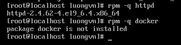

# Lab các command Chapter 2
## 1. `rpm` - Red Hat Package Mangager
### 1.1. `rpm -i` -> cài đặt gói 

### 1.2. `rpm -U` -> cài đặt hoặc cập nhật nếu gói có sẵn

### 1.3. `rpm -q` -> kiểm tra gói đã được cài đặt hay chưa

### 1.4. `rpm -qi` -> kiểm tra gói đã được cài hay chưa và xem chi tiết các gói

### 1.5. `rpm -V` -> xác minh xem các file của gói có còn đầy đủ nguyên vẹn không

-> Không in ra gì -> nguyên vẹn
-> còn lại sễ phụ thuộc vào bảng sau:

|  Ký hiệu  | Ý nghĩa                                       |
| :-------: | :-------------------------------------------- |
|    `?`    | Không thể kiểm tra được                       |
|    `5`    | Thay đổi giá trị *digest* (checksum SHA256)   |
|    `c`    | File cấu hình (config file)                   |
|    `D`    | Số thiết bị (major/minor) thay đổi            |
|    `G`    | Nhóm sở hữu (group) thay đổi                  |
|    `L`    | Liên kết (link path) thay đổi                 |
| `missing` | File bị mất                                   |
|    `M`    | Quyền truy cập (mode) hoặc loại file thay đổi |
|    `P`    | Quyền năng (capabilities) thay đổi            |
|    `S`    | Kích thước file thay đổi                      |
|    `T`    | Thời gian chỉnh sửa (timestamp) thay đổi      |
|    `U`    | Chủ sở hữu (user) thay đổi                    |

### 1.6. `rpm -e` -> xóa 1 gói đã cài đặt

Sau khi xóa kiểm tra lại và đã thấy file không tồn tại

### 1.7. `rpm2cpio` -> công cụ chuyển đổi định dạng `.rpm` -> `.cpio` để giải nén tệp `.rpm` mà ko cần tải 

**NOTE**: lệnh này thường đi kèm với `cpio -idv < tên_file.cpio` -> để giải nén tệp `.cpio`
- `-i`: copy-in mode (giải nén)

- `-d`: tạo thư mục con khi cần thiết

- `-v`: verbose — hiển thị chi tiết các file đang được giải nén

- `< tên_file.cpio`: lấy dữ liệu đầu vào từ file cpio

## 2. `yum` - Yellowdog Update Manager
### 2.1. `yum checkupdate` -> kiểm tra các gói nào đã cài đặt đang có sẵn phiên bản cập nhật

### 2.2. `yum update` -> cập nhật tất cả các gói đã cài đặt

### 2.3. `yum update + [tên gói]` -> cập nhật 1 gói cụ thể

### 2.4. `yum install [tên gói]` -> cài đặt 1 gói cụ thể

**NOTE**: có thể thêm option `-y` để không cần xác nhận tải gói

### 2.5. `yum list [tên gói]` -> tìm kiếm 1 gói cụ thể

### 2.6. `yum info [tên gói]` -> xem thông tin chi tiết về 1 gói phần mềm trong hệ thống hoặc trong repository

### 2.7. `yum remove [tên gói]` -> xóa gói

Chọn `y` để xác nhận xóa

Kiểm tra lại:

-> Không thấy dòng nào được in ra -> gói `httpd` đã bị gỡ bỏ

## 3. `dpkg` - Debian Package
### 3.1. `dpkg -I` -> Xem thông tin gói chưa cài: Tên gói, phiên bản, kiến trúc, ng duy trì, phụ thuộc, mô tả, trang chủ, ....

### 3.2. `dpkg --contents` -> xem nội dung trong gói

**NOTE**: thường kết hợp với `less` để dễ đọc

### 3.3. `dpkg -i` -> cài đặt gói

### 3.4. `dpkg -s` -> xem trạng thái gói

### 3.5. `dpkg -l` -> liệt kê tất cả gói đã cài

- `ii` - đã cài hoản chỉnh
- `iU` - gói được cài nhưng chưa cấu hình xong(thường do thiếu phụ thuộc)

### 3.6. `dpkg -r` -> Gỡ gói nhưng giữ cấu hình

### 3.7. `dpkg -P` -> Gỡ hoàn toàn

