# Lab các command Chapter 3
## 1. `lsdev` - hiển thị thông tin các thiết bị phần cứng được cài đặt trên system

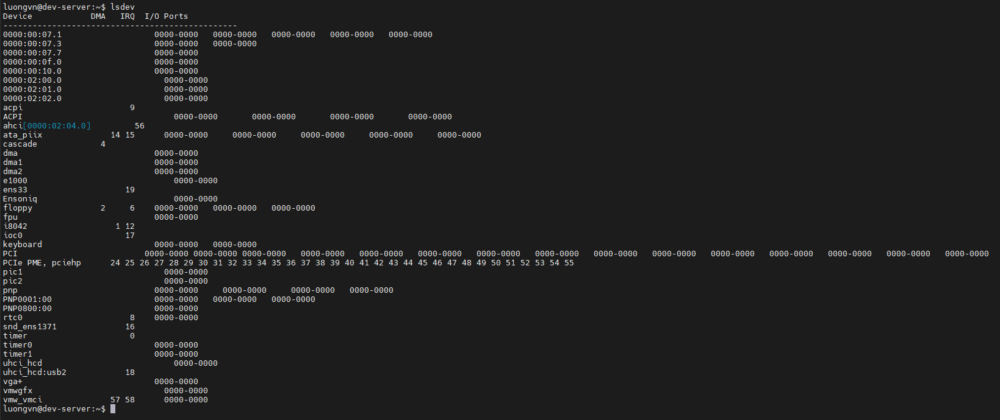

- `IRQ` (Interrupt Request lines)

- `DMA` (Direct Memory Access)

- `I/O ports` (Input/Output ports)

- `Memory addresses` (vùng nhớ được ánh xạ cho thiết bị)

## 2. `lsblk` - dùng để hiển thị thông tin về các thiết bị khối - như ổ cứng, SSD, USB...

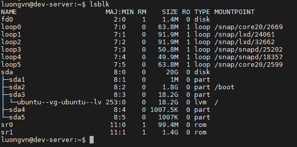

| Cột            | Ý nghĩa                                                             |
| -------------- | ------------------------------------------------------------------- |
| **NAME**       | Tên thiết bị (vd: sda, loop0, sr0, …)                               |
| **MAJ:MIN**    | Số định danh thiết bị chính và phụ (major:minor)                    |
| **RM**         | “Removable” — 1 nếu là thiết bị rời (USB, CD-ROM), 0 nếu là cố định |
| **SIZE**       | Dung lượng của thiết bị hoặc phân vùng                              |
| **RO**         | “Read Only” — 1 nếu chỉ đọc, 0 nếu đọc/ghi được                     |
| **TYPE**       | Loại thiết bị (`disk`, `part`, `loop`, `rom`, `lvm`, …)             |
| **MOUNTPOINT** | Thư mục mà thiết bị hoặc phân vùng được gắn vào hệ thống (mount)    |

### 2.1. `lsblk -f` - hiển thị hệ thống tệp(filesystem)
- Dùng khi muốn biết ổ nào đang được gắn ở đâu và định dạng hệ thống tệp là gì (`ext4`, `vfat`, `swap`, …).

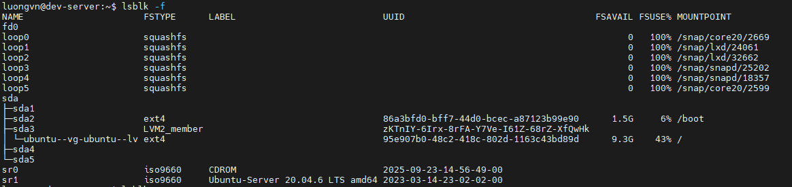


### 2.2. `lsblk -p` - hiển thị đường dẫn đầy đủ của thiết bị


### 2.3. `lsblk -d` - chỉ hiển thị thiết bị chính(ẩn các phân vùng con)

- Dùng khi muốn chỉ xem danh sách các ổ đĩa vật lý, bỏ qua phân vùng.

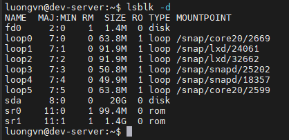

### 2.4. `lsblk -o` - tuỳ chọn cột hiển thị
- Chỉ chọn các cột cần thiết để xuất ra màn hình

```bash
lsblk -o NAME,SIZE,TYPE,MOUNTPOINT
```

- Chỉ hiển thị cột name, size, type, mountpoint

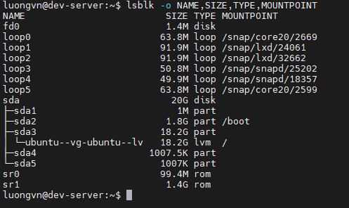

### 2.5. `lsblk -a` - hiển thị cả thiết bị trống
- Dùng khi muốn tìm ổ trống để phân vùng mới.

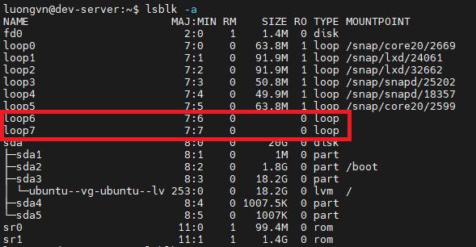

### 2.6. `lsblk --json` - xuất kết quả dạng JSON

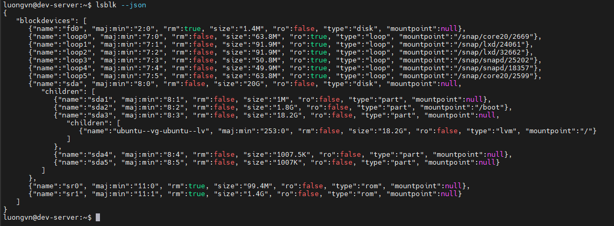

## 3. `lspci` - hiển thị thông tin về các thiết bị PCI

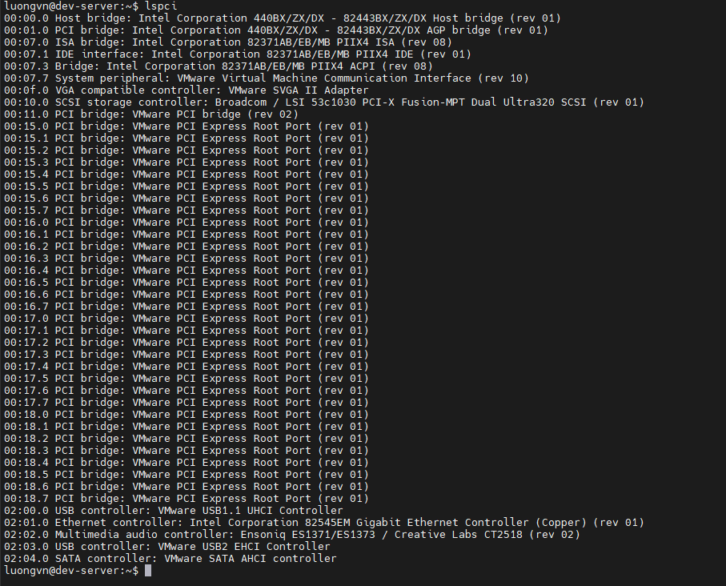

- `00:0f.0` → Địa chỉ bus của thiết bị PCI

- `VGA compatible controller` → Loại thiết bị

- `VMware SVGA II Adapter` → Tên phần cứng cụ thể

### 3.1. `lspci -k` - kiểm tra driver đang sử dụng trên linux

- Ví dụ:
```yaml
00:0f.0 VGA compatible controller: VMware SVGA II Adapter
    Subsystem: VMware SVGA II Adapter
    Kernel driver in use: vmwgfx
    Kernel modules: vmwgfx
```

| Dòng                                                | Ý nghĩa                                                                                                                                |
| --------------------------------------------------- | -------------------------------------------------------------------------------------------------------------------------------------- |
| `00:0f.0`                                           | Đây là **địa chỉ bus PCI** của thiết bị (Bus 00, Device 0f, Function 0). Mỗi thiết bị PCI trong hệ thống đều có địa chỉ riêng như vậy. |
| `VGA compatible controller: VMware SVGA II Adapter` | Cho biết đây là **thiết bị đồ họa (VGA controller)** thuộc loại **VMware SVGA II Adapter** — tức card đồ họa ảo được VMware tạo ra.    |
| `Subsystem: VMware SVGA II Adapter`                 | Xác nhận lại thông tin nhà sản xuất phụ của thiết bị (ở đây là VMware).                                                                |
| `Kernel driver in use: vmwgfx`                      | Đây là **driver mà kernel đang sử dụng** để điều khiển thiết bị này. `vmwgfx` là **driver đồ họa dành cho máy ảo VMware**.             |
| `Kernel modules: vmwgfx`                            | Đây là **module kernel tương ứng** — cũng là `vmwgfx`. Module này có thể được nạp hoặc gỡ bằng `modprobe vmwgfx` hay `rmmod vmwgfx`.   |

### 3.2. `lspci -v` - hiển thị thêm thông tin chi tiết

```yaml
00:02.0 VGA compatible controller: Intel Corporation UHD Graphics 620 (rev 07)
    Subsystem: Lenovo UHD Graphics 620
    Flags: bus master, fast devsel, latency 0, IRQ 129
    Memory at eb000000 (64-bit, non-prefetchable) [size=16M]
    I/O ports at f000 [size=64]
    Expansion ROM at 000c0000 [disabled]
    Capabilities: [40] Vendor Specific Information
    Kernel driver in use: i915
    Kernel modules: i915
```
- `Flags`, `Memory`, `I/O ports` → vùng tài nguyên phần cứng được thiết bị dùng.

- `Kernel driver in use` → driver hiện đang điều khiển thiết bị.

### 3.3. `lspci -nn` - hiển thị mã định danh thiết bị(vendor ID và device ID)

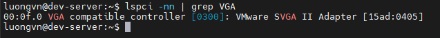

- `[0300]` -> Class code
  - `Class code` (mã lớp thiết bị) là một mã 3 byte (thường hiển thị dưới dạng 4 chữ số hex) cho biết loại thiết bị PCI là gì — ví dụ: card mạng, card đồ họa, bộ điều khiển USB, ổ đĩa, v.v.
- `[15ad:0405]`: 
  - `15ad`: Vendor ID(mã nhà sản xuất)
  - `0405`: Device ID(mã sản phẩm cụ thể)

## 4. `df: disk free` - hiển thị dung lượng đĩa còn trống trên các fs 

  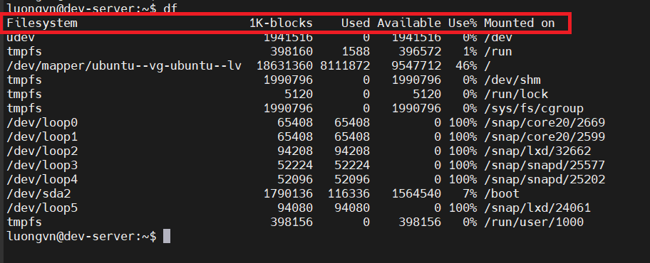

  | Cột            | Ý nghĩa                                                                                                   | Ví dụ                                                          |
  | -------------- | --------------------------------------------------------------------------------------------------------- | ---------------------------------------------------------------------------- |
  | **Filesystem** | Tên **hệ thống tệp (file system)** hay **thiết bị lưu trữ** được mount.                                   | `/dev/mapper/ubuntu--vg-ubuntu--lv`, `/dev/sda2`, `tmpfs`, `/dev/loop0`, ... |
  | **1K-blocks**  | Tổng **dung lượng của hệ thống tệp**, tính theo **khối 1 KB** (1 block = 1024 byte).                      | `18631360` nghĩa là ~18.6 GB                                                 |
  | **Used**       | **Dung lượng đã sử dụng** (tính bằng 1K-blocks).                                                          | `8111872` (~8.1 GB)                                                          |
  | **Available**  | **Dung lượng còn trống có thể sử dụng**.                                                                  | `9547172` (~9.5 GB)                                                          |
  | **Use%**       | **Tỷ lệ phần trăm dung lượng đã dùng** (`Used / (Used + Available)`).                                     | `46%`                                                                        |
  | **Mounted on** | **Thư mục nơi hệ thống tệp được mount**. Đây là nơi bạn truy cập nội dung của phân vùng hoặc thiết bị đó. | `/`, `/boot`, `/dev`, `/run`, `/snap/...`                                    |

### 4.1. `df -h` - hiển thị dung lượng theo KB, MB, GB, ...

- `-h`: human readable

  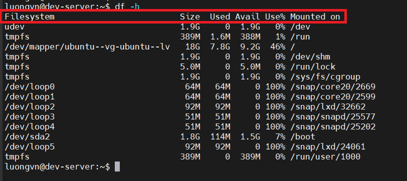

  | Cột            | Ý nghĩa                                       |
  | -------------- | --------------------------------------------- |
  | **Filesystem** | Tên thiết bị hoặc phân vùng (vd: `/dev/sda1`) |
  | **Size**       | Tổng dung lượng của hệ thống tệp              |
  | **Used**       | Dung lượng đã sử dụng                         |
  | **Avail**      | Dung lượng còn trống                          |
  | **Use%**       | Tỷ lệ phần trăm dung lượng đã dùng            |
  | **Mounted on** | Thư mục nơi hệ thống tệp được mount           |

### 4.2. `df -T` - hiển thị loại hệ thống tệp ext4, swap, ...

  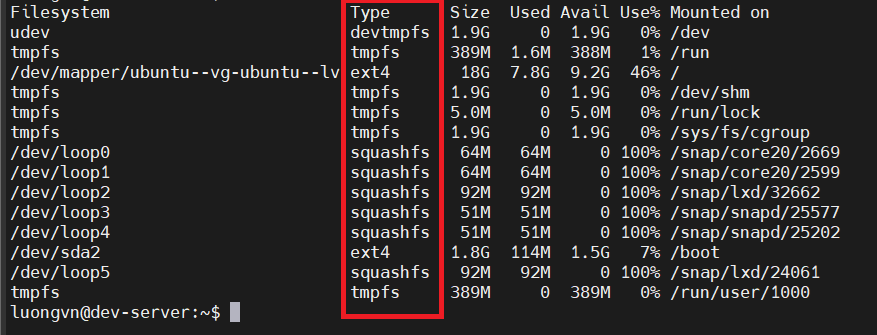

### 4.3. `df -i` - hiển thị thông tin inode

  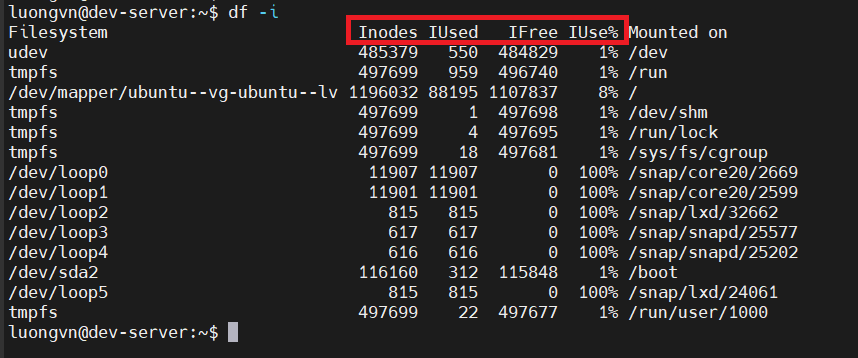

- `IUse% = 100%` -> hết inode -> ko thể tạo thêm file mới

### 4.4. `df + PATH` - hiển thị thông tin phân vùng chứa thư mục

  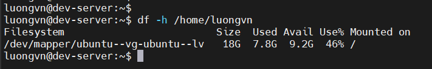

### 4.5. `df --total` - thêm dòng tổng kết toàn bộ dung lượng cuối bảng

  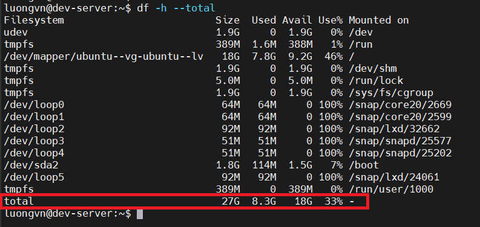

### 4.6. `df -x <fstype>` - loại trừ các hệ thống tệp có kiểu nhất định

  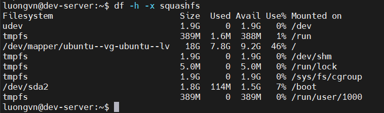

- có thể dùng nhiều option `-x` trong 1 câu lệnh: `df -x squashfs -x tmpfs ...`
- `-x: exclude`

## 5. `du: disk usage` - xem dung lượng đã sử dụng bởi các thư mục hoặc tập tin cụ thể

  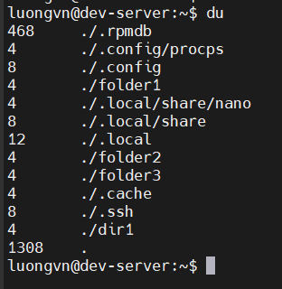

- Cú pháp: `du + [option] + [path]`
- Nếu không có path, mặc định là đường dẫn tới thư mục hiện tại

- Ý nghĩa:

  | Cột                      | Ý nghĩa                                                             | Ví dụ                                            |
  | ------------------------ | ------------------------------------------------------------------- | ------------------------------------------------ |
  | **Cột trái (số)**        | Dung lượng thư mục (hoặc file) tính bằng **block 1 KB** (mặc định). | Ví dụ: `468` nghĩa là 468 KB, `4` nghĩa là 4 KB. |
  | **Cột phải (đường dẫn)** | Tên hoặc đường dẫn tương đối của thư mục/file.                      | Ví dụ: `./.config`, `./folder1`, `./dir1`...     |

- Dòng cuối cùng: 
  - `1308`: Tổng dung lượng(KB) của toàn bộ thư mục(bao gồm cả thư mục con)
  - `.`: thư mục hiện tại

### 5.1. `du -h` - hiển thị thông tin dưới dạng dễ đọc

  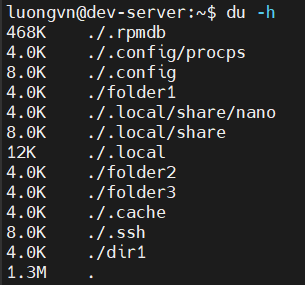

### 5.2. `du -s` - hiển thị tổng dung lượng của thư mục hiện tại

  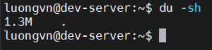

- `-s: sumarize`

### 5.3. `du --max-depth=n` - hiển thị dung lượng thư mục con (cấp n) trong thư mục hiện tại

  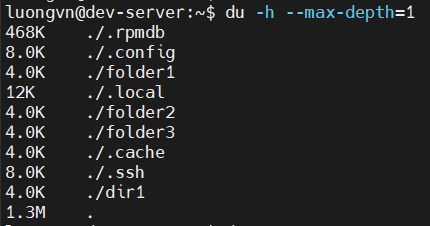

### 5.4. `du -ah` - xem dung lượng chi tiết từng file, thư mục

  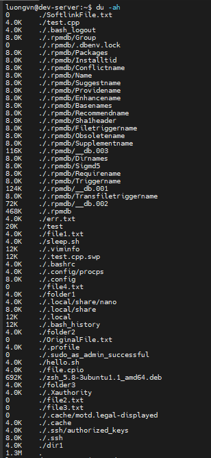

### 5.5. `du --exclude=<dir_name>` - bỏ qua thư mục nào đó

  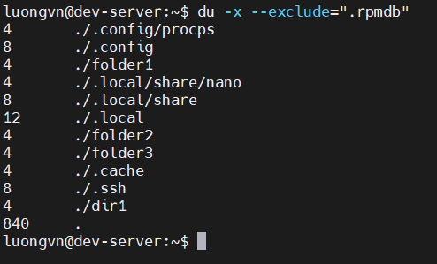

## 6. Một số yêu cầu ví dụ
### 6.1. Muốn debug thư mục nào chiếm nhiều dung lượng nhất trong ổ `root`, cụ thể là chiếm bao nhiêu?

  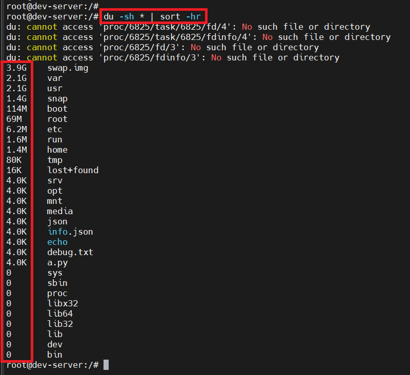

- Giải thích:
  - `-s`: summarize -> chỉ hiển thị tổng dung lượng của thư mục con cấp 1, không hiển thị đệ quy
  - `-h`: human readable -> hiển thị thông tin người dễ đọc
  - `*`: file hoặc thư mục con cấp 1
  - **NOTE**: Nếu chỉ dùng `du -h *` nó sẽ đệ quy hết thư mục con mặc dù `*` chỉ đại diện cho thư mục con cấp 1 vì bản chất `du` có đệ quy đến hết các thư mục con của 1 thư mục
  - `-r`: reverse -> sắp xếp theo thứ tự ngược lại

### 6.2. Hãy liệt kê tất cả các file lớn hơn 50MB trong hệ thống, sắp xếp theo kích thước giảm dần, và xuất ra top 10 file lớn nhất.

  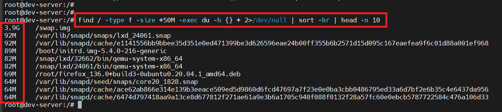

- Giải thích:
  - `find /`: tìm bắt đầu từ thư mục `/`
  - `-type f`: chỉ tìm file
  - `-size +50M`: chỉ lấy file lớn hơn 50M
  - `exec du -h {} +`:
    - `exec: execute: thực thi`
    - Với mỗi file tìm được chạy `du -h` để xem dung lượng thực tế trên đĩa
    - `{}`: đại diện cho file tìm thấy hiện tại
    - `+`: gom nhiều file tìm được thay vì chạy từng file bằng `/;`


