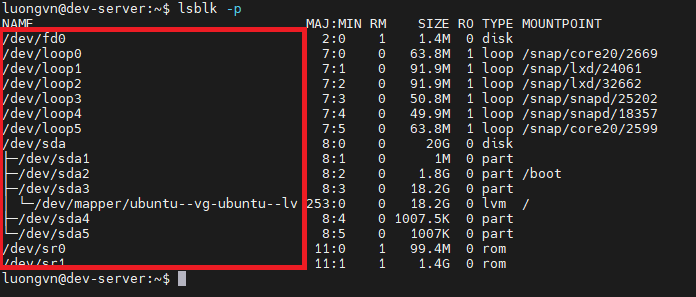

# Lab các command Chapter 2
## 1. `lsdev` - hiển thị thông tin các thiết bị phần cứng được cài đặt trên system


- `IRQ` (Interrupt Request lines)

- `DMA` (Direct Memory Access)

- `I/O ports` (Input/Output ports)

- `Memory addresses` (vùng nhớ được ánh xạ cho thiết bị)

## 2. `lsblk` - dùng để hiển thị thông tin về các thiết bị khối - như ổ cứng, SSD, USB...


| Cột            | Ý nghĩa                                                             |
| -------------- | ------------------------------------------------------------------- |
| **NAME**       | Tên thiết bị (vd: sda, loop0, sr0, …)                               |
| **MAJ:MIN**    | Số định danh thiết bị chính và phụ (major:minor)                    |
| **RM**         | “Removable” — 1 nếu là thiết bị rời (USB, CD-ROM), 0 nếu là cố định |
| **SIZE**       | Dung lượng của thiết bị hoặc phân vùng                              |
| **RO**         | “Read Only” — 1 nếu chỉ đọc, 0 nếu đọc/ghi được                     |
| **TYPE**       | Loại thiết bị (`disk`, `part`, `loop`, `rom`, `lvm`, …)             |
| **MOUNTPOINT** | Thư mục mà thiết bị hoặc phân vùng được gắn vào hệ thống (mount)    |

### 2.1. `lsblk -f` - hiển thị hệ thống tệp(filesystem)
- Dùng khi muốn biết ổ nào đang được gắn ở đâu và định dạng hệ thống tệp là gì (`ext4`, `vfat`, `swap`, …).


### 2.2. `lsblk -p` - hiển thị đường dẫn đầy đủ của thiết bị



### 2.3. `lsblk -d` - chỉ hiển thị thiết bị chính(ẩn các phân vùng con)

- Dùng khi muốn chỉ xem danh sách các ổ đĩa vật lý, bỏ qua phân vùng.


### 2.4. `lsblk -o` - tuỳ chọn cột hiển thị
- Chỉ chọn các cột cần thiết để xuất ra màn hình

```bash
lsblk -o NAME,SIZE,TYPE,MOUNTPOINT
```

- Chỉ hiển thị cột name, size, type, mountpoint


### 2.5. `lsblk -a` - hiển thị cả thiết bị trống
- Dùng khi muốn tìm ổ trống để phân vùng mới.


### 2.6. `lsblk --json` - xuất kết quả dạng JSON


## 3. `lspci` - hiển thị thông tin về các thiết bị PCI


- `00:0f.0` → Địa chỉ bus của thiết bị PCI

- `VGA compatible controller` → Loại thiết bị

- `VMware SVGA II Adapter` → Tên phần cứng cụ thể

### 3.1. `lspci -k` - kiểm tra driver đang sử dụng trên linux

- Ví dụ:
```yaml
00:0f.0 VGA compatible controller: VMware SVGA II Adapter
    Subsystem: VMware SVGA II Adapter
    Kernel driver in use: vmwgfx
    Kernel modules: vmwgfx
```

| Dòng                                                | Ý nghĩa                                                                                                                                |
| --------------------------------------------------- | -------------------------------------------------------------------------------------------------------------------------------------- |
| `00:0f.0`                                           | Đây là **địa chỉ bus PCI** của thiết bị (Bus 00, Device 0f, Function 0). Mỗi thiết bị PCI trong hệ thống đều có địa chỉ riêng như vậy. |
| `VGA compatible controller: VMware SVGA II Adapter` | Cho biết đây là **thiết bị đồ họa (VGA controller)** thuộc loại **VMware SVGA II Adapter** — tức card đồ họa ảo được VMware tạo ra.    |
| `Subsystem: VMware SVGA II Adapter`                 | Xác nhận lại thông tin nhà sản xuất phụ của thiết bị (ở đây là VMware).                                                                |
| `Kernel driver in use: vmwgfx`                      | Đây là **driver mà kernel đang sử dụng** để điều khiển thiết bị này. `vmwgfx` là **driver đồ họa dành cho máy ảo VMware**.             |
| `Kernel modules: vmwgfx`                            | Đây là **module kernel tương ứng** — cũng là `vmwgfx`. Module này có thể được nạp hoặc gỡ bằng `modprobe vmwgfx` hay `rmmod vmwgfx`.   |

### 3.2. `lspci -v` - hiển thị thêm thông tin chi tiết

```yaml
00:02.0 VGA compatible controller: Intel Corporation UHD Graphics 620 (rev 07)
    Subsystem: Lenovo UHD Graphics 620
    Flags: bus master, fast devsel, latency 0, IRQ 129
    Memory at eb000000 (64-bit, non-prefetchable) [size=16M]
    I/O ports at f000 [size=64]
    Expansion ROM at 000c0000 [disabled]
    Capabilities: [40] Vendor Specific Information
    Kernel driver in use: i915
    Kernel modules: i915
```
- `Flags`, `Memory`, `I/O ports` → vùng tài nguyên phần cứng được thiết bị dùng.

- `Kernel driver in use` → driver hiện đang điều khiển thiết bị.

### 3.3. `lspci -nn` - hiển thị mã định danh thiết bị(vendor ID và device ID)


- `[0300]` -> Class code
  - `Class code` (mã lớp thiết bị) là một mã 3 byte (thường hiển thị dưới dạng 4 chữ số hex) cho biết loại thiết bị PCI là gì — ví dụ: card mạng, card đồ họa, bộ điều khiển USB, ổ đĩa, v.v.
- `[15ad:0405]`: 
  - `15ad`: Vendor ID(mã nhà sản xuất)
  - `0405`: Device ID(mã sản phẩm cụ thể)