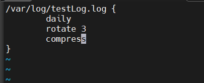

# Xem và kiểm tra log
## 1. Thử kiếm tra 1 log là ssh
- Ta có máy server là ubuntu và 1 máy rocky

- `B1`: Trên máy ubuntu ta xem các log theo thời gian thực đi kèm với tìm kiếm `ssh`

  

    - `-f: follow`
    - `grep ssh` - tìm những dòng chứa `ssh`

  - Ở đây ta chưa thấy hiện gì vì chưa có client nào ssh vào server

- `B2`: Qua máy Rocky sau đó ssh vào ubuntu

  

  -> Đã ssh được từ rocky 

- `B3`: Qua lại server ubuntu để kiểm tra log

  

  -> Ta thấy đã hiện log: user `luongvn` từ máy `192.168.174.135` đã đăng nhập thành công vào server `dev-server` bằng phương thức SSH key (RSA), và hệ thống đã mở một phiên làm việc.

- `B4`: Ta exit khỏi server ubuntu trên rocky và kiểm tra lại log trên ubuntu

  

  


  -> Ta thấy đã hiện log: User `luongvn` ngắn kết nối ssh tới server ubuntu


- `B5`: Ta thử nhập sai pass để ssh và xem log 

  

- `B6`: Ta thử nhập sai user để ssh và xem log

  


## 2. Kiểm tra file log `wtmp`

- `wtmp` dùng để ghi lại lịch sử đăng nhập và đăng xuất của người dùng trên hệ thống.

  

  - `last`: dùng để xem lịch sử đăng nhập (login history) của hệ thống
  - `-f, --file`: chỉ định file dạng `wtmp`, `btmp`

## 3. Kiểm tra file log `btmp`

- `btmp` dùng để ghi lại các lần đăng nhập thất bại (failed login attempts).

  

# Cấu hình rsyslog
- Ta sẽ cấu hình file `/etc/rsyslog.conf` để có thể Gửi mọi log từ mọi dịch vụ với mọi mức độ nghiêm trọng
- Ở đây ta chọn máy `ubuntu: 192.168.174.136` là client và `rocky: 192.168.174.135` là server

- `B1`: Ta mở section `RULES` trong máy ubuntu. 
  - **NOTE**: Trong các phiên bản mới thì nó nằm trong `/etc/rsyslog.d/50-default.conf`. Còn phiên bản cũ thì nằm trong ngay `/etc/rsyslog.conf`

  ```bash
  vim /etc/rsyslog.d/50-default.conf
  ```

- `B2`: Thêm dòng `*.* @@192.168.174.135:514`
  - `*.*`: Gửi mọi log từ mọi dịch vụ với mọi mức độ nghiêm trọng
  - `@@`: gửi log qua TCP(`@` cho UDP)
  - `192.168.174.135`: địa chỉ của máy rocky 
  - `:514`: port


- `B3`: restart dịch vụ rsyslog

  ```bash
  sudo systemctl restart rsyslog
  ```

- `B4`: Kiểm tra server Rocky có cấu hình để nhận log từ xa chưa
  - Truy cập vào file config của rsyslog trên rocky

    
    - Cần load module để nhận log TCP
    - mở port 514 TCP
  - Mở port 514 trên Rocky
    
    ```bash
    sudo firewall-cmd --permanent --add-port=514/tcp
    sudo firewall-cmd --reload
    ````

  - Kiểm tra lại:

    ```bash
    sudo firewall-cmd --list-ports
    ```

    

- `B5`: Gửi thử log thủ công từ client ubuntu

  ```bash
  $ logger "this is a message from ubuntu client to remote server"
  ```

- `B6`: Kiểm tra log đến server Rocky

  


- `B7`: Ta kiểm tra với các priority khác nhau

  - `err`: `user.err     @@192.168.174.135:514`

    

    

# Logrotate
## Tạo 1 file lưu log riêng trên hệ thống, cấu hình logrotate và kiểm tra thử

`B1`: Tạo 1 file lưu log riêng `testLog.log` trong `/var/log`

  ```bash
  touch /var/log/testLog.log
  ```

`B2`: cấu hình logrotate của testLog trong `/etc/logrotate.d`

  ```bash
  sudo vi /etc/logrotate.d/testLog
  ``` 

  

  - `daily`: Xoay log mỗi ngày
  - `rotate 3`: giữ lại 3 bản cũ 
  - `compress`: nén file cũ (.gz)

`B3`: Ta có thể xoay thủ công bằng option `-f, --force` của logrotate

  ```bash
  sudo logrotate -f /etc/logrotate.conf
  ```

  - Sau đó kiểm tra trong `/var/log`

  

  - Ta thấy đã tạo ra 1 rotate của `testLog.log` là `testLog.log.1.gz`

`B4`: Ta cấu hình `rsyslog.conf` 

  ```bash
  sudo vi /etc/rsyslog.d/50-default.conf
  ```

  - Thêm dòng `user.debug   /var/log/testLog.log` mục đích để chuyển các log có priority là `user.debug` vào `/var/log/testLog.log`

    

`B5`: Khởi động lại dịch vụ `rsyslog`

  ```bash
  sudo systemctl restart rsyslog.service
  ```

- **NOTE**: Mặc dù ta đã cấu hình `rsyslog` để chuyển những log dạng `user.debug` vào `testLog.log` nhưng ta cần chỉnh sửa lại quyền vì user ghi log là user hệ thống `syslog` chứ không phải root hay user nào khác.

  ```bash
  sudo chown syslog:adm /var/log/testLog.log
  ```

`B6`: Tạo 1 log dạng `user.debug` và kiểm tra thử

  ```bash
  logger -p user.debug "this is a message to test testLog.log"
  ```

  - `-p: priority`

  - Ta xem thử file ghi log `/var/log/testLog.log`

    