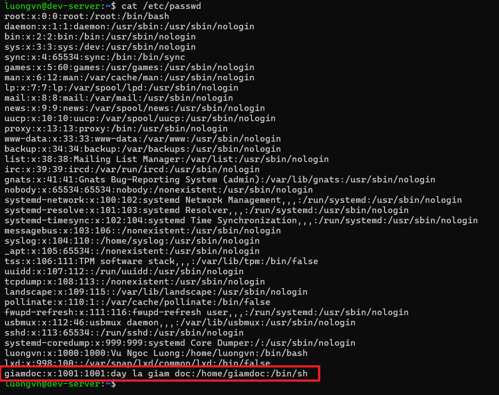

# Lab: Quản lý User và Group trong Ubuntu
## Mục tiêu
- Biết cách tạo, xóa, liệt kê user trong hệ thống.
- Biết cách tạo, xóa group.
- Biết cách thêm user vào group và kiểm tra thành viên group.

## 1. Chuẩn bị môi trường
- Máy ảo ubuntu
- Quyền sudo

## 2. Thực hiện
### Tạo user mới
```bash
sudo useradd -c "day la giam doc" giamdoc

# tạo user "giamdoc" với thông tin "Đây là giám đốc"
```

### Đặt password
```bash
sudo passwd giamdoc
```

### Mở file /etc/passwd xem có thông tin của user: giamdoc chưa

```bash
cat /etc/passwd
```




### Thay đổi thông tin người dùng
```bash
sudo usermod -c "chi la nhan vien" giamdoc
```

Mở lại file /etc/passwd xem thông tin của user "giamdoc" đã được thay đổi chưa


### Xóa người dùng
```bash
sudo userdel giamdoc
```

Mở lại file /etc/passwd xem user "giamdoc" đã được xóa hay chưa


> -> Ta không thấy thông tin của user "giamdoc" nữa -> Xóa user thành công.

### Khóa/Mở khóa người dùng
```bash
# có 2 cách khóa 1 user

passwd -l <username>
usermod -L <username>

# có 2 cách để mở khóa 1 user

passwd -u <username>
usermod -U <username>
```

Thực nghiệm: 

1) Tạo 1 user mới 
```bash
sudo useradd nhanvien
sudo passwd nhanvien # cai mk cho nhanvien
```

2) Đăng xuất ra khỏi user hiện tại 
- Dùng lệnh exit để thoát khỏi user hiện tại và đăng nhập lại vào user "nhanvien"


- Dùng lệnh `whoami` để xem có đúng rằng mình đang là user "nhanvien" không?


3) Đăng xuất tiếp và vào tài khoản gốc để "khóa" user "nhanvien"
```bash
sudo passwd -l nhanvien
```

- Mở lại `/etc/passwd` xem còn thông tin của nhanvien không


> Ở đây ta thấy vẫn còn thông tin của nhanvien nhưng bây giờ ta sẽ thử login vào nhanvien xem có thể vào được không.


> Không thể login -> Khóa user thành công

4) Để Mở ta làm giống nhưng thay bằng câu lệnh mở khóa
```bash
sudo passwd -u nhanvien
```


- Sau đó exit và login lại vào user "nhanvien"


> Đã unlock user thành công


### Tạo group mới
```bash
sudo groupadd kinhdoanh

# tạo group kinhdoanh
```

- Vào file `/etc/group` xem thử đã có group "kinhdoanh" chưa


- Tạo 1 user mới và thêm nó vào group "kinhdoanh"

```bash
sudo useradd -g kinhdoanh Bnv

# thêm user "Bnv" vào group "kinhdoanh"
```


Vào `/etc/passwd` và ta thấy user "Bnv" nằm trong group id : 1002

Ta check thử xem gid = 1002 có phải là của group "kinhdoanh" hay không bằng cách vào `/etc/group`


> Thêm user vào group thành công

### Xóa group 
- Nếu ở đây ta dùng `sudo groupdel kinhdoanh`, sẽ bị báo lỗi 


- Lý do vì `kinhdoanh` đang là primary group của user `Bnv` do đó mình không thể xóa group. 
- Để xóa được `kinhdoanh` ta có thể chuyển `Bnv` sang group khác hoặc là xóa `Bnv` trước


- Chuyển `Bnv` sang group khác:
  - Tạo 1 group mới "thuki"
  ```bash
    sudo groupadd thuki
  ```
  - Thay đổi group của `Bnv` thành `thuki`
  ```bash
    sudo usermod -g thuki Bnv
  ```
- Xóa group `kinhdoanh`:
```bash
sudo groupdel kinhdoanh
```

- Mở file `/etc/group ` và check lại


> Không còn group `kinhdoanh` và lúc này `Bnv` có gid = 1003 - `thuki` -> Xóa group thành công.


### Thay đổi group
- Thay đổi GID:
```bash
sudo groupmod -g 2003 thuki # option -g: thay đổi GID của thuki thành 2003
```

Check lại file /etc/group:


- Thay đổi name group:
```bash
sudo groupmod -n deverlopers thuki # option -n: thay đổi name của thuki thành deverlopers
```

check lại file /etc/group:


