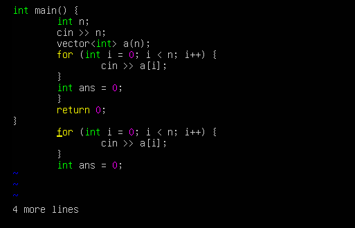

# LAB VIM EDITOR
## 1. Mở file 
```bash
vim <file>
```

Nếu file chưa tồn tại -> tạo file mới

## 2. Chuyển đổi giữa các chế độ

| Hành động              | Phím                     |
| ---------------------- | ------------------------ |
| Chèn văn bản           | `i` (insert tại con trỏ) |
| Chèn ở đầu dòng        | `I`                      |
| Thêm ở cuối dòng       | `A`                      |
| Thêm dòng mới bên dưới | `o`                      |
| Quay lại Normal mode   | `Esc`                    |


Ta thấy khi mới vào vim đang ở normal mod con trỏ đang ở vị trí `h`

- Nhấn `i` để xem vị trí con trỏ sau đó


Lúc này đã vào mode Insert và con trỏ ở vị trí `h`

## 3. Lưu và thoát

| Hành động       | Lệnh            |
| --------------- | --------------- |
| Lưu file        | `:w`            |
| Thoát           | `:q`            |
| Lưu và thoát    | `:wq` hoặc `:x` |
| Thoát không lưu | `:q!`           |

- Vào file1.txt và gõ "hello world" sau đó lưu thử và mở lại file xem nội dung đã được lưu chưa


- Dùng `!x` hoặc `!wq` để lưu và thoát

- Sau đó cat lại thử file1.txt xem nội dung được lưu chưa


-> Nội dung đã được lưu

## 4. Di chuyển con trỏ

| Phím       | Tác dụng    |
| ---------- | ----------- |
| `h`        | Sang trái   |
| `l`        | Sang phải   |
| `j`        | Xuống dòng  |
| `k`        | Lên dòng    |
| `0`        | Đầu dòng    |
| `$`        | Cuối dòng   |
| `gg`       | Đầu file    |
| `G`        | Cuối file   |
| `n + G`    | Di chuyển đến dòng thứ n |
| `Ctrl + f` | Trang xuống |
| `Ctrl + b` | Trang lên   |

## 5. Xóa, sao chép và dán

| Hành động       | Lệnh       |
| --------------- | ---------- |
| Xóa 1 ký tự     | `x`        |
| Xóa 1 dòng      | `dd`       |
| Copy 1 dòng     | `yy`       |
| Dán             | `p`        |
| Hoàn tác (Undo) | `u`        |
| Làm lại (Redo)  | `Ctrl + r` |


- Tại đây nhấn `x` để xóa dấu `;`


Đã xóa thành công

- Ta có thể dùng `dd` để xóa nguyên 1 dòng


Xóa dòng thành công

- Xóa 3 dòng liên tiếp bằng `3dd` 


- Copy 4 dòng liên tiếp bằng `4yy` sau đó di chuyển đến cuối file bằng `G` và paste bằng `p`




## 6. Tìm kiếm và thay thế
| Hành động          | Cú pháp         |
| ------------------ | --------------- |
| Tìm chuỗi          | `/chuỗi`        |
| Tìm ngược          | `?chuỗi`        |
| Tìm tiếp           | `n`             |
| Thay thế 1 dòng    | `:s/old/new/`   |
| Thay thế toàn file | `:%s/old/new/g` |

- Thay thế hết `int` thành `long long` trong file test.cpp


## 7. Visual Mode

| Hành động          | Phím       |
| ------------------ | ---------- |
| Vào visual mode    | `v`        |
| Chọn khối chữ nhật | `Ctrl + v` |
| Copy vùng chọn     | `y`        |
| Xóa vùng chọn      | `d`        |

- Xóa toàn bộ hàm main bằng chế độ visual mode và `d`


-> Đã xóa thành công